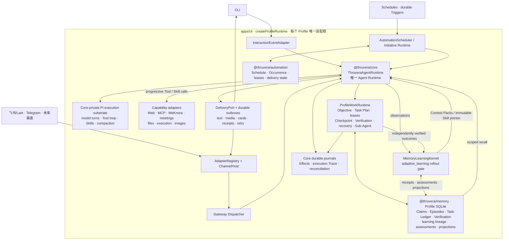

# Thruvera Agent

> A durable personal and organizational Agent runtime built on Pi, with scoped Memory, governed execution, recoverable Tasks, progressive Skills, and multi-channel delivery.

**See it through. Prove it true.**

[](https://github.com/Zanetach/beemax/releases/latest)
[](https://github.com/Zanetach/beemax/actions/workflows/ci.yml)


**Current release:** [v1.5.1](https://github.com/Zanetach/beemax/releases/tag/v1.5.1), distributed as a checksum-verified source archive for Ubuntu and macOS.

[简体中文](README.zh-CN.md)


Thruvera is one Agent product with one Core-owned Pi execution loop. It can chat locally, connect to Feishu/Lark and Telegram through one Profile Gateway, preserve long-running responsibility across restarts, and understand images through native vision or OCR.

Every surface operates under Profile-scoped policy.

It does not encode customer-specific objects such as orders, tickets, or contracts. Unknown business vocabulary enters through Work Context, evidence, configured capabilities, and enterprise policy instead of a fixed business ontology.

## The execution flow

```text
Natural-language Turn
        ↓
One Pi model understands the requested outcome
        ├─ simple → answer directly
        └─ complex → adapt the plan while executing
                         ↓
              progressively load Tools / Skills
                         ↓
              model ↔ Tool loop with recovery
                         ↓
              model completion + system guards
                         ↓
                    text and files

Durable Trigger or explicit Objective lifecycle
        ↓
admitted Work Contract → Objective / Task Ledger
        ↓
the same Pi loop → checkpoint → independent Verification → delivery

Verified outcome while `adaptive_learning` is enabled
        ↓
fenced proposal → low-risk Learning Objective → independent Verification
        ↓
atomic settlement → scoped projection / immutable managed-Skill trial
```

Pi owns task understanding, adaptive execution, model interaction, tools, session events, and live compaction. Thruvera Core adds product semantics around Pi: progressive capability disclosure, scope, sandbox and Tool policy, durable responsibility where requested, Effect authority, recovery, verification, and delivery. Work Contracts govern durable/background responsibility; they are not a mandatory pre-model classification pass for ordinary interactive work.

## Quick start

### 1. Install Thruvera

Linux and macOS require Node.js 22.19 or newer, `curl`, `tar`, `npm`, and either `sha256sum` or `shasum`.

Install the latest published Thruvera release:

```bash
curl -fsSL https://raw.githubusercontent.com/Zanetach/beemax/main/scripts/bootstrap-install.sh | bash
```

The bootstrap installer resolves GitHub's latest stable Release, then downloads its checksum-verified archive containing Thruvera and the vendored Pi source. Application files go to `~/.thruvera/app`; the command is installed to `~/.local/bin`.

To validate unreleased source or contribute to Thruvera, install from a checkout instead:

```bash
git clone https://github.com/Zanetach/beemax.git thruvera
cd thruvera
./scripts/install.sh
```

On Ubuntu and macOS, installation discovers or installs Caddy and Tesseract OCR. Ubuntu installation additionally provisions Noto CJK fonts so Chinese HTML/PDF reports retain visible, extractable text. Set `THRUVERA_INSTALL_MEDIA_DEPS=0` only when the host image manages all of these dependencies separately.

Every Profile enables its own Caddy Artifact Site by default for integrity-checked HTML, PDF, and Word links. `thruvera doctor` and Gateway use the same trusted-host command resolver, and Doctor verifies `caddy version` before startup. An explicit `gateway.artifactSite.enabled: false` remains available. Caddy receives only an allowlist of non-secret host launch variables—never the Profile environment or its Secrets—while HOME, XDG, and temporary state stay inside that Profile's private runtime directory.

### 2. Create a Profile

```bash
thruvera setup --profile personal
```

The wizard configures the Profile identity, model, credentials, workspace, Skills, and local readiness. Secrets are prompted securely and stored outside YAML.

### 3. Start chatting

```bash
thruvera chat --profile personal
```

Local chat uses the same Profile, Memory, Skills, Pi runtime, governance, and durable work graph as a channel Gateway.

### 4. Connect messaging channels when needed

```bash
thruvera gateway setup --profile personal
thruvera gateway run --profile personal
```

The setup flow configures the channel allowlist, probes credentials and bot identity, and prints the Feishu publishing checklist. WebSocket long connection is the default; webhook mode is available for public HTTPS deployments.

Telegram can run beside Feishu in the same Profile Gateway:

```bash
thruvera channel add telegram --profile personal
thruvera channel test telegram --profile personal
thruvera channel list --profile personal
```

## What ships in v1.5.1

| Area | Implemented surface |
| --- | --- |
| Agent runtime | One Core-owned model-first Pi runtime for CLI and Gateway, with adaptive planning for complex turns and a Contract-governed lane for durable Tasks, recovery, automation, and proactive execution |
| Work Context | Situation model for facts, goals, constraints, uncertainty, conflicts, possible actions, and provenance |
| Memory | One Profile-bound SQLite/FTS5 authority for scoped recall, Claims, verified Episodes, candidates, evidence lineage, correction, conflict, contribution receipts, assessments, and immutable projections |
| Durable work | Objectives, DAG Task Plans, Task Runs, leases, Checkpoints, Candidate Results, Verification, correction, cancellation, and recovery |
| Effects | One authority for mutating Tool Effects, idempotency, provider receipts, unknown outcomes, reconciliation, and compensation |
| Initiative | Evidence-gated observation and read-only investigation with duplicate and interruption controls |
| Context | Model-aware budgets, bounded Tool results, Pi compaction, Task Preservation Envelopes, and restart-safe recovery context |
| Channels | Independent Channel Runtime and Adapter packages, deterministic multi-instance Bindings, shared group Conversations, bounded contextual activation, Feishu/Lark streaming cards, Telegram text/media, governed delivery, and Profile lifecycle isolation |
| Images | Native model vision, auxiliary configured vision models, local Tesseract OCR, and optional GPT Image generation |
| Capabilities | Progressive Skills, Web research, MCP, WeKnora retrieval, Feishu meetings, files, schedules, reminders, bounded Sub-Agents, and an `adaptive_learning`-gated managed-Skill stable/canary lane |
| Operations | Doctor, Profile backup, explicit Channel/Session ownership migration, hardened Docker execution, Ubuntu resource gates, Linux systemd, macOS LaunchAgent, logs, traces, Effect inspection, and verified updates |

## Architecture



[`apps/cli/src/runtime-composition.ts`](apps/cli/src/runtime-composition.ts) is the application composition seam, not a second Agent runtime. It creates one shared Profile Runtime for CLI or Gateway use. [`apps/cli/src/profile-work-runtime.ts`](apps/cli/src/profile-work-runtime.ts) binds the same Task Ledger, Effect authority, execution Trace, recovery service, Verification, and Memory Learning Kernel.

`@thruvera/core` is the only Agent Runtime boundary, and Pi is its private execution substrate. Gateway owns authenticated channel transport, routing, lifecycle, presentation, and delivery, but does not select models, assemble prompts, recall Memory, authorize Tools, or decide Agent work. Capability packages enter through Core-owned Tool contracts and cannot bypass current Profile scope, Sandbox, Enterprise Policy, or Effect governance.

Capability packages consume Pi primitives through Core. The CLI presentation layer may use `pi-tui`, but it does not own Agent execution. See the [Core/Gateway ownership contract](docs/architecture/core-gateway-boundaries.md).

## Profiles and configuration

Each Profile is an isolated Agent Home under `~/.thruvera/profiles/<name>/`.

| Path | Purpose |
| --- | --- |
| `config.yaml` | Profile model, runtime, channel, context, and capability settings |
| `.env` | Provider and channel secrets, stored with owner-only permissions |
| `SOUL.md` | Long-lived identity, style, and default behavioral boundaries |
| `USER.md` | Stable user preferences and working context |
| `MEMORY.md` | Reviewed durable-memory snapshot |
| `workspace/` | Isolated default workspace and project instructions |
| `skills/` | Profile-scoped progressive Skills |
| `data/` | SQLite authority, Pi sessions, traces, caches, and delivery state |

Common Profile operations:

```bash
thruvera profile create work
thruvera profile list
thruvera profile show work
thruvera profile use work
thruvera profile backup work ./backups
thruvera doctor --profile work
```

Set `THRUVERA_HOME` to relocate all Profile Homes. Legacy repository-local Profiles remain readable and can be copied non-destructively with `thruvera profile migrate <name>`.

Existing BeeMax installations remain compatible during the rename: if `~/.thruvera` is absent, Thruvera reuses `~/.beemax`; `BEEMAX_*` variables and the `beemax` executable remain aliases. When both environment namespaces are present, `THRUVERA_*` wins. Durable `beemax.*` schema identifiers are intentionally retained as the stable on-disk protocol namespace.

### Models

Setup reads providers and model capabilities from Pi's built-in registry. A Profile can hold multiple configured models and switch per conversation.

Custom endpoints support OpenAI Chat Completions, OpenAI Responses, and Anthropic Messages protocols. Declare the real context window and maximum output when capability metadata is unavailable.

```yaml
model:
  provider: custom
  model: company-model
  baseUrl: https://models.example.com/v1
  customProtocol: openai-responses
  contextWindow: 128000
  maxTokens: 8192
```

Keep API keys in the Profile `.env`, or enter them through `thruvera setup`. Thruvera rejects model and credential secrets passed in command-line arguments.

### Toolsets

Profiles use the `standard` Toolset by default. Set `agent.toolset: safe` for a lower-trust channel.

The safe Toolset keeps read/search, Memory inspection, task status, schedules, Skill inspection, and read-only MCP tools. It excludes shell, file writes, Memory mutation, image generation, scheduling mutation, and mutating MCP tools.

Capability selection is progressive. An admitted exact Tool/MCP/Skill name, alias, or trigger phrase uses a deterministic metadata fast path; description-word overlap is recall only and never grants execution authority. Configured Profile text models resolve the remaining requirements with bounded semantic cognition. Thruvera may fail over between configured semantic models. Only Provider unavailability or the auxiliary preflight deadline may repair through the same exact local metadata; malformed, empty, incomplete, or below-threshold semantic output fails closed and is never replaced by weaker lexical routing. When no Profile text model is configured, lexical recall remains available but still passes Policy and Tool-Spec admission. A valid semantic “no match” remains empty and never forces an unrelated Skill. Optional Profile preferences optimize equivalent candidates but do not grant execution authority:

```yaml
agent:
  capabilityPreferences:
    web_search: 0.4
    skill:source-review: 0.8
  capabilityCognition:
    maxModelAttempts: 3
    maxTokens: 2048
    timeoutMs: 12000
```

Preference values range from `-1` to `1`. Capability cognition retries distinct Provider models without a cumulative token or cost ceiling; a timed-out model is not retried inside a smaller slice of the same deadline, while a fast structural response may receive one bounded repair. `maxModelAttempts` accepts `1`–`5`. The compact `maxTokens` value is only the output size requested for one bounded JSON decision, not an Agent Turn or Objective budget. `timeoutMs` bounds only this optional preflight lane; it never times out or abandons the Objective. Individual stalled network requests still fail visibly so another Provider or exact deterministic discovery route can continue the unchanged Objective. Neither setting authorizes description-overlap fallback or lexical degradation after malformed or empty semantic responses. Policy, Profile scope, Provider health, Effects, and the turn-scoped Tool Spec still decide whether a selected capability can execute.

Every new Profile enables the `standard-web` pack and pre-authorizes only Thruvera's pinned `exa-mcporter` adapter. The mutating `capability_acquire` Tool executes directly after the configured Provider, Profile scope, Enterprise Policy, and Effect gates pass. Installation uses a pinned adapter in the Profile's private directory, and Thruvera resumes the unchanged Objective only after a health probe returns evidence. Operators can still disable acquisition or replace the exact allowlist in a Profile:

```yaml
capabilityProviders:
  installation:
    enabled: true
    allowedProviders: [exa-mcporter]
```

The equivalent environment settings are `THRUVERA_PROVIDER_INSTALLATION_ENABLED=true` and `THRUVERA_PROVIDER_INSTALLATION_ALLOW=exa-mcporter`; set the first to `false` for an explicit opt-out. Thruvera currently ships a pinned Exa/mcporter adapter for restoring `web_search`; arbitrary package names or model-authored shell commands are never accepted. The adapter installs a fixed mcporter dependency closure from Thruvera's SHA-256-verified `package-lock`, disables package lifecycle scripts, runs with a minimal Profile-scoped environment, and publishes through an atomic cross-process lock plus rename. Its manifest content-addresses the executable, configuration, and complete dependency tree; integrity is rechecked before health probes and searches. Interrupted or ambiguous installs leave a durable quarantine; the next acquisition first reconciles the isolated staging state, then retries without overlapping the previous installer. Missing configuration, denied authority, unhealthy installation, and unknown outcomes fail closed instead of producing an evergreen substitute.

Every Capability decision receives a content-free cognition ID that correlates model usage, fallback telemetry, the execution trace, and the eventual verified, rejected, failed, cancelled, or unverified task outcome. Calibration reports keep lexical, frozen-semantic, and live-Provider results separate and measure Top-1, Top-K, required-capability recall, unnecessary activation, no-match precision, completion, latency, tokens, and cost. Versioned threshold trials cannot be promoted when authorization, false-positive, recall, or completion metrics regress.

Before a release, refresh the credentialed semantic-routing and outcome evidence with `npm run eval:capability-ranking:live -- --profile <profile> --write evals/baselines/capability-ranking-live.json`. This includes a separate live-Pi lane: the configured model receives the turn-scoped Tool Spec, chooses Tools itself, and must satisfy independent Acceptance Criteria. Every Pi-originated Tool call is bound to the exact internal assistant Turn, Provider response, Tool name, and canonical argument identity that produced it. Provider response IDs and Tool arguments never enter the durable Trace as raw content: only SHA-256 identity projections are retained. A Tool-bearing Turn without a reported Provider response identity is blocked before execution; a Tool-free Turn may honestly record the identity as `unavailable`. The deterministic routing harness remains infrastructure evidence, not proof that a model completed the task. Live-Pi token, latency, and model-Turn usage are measured and reported; missing required Provider or usage evidence fails closed, but these diagnostics do not impose a cumulative Agent Turn or Objective termination ceiling. Provider cost remains explicitly `unpriced` when the configured catalog supplies no price rather than being presented as free. The release verifier independently recomputes rankings, correlated task outcomes, model-driven Tool receipts, usage, costs, and threshold promotion decisions; it rejects missing, failed, expired, fallback-backed, implementation-mismatched, incorrectly ordered, causally detached, or gate-violating evidence.

## Memory and durable work

Thruvera separates chat history from durable organizational evidence.

- One Profile-bound SQLite database is the semantic Memory authority; Task, Effect, Verification, and delivery ledgers remain separate execution authorities.
- Conversation candidates stay pending until reviewed or promoted.
- Explicit, low-risk personal preferences may additionally be admitted by the governed L4 extractor when `adaptive_learning` is enabled; broader organizational knowledge still requires type-specific authority.
- Claims retain source evidence, validity, visibility, scope, correction, and conflict lineage.
- Verified Objective outcomes may publish idempotent Situation-backed Episodes.
- Recall is constrained by Profile, owner, conversation, thread, access scope, and business-object evidence when available.
- Unknown customer vocabulary remains open semantics; it is not mapped into a fixed order, ticket, or contract schema.

### Governed L4 Memory Learning foundation

v1.5.1 ships the governed implementation foundation behind Profile rollout authority. Production conversation evidence may become a fenced extraction proposal and a low-risk Learning Objective. Only a correlated, independently verified outcome can settle contribution receipts and assessments or publish a project/organization projection. A procedural candidate remains quarantined until independent trials authorize an immutable canary or stable pointer; rollback changes the pointer without rewriting history.

The safety model is intentionally strict:

- Raw model output, repeated behavior, and unverified candidates are evidence, not authority or active policy.
- Trusted access scope and visibility are filtered before ranking, so relevance cannot widen access.
- Verification unavailable, cancellation, authorization denial, and ambiguous attribution settle as `unknown`, not as invented success or failure.
- Corrections and forgetting invalidate dependent receipts and projections instead of silently rewriting provenance.
- Managed Skills remain subject to current Tool, Sandbox, Enterprise Policy, and Effect governance; learning cannot create new execution authority.

This is not an L4 certification claim. That label requires the production-path, multi-provider, paired Memory-On/Memory-Off, fault, privacy, migration, and soak evidence defined by the [L4 rollout and certification gate](docs/operations/l4-memory-learning-rollout-and-certification.md).

Useful Memory commands:

```bash
thruvera memory status --profile personal
thruvera memory candidates --profile personal
thruvera memory claims --profile personal
thruvera memory explain <memory-id> --profile personal
thruvera memory promote <candidate-id> --profile personal --yes
thruvera memory reject <candidate-id> --profile personal --yes
```

Responsible work becomes an Objective with durable Tasks. Safe work may resume after a crash only when recovery policy, idempotency identity, execution scope, and unresolved Effect state all permit it.

In chat, inspect work without asking the model to reconstruct it:

```text
/status
/tasks plans
/tasks show <plan-id>
/tasks verify <plan-id>
/tasks retry <plan-id>
/tasks cancel <plan-id>
```

Verification unavailable retries Verification against the retained Candidate Result; it does not replay Task execution. Explicit rejection may start one bounded Corrective Attempt only when safe-retry authority is complete.

## Governed actions and Effects

Every action is evaluated independently from its target, risk, reversibility, enterprise policy, current Effect state, and execution grant.

Tool calls do not pause for interactive approval. Once Profile scope, Tool policy, Enterprise Policy, active-Tool scope, execution budget, and Effect reconciliation permit an action, it executes directly. An Enterprise Policy that explicitly requires manual approval fails closed because no interactive approval mechanism exists.

External mutation follows a durable lifecycle:

```text
planned → executing → committed | failed | unknown
```

A committed mutation is never replayed. An `unknown` outcome blocks retry until an operator observes the external system and reconciles it.

```bash
thruvera effect list --status unknown --profile personal
thruvera effect reconcile <effect-id> --status committed \
  --operation <observed-operation> --external-ref <reference> \
  --profile personal
thruvera effect reconcile <effect-id> --status failed --profile personal
```

Runtime recovery procedures are documented in the [fault recovery runbook](docs/operations/fault-recovery.md).

## Context management

Thruvera has one context pipeline and one compactor.

Core assembles bounded Situation, scoped Memory evidence, capability context, and durable Task state. Pi owns the live session, threshold/overflow detection, summaries, and manual compaction.

```yaml
context:
  maxTurnChars: 12000
  maxToolResultTokens: 12000
  compaction:
    enabled: true
    # reserveTokens: 19200
    # keepRecentTokens: 20480
```

Defaults scale from the active model's context window. `/usage` shows effective budgets, and `/compact` requests compaction while the session is idle.

After compaction, Thruvera checks durable responsibility identities. Missing Tasks are restored from the authoritative Task Ledger and persisted into Pi's session transcript rather than guessed from the summary.

## Initiative and automation

Thruvera can observe durable Triggers and propose or execute bounded proactive work. Autonomy is separated into evidence-gated levels instead of one global switch.

```bash
thruvera autonomy status --profile personal
thruvera autonomy promote situation_context --profile personal --yes
thruvera autonomy stop read_only_investigation \
  --evidence-ref incident:2026-07-14 --profile personal --yes
thruvera autonomy rollback initiative_observation \
  --evidence-ref review:2026-07-14 --profile personal --yes
```

Promotion requires measured quality, safety, expected value, duplication, and interruption evidence. Enterprise deny always wins; enterprise allow cannot bypass failed evidence.

Schedules, reminders, and Heartbeat are durable and Profile-scoped. Heartbeat is single-flight, defers while the Agent is busy, respects active hours, and suppresses `HEARTBEAT_OK`.

```text
schedule_create   schedule_get      schedule_list
schedule_update   schedule_pause    schedule_resume
schedule_run_now  schedule_delete   schedule_runs
schedule_status
```

Unattended scheduled Agent runs use bounded, isolated execution. Each due time materializes one durable Schedule Occurrence linked to the Pi-created Objective and Task Run. Renewable fenced claims prevent stale instances from settling the same occurrence; finite retry and explicit misfire policy prevent unbounded catch-up.

Pi execution and channel delivery settle independently. A verified result is persisted before entering the Delivery Outbox, so a Feishu or Telegram outage retries only delivery and never replays completed Agent or Tool work. ChannelHost keeps supervising offline adapters while the Profile Runtime, scheduler, and durable work remain available.

## Images and OCR

Inbound images pass through one Profile-scoped media-understanding seam.

1. The active model receives the original image when it supports image input.
2. Other configured image-capable models can act as auxiliary vision adapters.
3. Tesseract provides local OCR fallback on Ubuntu and macOS.
4. If no adapter can inspect the image, Thruvera fails explicitly.

```yaml
mediaUnderstanding:
  auxiliaryVisionEnabled: true
  localOcr:
    enabled: true
    # languages: eng+chi_sim
    timeoutMs: 30000
```

The OCR executable is host-owned. If it is not on the trusted service `PATH`, set an absolute `THRUVERA_LOCAL_OCR_COMMAND` in the host/service environment; Profile YAML and Profile `.env` cannot choose executable code.

Media output enters Pi as untrusted evidence with digest, provenance, confidence, warnings, and timing. Raw image bytes are not copied into receipts, telemetry, Task Ledger, or Memory.

## Skills, MCP, Web, and knowledge

Thruvera installs bundled Profile Skills and discovers eligible Pi Skills progressively. Only Skill metadata enters the initial prompt; the full body loads after a task matches it.

```bash
thruvera skills list --profile personal
thruvera skills sync --profile personal
thruvera skills install pi-web-access --profile personal
thruvera skills inspect --from /absolute/path/customer-skill --json
thruvera skills install --from /absolute/path/customer-skill --sha256 <tree-digest> --profile personal
thruvera capabilities status --profile personal
thruvera capabilities install standard-web --profile personal
thruvera capabilities start pi-web-access --profile personal
thruvera capabilities stop pi-web-access --profile personal
```

New Profiles include the three-part `standard-web` pack: native `web_search`/`exa_web_search` with a Profile-local Exa MCP adapter acquired on first use, the Thruvera-native Agent Reach routing Skill, and native Pi-compatible CDP browser Tools plus the Pi Web Access Skill. Production Skill discovery is Profile-only; workspace and machine-global Skill directories are not inherited implicitly. Chrome asks the OS for a free loopback CDP port at startup, persists that endpoint inside the Profile, and proves it belongs to the same Profile data directory and a fresh runner/egress heartbeat before every connection. Its production runner forces HTTP(S), redirects, JavaScript requests and WebSockets through a loopback egress proxy that resolves and pins public destinations while rejecting private, link-local, metadata and reserved addresses. The browser is started only when needed, can be stopped explicitly, is stopped before Profile deletion, and never imports the user's normal Chrome profile or exposes Cookie values. `capabilities install standard-web` lets customers preinstall the Exa runtime; the Pi-compatible browser implementation is already bundled and the command verifies/backfills its complete Skill tree. Migration preserves an existing explicit Provider opt-out; running this install command folds environment overrides into the Profile policy and opts that Profile back in.

MCP supports stdio and Streamable HTTP servers. `${ENV_VAR}` references are resolved from an immutable snapshot of the selected Profile's `.env`; the stdio child receives only safe runtime variables plus keys explicitly mapped in that server's `env`, so unrelated host or Profile secrets are not inherited. External Tools and resource/prompt calls are governed as mutations by default—even if the server self-reports `readOnlyHint`. Set `trustReadOnlyOperations: true` on that exact Profile-local server entry only after the operator has attested its read behavior; this changes effect classification, not the no-approval execution model.

Customer Skills are installed from bounded local trees only after their complete canonical digest matches `--sha256`; existing same-name Skills are never overwritten. Self-service MCP installation accepts remote HTTPS descriptors (and loopback HTTP for a local managed service), rejects unknown fields and literal credentials, and requires credential fields to use `${ENV_VAR}` references. Because stdio MCP is host code under the Gateway OS account, only a trusted host operator may provision its fixed absolute command and working directory directly in the Profile manifest; Profile environment references are forbidden for both, and runtime rejects a command that is not a real, executable, non-symlink file. Executable integrity and updates remain the responsibility of trusted host package/deployment controls. Logical Profiles are not a substitute for separate OS users or containers when tenants are mutually untrusted.

Streamable HTTP MCP connections resolve and pin a validated address again for every HTTPS redirect hop; explicitly local HTTP endpoints are confined to loopback addresses. Cross-origin redirects discard credential and session headers, and JSON/SSE response streams are capped at 16 MiB before the MCP SDK can parse them.

```bash
thruvera mcp add company-search --from /absolute/path/company-search.json --profile personal
thruvera mcp status --profile personal
thruvera mcp remove company-search --profile personal
```

Web research supports provider-backed search plus SSRF-guarded extraction. WeKnora integration exposes only explicitly configured knowledge spaces through the read-only `knowledge_retrieve` tool.

```yaml
knowledge:
  enabled: true
  provider: weknora
  baseUrl: http://127.0.0.1:8080
  spaces:
    - id: company
      name: Company Knowledge
      knowledgeBaseId: kb-xxxxxxxx
```

Store `THRUVERA_WEKNORA_API_KEY` in the Profile `.env`.

## Messaging Gateway

One Profile Gateway hosts all enabled channel adapters while using exactly one shared Profile Runtime. `AdapterRegistry` creates transports, `ChannelHost` isolates lifecycle failures, and `GatewayDeliveryPort` routes outbound artifacts by platform. Channel adapters normalize identity, messages and media; they do not own Tasks, Memory, Policy, Effects, Verification, recovery, or a second Pi loop.

Non-secret declarations live under `gateway.channels[]`; each entry has an adapter ID, instance ID, enabled state, `credentialRef`, and adapter settings. Built-in channel Secrets remain in the owner-only Profile `.env` and are resolved at the trusted Adapter/diagnostic boundary by `profile-env:<adapter>`. They do not enter YAML, ordinary `ThruveraConfig`, logs, Memory, or model context; rotating the Profile Secret source does not require rebuilding the ordinary configuration object.

```yaml
gateway:
  channels:
    - id: feishu-main
      adapter: feishu
      enabled: true
      credentialRef: profile-env:feishu
      settings: {}
    - id: telegram-main
      adapter: telegram
      enabled: true
      credentialRef: profile-env:telegram
      settings:
        allowedUsers: ["123456789"]
        allowedChats: []
        allowAllUsers: false
        activation:
          mode: explicit
          respondTo: [mention, reply, command]
```

Run `thruvera channel list --profile personal` to inspect declarations, `thruvera doctor --profile personal` to validate enabled adapters, and the standard Gateway lifecycle commands to run them together.

## Feishu and Lark

Thruvera supports self-built Feishu/Lark applications through WebSocket long connection or encrypted webhook delivery.

Required Feishu capabilities include Bot, direct-message receive, group `@mention` receive, and send-as-bot. Subscribe to `im.message.receive_v1` and publish the app before testing.

Access is deny-by-default. Configure authorized user IDs with `FEISHU_ALLOWED_USERS`; optionally restrict chats with `FEISHU_ALLOWED_CHATS`.

Unknown private-message users receive a bounded pairing code instead of reaching the Agent:

```bash
thruvera pairing list --profile personal
thruvera pairing approve feishu ABCD2345 --profile personal
thruvera pairing revoke feishu ou_xxx --profile personal
```

Each turn renders one streaming interactive card with answer, progress, bounded tool activity, and usage metadata. Tool calls never render approval buttons or wait for approval replies. Only one Gateway process may own a Profile at a time.

Feishu meeting tools cover meeting queries, reservations, participants, host control, and recording lifecycle. Private user resources still require a future Feishu User OAuth layer.

## Telegram

Thruvera uses the Telegram Bot API with bounded long polling, deny-by-default user/chat allowlists, text reply and edit support, typing indicators, native image/file delivery, and bounded temporary downloads for inbound photos, documents, audio, and voice messages. Group activation uses the same transport-neutral contract as Feishu: verified mention/reply/command signals, bounded contextual follow-ups inside the same Telegram Thread, and an optional observe-only path that never becomes an Agent turn. Channels without interactive cards automatically degrade to final text while retaining the same governed Core execution.

Create a bot with BotFather, then run `thruvera channel add telegram --profile personal`. The token is prompted securely or read from `TELEGRAM_BOT_TOKEN`; authorized numeric user IDs may be supplied through the prompt or `TELEGRAM_ALLOWED_USERS`.

## Deployment and operations

### Ubuntu

The first measured production resource class is Ubuntu 24.04 x64 with Node.js 22, at least 2 logical CPUs, and 6 GiB host RAM. Its systemd limits, operational high-water marks, and reproducible queue/concurrency/SQLite/RSS gate are documented in [Ubuntu resource high-water](docs/operations/ubuntu-resource-high-water.md).

Docker is Thruvera's first production Execution Sandbox for built-in command and workspace tools. Trusted local execution is not a sandbox. Configuration, enforced limits, cancellation cleanup, capability scope, and the real-Docker release gate are documented in [Docker Execution Sandbox](docs/operations/docker-execution-sandbox.md).

Run the Gateway in the foreground for the first end-to-end test:

```bash
thruvera gateway run --profile personal
```

Then install a user-level systemd service:

```bash
thruvera gateway install --profile personal
thruvera gateway start --profile personal
thruvera gateway status --profile personal
thruvera gateway logs --profile personal
```

For a headless user service that must start before login, enable lingering once:

```bash
sudo loginctl enable-linger "$USER"
```

A machine-wide service is available through `thruvera service install --system`; run the Agent as a dedicated non-root account and set `THRUVERA_SERVICE_USER`.

### macOS

The same lifecycle commands install and control one LaunchAgent per Profile. On WSL or containers without a supervisor, keep the Gateway in the foreground or use the host's process manager.

### Health and diagnostics

```bash
thruvera doctor --profile personal
thruvera status --deep --profile personal
thruvera gateway health --profile personal
thruvera gateway logs --profile personal --tail 200
thruvera trace show <execution-id> --profile personal
```

## Security model

- Feishu/Lark and Telegram access default to deny.
- Profile secrets are isolated from YAML and protected with owner-only permissions.
- The Credential Vault stores encrypted external credentials behind scoped references.
- Shell and file tools remain inside the configured workspace and block known destructive commands and credential paths.
- Mutation receipts exclude credential material.
- MCP and external tools cannot self-certify a mutation with proof-shaped model output.
- Task, Effect, delivery, Trigger, and compensation claims use leases and stale-holder fencing.
- Queues, traces, cards, Tool output, context, and background concurrency are bounded.
- High-risk autonomy remains unavailable without explicit human authority.

See [autonomy rollout](docs/operations/autonomy-rollout.md), [performance and cost](docs/operations/performance-and-cost.md), and the [P0–P10 acceptance record](docs/operations/p0-p10-acceptance.md).

Legacy Actor-scoped group transcripts are never guessed or merged. Administrators can explicitly assign one transcript to the canonical shared Conversation with `thruvera migration session plan/apply`, retain every legacy file, and use digest-guarded rollback. See [Session Ownership Migration](docs/operations/session-ownership-migration.md).

## CLI reference

| Command | Purpose |
| --- | --- |
| `thruvera setup` | Configure a Profile, model, identity, Skills, and optional channel |
| `thruvera chat` | Start the adaptive local terminal Agent |
| `thruvera gateway` | Configure, run, install, inspect, and control channel Gateways |
| `thruvera binding` | Validate, explain, atomically activate, or disable deterministic Channel-to-Profile routes |
| `thruvera profile` | Create, select, migrate, back up, inspect, and delete Profiles |
| `thruvera migration channel-instance` | Plan, apply, audit, and safely roll back explicit legacy route ownership |
| `thruvera model` | Show or change the Profile model |
| `thruvera memory` | Inspect, explain, compile, promote, reject, or forget Memory evidence |
| `thruvera autonomy` | Inspect and control evidence-gated autonomy levels |
| `thruvera credentials` | Manage the encrypted Profile Credential Vault |
| `thruvera effect` | Inspect and reconcile unresolved Tool Effects |
| `thruvera trace` | Inspect a content-free execution trace |
| `thruvera doctor` | Validate runtime and integration readiness |
| `thruvera update` | Install the latest verified release while preserving Profiles |

Run `thruvera --help` for the complete command surface. Inside chat, use `/help` for session, model, compaction, Task, retry, cancellation, and display controls.

## Troubleshooting

### The bot receives no messages

Run `thruvera gateway health --profile <name>`. Confirm the app is published, WebSocket long connection is enabled, `im.message.receive_v1` is subscribed, and the sender is allowed or paired.

### A Task did not resume after restart

Inspect `/tasks show <plan-id>`, `thruvera effect list --status unknown`, and the execution trace. Unsafe or non-idempotent Tasks intentionally fail closed instead of replaying.

### A text-only model cannot read an image

Run `thruvera doctor`. Configure an image-capable model, enable auxiliary vision, or ensure Tesseract and the required language data are installed.

### Context is near its limit

Use `/usage` to inspect effective budgets and `/compact` while idle. Active durable Tasks survive compaction through the Task Preservation Envelope.

### MCP is unavailable

Run `thruvera mcp status --profile <name>`. Verify the server command or URL, required environment variables, startup deadline, and Profile Toolset.

## Development and verification

```bash
npm ci
npm run build
npm run typecheck
npm test
```

The full release gate adds unknown-business evaluation, committed performance profiles, heap/RSS bounds, fault evidence, architecture boundaries, and migration rehearsal:

```bash
npm run verify:release
npm run test:reliability
```

Create and verify the archive for the exact package version:

```bash
VERSION="v$(node -p "require('./package.json').version")"
bash scripts/create-release-archive.sh "$VERSION"
bash scripts/verify-release-archive.sh "$VERSION"
```

Tag, root package, every Thruvera workspace, internal dependency, and Changelog release section must match. The archive verifier checks checksum portability, source layout, isolated installation, rebuild, Profile reload, and packaged Skills.

### v1.5.1 release evidence

The committed live baselines were generated on 2026-07-19 with configured Provider models and independently rechecked by the release verifier:

| Gate | Result | Measured evidence |
| --- | --- | --- |
| Adaptive turn admission | 6/6 correct (100%) | Five direct model-first cases, one durable Contract case, 8,422 total Provider tokens |
| Progressive Capability ranking | 16/16 cases passed | Top-1 accuracy 100%, Top-K recall 100%, no-match precision 100%, forbidden activation 0% |
| Live Pi model-first outcome | 16/16 accepted | 32/32 Provider turns reported, 36,051 measured tokens, exact Tool/Skill receipts and terminal answers |
| Published release | [v1.5.1](https://github.com/Zanetach/beemax/releases/tag/v1.5.1) | [Release workflow](https://github.com/Zanetach/beemax/actions/runs/29677218897) passed; archive SHA-256 `ba62e6514dcced45c45f1e4dc7021247119c440bee235cc083c171d28ae1d6cf` |

The source evidence is committed in [adaptive turn admission](evals/baselines/adaptive-turn-admission-live.json) and [Capability ranking / live Pi outcome](evals/baselines/capability-ranking-live.json). These are real-model Runtime gates over a frozen evaluation corpus and isolated evaluation Tool implementations. They prove the tested admission, selection, execution-receipt, and completion-guard paths; they are not a claim that every open-ended business task has a 100% end-to-end success rate.

## Repository layout

```text
apps/cli/                         CLI, Profile composition, setup, services
packages/core/                    Agent semantics and the sole Pi runtime seam
packages/memory/                  SQLite/FTS5 Memory and durable authorities
packages/channel-runtime/         Platform-neutral channel contracts and lifecycle
packages/channel-feishu/          Feishu transport and rich presentation Adapter
packages/channel-telegram/        Telegram transport Adapter
packages/gateway/                 Channel-neutral interaction orchestration and governance
packages/automation/              Schedule persistence and time calculation
packages/knowledge/               WeKnora capability adapter
packages/mcp-capability/          MCP client capability
packages/feishu-capability/       Feishu meeting capability
pi/                               Vendored Pi source and workspace packages
config/                           Configuration examples
evals/                            Runtime and performance evaluation corpus
scripts/                          Install, release, evaluation, and migration tools
docs/                             Architecture, ADRs, operations, PRD, and research
```

## Documentation

- [Unified Agent Runtime PRD](docs/prd/thruvera-pi-unified-agent-runtime.md)
- [Core and Gateway boundaries](docs/architecture/core-gateway-boundaries.md)
- [Channel-neutral runtime contract](docs/architecture/channel-runtime-contract.md)
- [L4 Memory Learning architecture](docs/architecture/l4-memory-learning-architecture.md)
- [L4 Memory Learning rollout and certification](docs/operations/l4-memory-learning-rollout-and-certification.md)
- [Fault recovery runbook](docs/operations/fault-recovery.md)
- [Autonomy rollout](docs/operations/autonomy-rollout.md)
- [Performance and cost](docs/operations/performance-and-cost.md)
- [P0–P10 acceptance](docs/operations/p0-p10-acceptance.md)
- [Changelog](CHANGELOG.md)

## Current boundaries

Thruvera v1.5.1 intentionally does not include a fixed customer business ontology, a second Agent Loop, high-risk fully autonomous execution, large multi-Agent organizations, or arbitrary model-authored production Skill mutation. It does include an `adaptive_learning`-gated managed-Skill lane: only immutable, integrity-sealed versions with accepted trial identities and promotion authority can enter a bounded canary, and verified operational evidence may promote or roll that pointer back without rewriting historical versions.

Planned extension points include additional registry adapters such as Slack, Discord, DingTalk, and WeCom; Feishu User OAuth for private resources; externally backed work queues for larger horizontal deployments; and deeper enterprise policy integrations.
