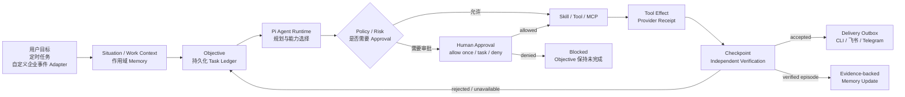
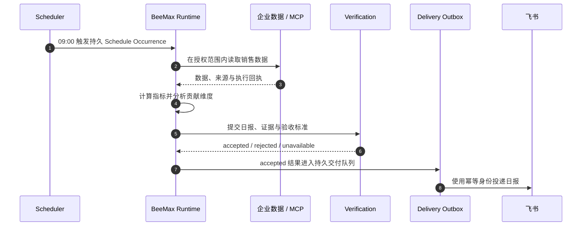
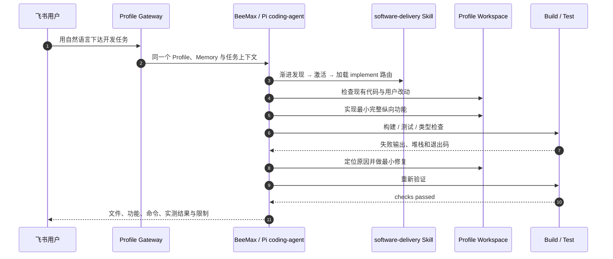
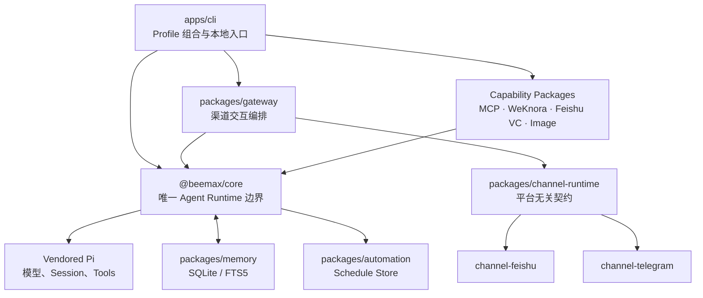

<div align="center">
  <h1>BeeMax Agent</h1>
  <h3>可私有化部署的企业 AI 数字员工</h3>
  <p><strong>让 AI 从“会回答问题”，升级为“能在权限边界内持续把事情做完”。</strong></p>
  <p>
    <a href="https://github.com/Zanetach/beemax/releases/latest"></a>
    <a href="https://github.com/Zanetach/beemax/actions/workflows/ci.yml"></a>
    
    
  </p>
  <p>
  <a href="#quick-start">快速开始</a> ·
  <a href="#runtime-flow">运行闭环</a> ·
  <a href="#sales-example">场景示例</a> ·
  <a href="#software-example">软件开发</a> ·
  <a href="#capability-boundaries">能力边界</a> ·
  <a href="#development">开发验证</a>
  </p>
</div>

<p align="center">
  
</p>

> [!NOTE]
> BeeMax 不是把聊天界面套在大模型外面。它使用一个 Core-owned Pi Agent Runtime，把目标、Memory、Task、Effect、Approval、Verification 和 Delivery 组织成可恢复的长期工作。

| **1 个执行内核** | **3 个主要入口** | **持久化责任** | **默认受治理** |
| :---: | :---: | :---: | :---: |
| Pi Agent Runtime | CLI · 飞书/Lark · Telegram | SQLite/FTS5 · Task Ledger · Checkpoint | Policy · Approval · Effect · Verification |

## 为什么是 BeeMax

| 普通聊天助手 | BeeMax Agent |
| --- | --- |
| 一次提问、一次回答 | Objective 与 Task 独立于聊天长期存在 |
| 主要依赖当前聊天上下文 | 作用域 Memory、证据和 Task Ledger 跨会话保留 |
| 工具调用结束即认为完成 | Effect Receipt、Checkpoint 与独立 Verification 共同确认结果 |
| 进程中断后通常重新开始 | 仅在幂等、权限与 Effect 状态安全时恢复 |
| 渠道各自维护一套逻辑 | CLI、飞书/Lark、Telegram 共享同一个 Profile Runtime |

从产品层看：

| 🧭 **BeeMax Agent** | ⚙️ **BeeMax Runtime** | 🧩 **解决方案模板** |
| --- | --- | --- |
| 面向企业的智能体协作平台 | 持久任务与受治理执行底座 | 销售、运营、研究、知识客服等可配置场景 |

销售、订单、工单、项目等业务对象不会被硬编码进 Core；它们通过 Work Context、企业数据、Skills、MCP、策略和验收标准进入运行时。

<a id="runtime-flow"></a>

## 它如何工作



Pi 负责模型交互、工具调用、会话事件和实时上下文压缩；BeeMax Core 负责 Profile 作用域、持久责任、任务恢复、Effect 幂等、审批、验证和交付。

## 核心能力

| 能力 | 当前实现 |
| --- | --- |
| 🧠 **长期记忆** | 使用 SQLite/FTS5 保存经审核的偏好、事实、目标、证据、纠正、冲突、惯例和已验证工作 Episode |
| 🗂️ **持久任务** | Objective、DAG Task Plan、Task Run、Lease、Checkpoint、Candidate Result、Verification、纠错、取消与安全恢复 |
| 🧰 **工具执行** | 内嵌 Pi coding-agent 的文件与命令能力，以及 Web、MCP、WeKnora、飞书会议、图片理解、Tesseract OCR 与可选图片生成 |
| 🧩 **渐进 Skills** | 先发现元数据，任务命中后再激活 Skill 并按需读取资源，避免把所有说明一次性塞进上下文 |
| ⏱️ **自动化** | 提醒、一次性任务、间隔任务、Cron、Heartbeat、misfire 策略、重试和有边界的主动只读调查 |
| 🛡️ **受治理动作** | 变更型工具按风险、范围、企业策略和执行授权决定是否审批；外部副作用使用持久 Effect 和幂等键 |
| 🔀 **多模型** | OpenAI、Anthropic、OpenRouter、Gemini、DeepSeek，以及兼容 OpenAI/Anthropic 协议的自定义端点；Ollama 可经兼容端点接入 |
| 💬 **多渠道** | 本地终端、飞书/Lark 流式卡片、Telegram 文本与媒体，共享同一个 Profile Runtime |
| 🧱 **Profile 隔离** | 每个 Profile 拥有独立模型、密钥、Memory、工作区、Skills、渠道和任务状态 |
| 🩺 **运维** | Doctor、备份、日志、Trace、Effect 对账、显式迁移、Linux systemd、macOS LaunchAgent 和 Docker 执行沙箱 |

<p align="center">
  
  
  
  
  
  
  
</p>

<a id="sales-example"></a>

## 示例：配置一个“飞书销售运营助理”

你可以在飞书里提出：

> 每天上午 9 点读取昨天的销售数据，生成日报。如果销售额相对既定基线下降超过 20%，按地区、产品和渠道定位主要贡献维度，并提醒我。



在数据源、指标口径和权限配置完成后，BeeMax 可以：

1. 创建带时区、重试和 misfire 策略的每日任务。
2. 从文件、已授权知识空间、MCP 服务或受控命令读取销售数据。
3. 调用配置好的 SQL、分析工具或销售分析 Skill 计算销售额、订单量和转化率。
4. 按明确的比较基线检查波动阈值。
5. 对地区、产品、渠道等维度做贡献分析，并把推测与已验证事实分开。
6. 生成带数据来源、统计口径和异常说明的日报。
7. 将通过 Verification 的结果经 Delivery Outbox 投递到原飞书会话。
8. 把稳定的格式偏好保存为可审核 Memory，供后续任务复用。
9. 进程中断后，仅在恢复策略、幂等身份、执行范围和 Effect 状态都安全时继续任务。

这个示例展示的是通用能力的组合，不是内置销售数据模型。企业需要明确：

- 数据源与访问授权；
- 销售额、订单量、转化率等指标口径；
- 比较周期、时区、退款和异常订单处理方式；
- 日报接收范围及外部写入权限；
- 验收标准和允许自动执行的动作。

如果任务还需要修改文件、回写 CRM、发送给新的外部联系人或操作其他业务系统，BeeMax 会按工具策略和企业授权要求审批。已经验证且配置了交付路径的任务结果可以自动投递，不要求每次重复确认。

## 可配置的 Agent 场景

以下场景由 Skills、工具、知识空间、任务规则和企业策略组合而成：

| 场景 | 可组合能力 | 需要补充的企业配置 |
| --- | --- | --- |
| 研究助理 | Web 搜索、网页读取、文件整理、证据引用、研究简报 | 可信来源、报告模板；PDF 深度解析需配置相应工具或 MCP |
| 知识客服 | WeKnora 检索、作用域过滤、来源回溯、飞书回复 | 授权知识空间、升级人工规则、回答验收标准 |
| 项目助理 | Objective、Task Plan、Checkpoint、提醒、周报 | 项目数据源、责任人、延期和升级规则 |
| 软件工程数字员工 | `software-delivery` Skill、工作区读写、构建、测试、错误诊断与修复闭环 | 代码工作区、运行环境；Shell 首次按任务授权，部署和外部发布单独审批 |
| 销售运营助理 | 定时任务、MCP/文件数据、分析 Skill、日报交付 | CRM/数据库连接、指标口径、接收人和审批策略 |
| 运维助理 | 定时检查、日志分析、异常通知、受治理命令 | 监控来源、运行手册、允许的只读/变更操作 |
| 会议助理 | 飞书会议查询与预约、知识检索、资料整理 | 应用权限、会议资料来源；当前未内置飞书 User OAuth，私有用户资源需外部适配 |

<a id="software-example"></a>

## 示例：在飞书里下达一个软件开发任务

你可以直接对同一个 Profile 的飞书机器人说：

> 在工作区开发一个可以本地运行的 CRM 最小版本，包含客户、联系人和销售机会；写测试，遇到错误自己定位并修复，全部通过后把启动方式和结果发给我。



BeeMax 不会把“已经生成代码”当成完成。`software-delivery` Skill 要求它先检查工作区并形成可观察验收项，然后持续执行“实现 → 测试 → 诊断 → 修复 → 重测”，直到验收项有工具证据，或证明存在一个无法在当前权限内解决的精确阻塞。

软件模式默认允许当前任务在 Profile `workspace/` 内写入和编辑文件。Shell 可以读取宿主环境或执行任意程序，因此第一次调用仍会在飞书请求审批；回复“本任务允许”后，同一任务可以继续构建、测试和修复，不会每条命令都重复打断。部署、GitHub 发布、生产数据、密钥和破坏性操作仍需要单独授权。

这里的代码智能体能力由 BeeMax 内嵌的 Pi coding-agent 文件/命令执行栈实现，不依赖另起一套外部 Agent Runtime，也不会伪装成已经连接了未配置的外部编码 Agent 服务。

<a id="quick-start"></a>

## 快速开始

### 一条命令安装并开始使用

Linux 和 macOS 需要 Node.js 22.19 或更高版本，以及 `curl`、`tar`、`npm` 和 `sha256sum` 或 `shasum`。

安装最新稳定 Release 后，向导会依次创建 Profile、配置模型、询问是否启用软件交付模式，并询问是否连接飞书/Lark：

```bash
curl -fsSL https://raw.githubusercontent.com/Zanetach/beemax/main/scripts/bootstrap-install.sh | bash -s -- --quickstart
```

模型 API Key 与飞书 App Secret 都通过安全提示处理，不会进入命令行、YAML 或模型上下文。配置了渠道时，`quickstart` 会直接进入同一个 Profile Gateway；保持该进程运行后即可在飞书下达任务。未配置渠道时，它会进入本地聊天。

已经安装 BeeMax 时，可以随时执行：

```bash
beemax quickstart --profile personal
```

然后直接告诉它想要的结果，例如：

> 调研过去的黄金走势报告。给我结论、关键数据、影响因素、风险和来源。

如果没有指定时间范围，`historical-market-research` Skill 会明确采用最近 30 个日历日作为可撤销假设并继续。BeeMax 会先按任务渐进激活该 Skill 和结构化行情 Tool，交叉验证独立来源；只有确实需要正式文件时才继续发现报告 Skill。只读来源失败时会避免重复同一个失败调用，寻找等价能力并保留限制说明。通过独立验证的结果才能进入长期记忆。

运行一个任务后退出：

```bash
beemax quickstart --profile personal --once "调研过去的黄金走势报告，并给出可核验来源"
```

也可以显式打开软件模式和飞书步骤：

```bash
beemax setup --profile personal --software-agent --with-feishu
beemax gateway run --profile personal
```

### 仅安装

```bash
curl -fsSL https://raw.githubusercontent.com/Zanetach/beemax/main/scripts/bootstrap-install.sh | bash
```

Bootstrap 会解析 GitHub 最新稳定 Release，校验归档校验和，并将应用安装到 `~/.beemax/app`、命令安装到 `~/.local/bin`。

从源码安装：

```bash
git clone https://github.com/Zanetach/beemax.git
cd beemax
./scripts/install.sh
```

安装程序会检查本地媒体依赖，并在受支持的 Ubuntu/macOS 环境中发现或安装 Tesseract OCR。若宿主环境自行管理 OCR，可设置 `BEEMAX_INSTALL_MEDIA_DEPS=0`。

### 分步创建 Profile

```bash
beemax setup --profile personal
```

向导会配置 Profile 身份、模型、凭据、工作区、Skills 和本地运行状态。加上 `--software-agent` 后，工作区文件写入与编辑获得每任务授权；Shell、外部系统和高风险动作不会因此获得无限权限。密钥通过安全提示输入并保存在 YAML 之外。

### 在终端开始使用

```bash
beemax chat --profile personal
```

本地聊天与渠道 Gateway 使用相同的 Profile、Memory、Skills、治理策略和持久任务图。

### 接入飞书/Lark

```bash
beemax gateway setup --profile personal
beemax gateway run --profile personal
```

配置流程会设置访问白名单、探测凭据和机器人身份，并输出飞书应用发布清单。默认使用 WebSocket 长连接，也支持加密 Webhook。

飞书自建应用至少需要启用 Bot，并配置私聊消息读取、群聊 `@mention` 读取和机器人发信权限；事件订阅需要包含 `im.message.receive_v1`，完成后发布应用版本。未知私聊用户不会直接进入 Agent，可以由管理员通过配对码授权：

```bash
beemax pairing list --profile personal
beemax pairing approve feishu <pairing-code> --profile personal
beemax pairing revoke feishu <user-id> --profile personal
```

### 接入 Telegram

```bash
beemax channel add telegram --profile personal
beemax channel test telegram --profile personal
beemax channel list --profile personal
```

先通过 BotFather 创建机器人。Token 应由安全提示输入或保存在 Profile `.env` 的 `TELEGRAM_BOT_TOKEN` 中；使用 `TELEGRAM_ALLOWED_USERS` 配置允许访问的数字用户 ID。飞书和 Telegram 可以在同一个 Profile Gateway 中同时运行；渠道只负责连接与呈现，不会创建第二套 Agent Loop。

## Profile、模型与密钥

每个 Profile 位于 `~/.beemax/profiles/<name>/`：

| 路径 | 用途 |
| --- | --- |
| `config.yaml` | 模型、运行时、渠道、上下文和能力配置 |
| `.env` | 模型与渠道密钥，使用仅所有者可读权限 |
| `SOUL.md` | 长期身份、风格和默认行为边界 |
| `USER.md` | 稳定的用户偏好与工作上下文 |
| `MEMORY.md` | 已审核的长期记忆快照 |
| `workspace/` | 隔离的默认工作区及项目说明 |
| `skills/` | Profile 作用域内的渐进 Skills |
| `data/` | SQLite authority、Pi 会话、Trace、缓存和交付状态 |

可以通过 `BEEMAX_HOME` 重定位所有 Profile Home。旧版仓库内 Profile 仍可读取，并可使用 `beemax profile migrate <name>` 非破坏地迁移到隔离目录。

常用命令：

```bash
beemax profile create work
beemax profile list
beemax profile show work
beemax profile use work
beemax profile backup work ./backups
beemax doctor --profile work
```

Profile 可以配置多个模型并按会话切换。自定义端点支持 OpenAI Chat Completions、OpenAI Responses 和 Anthropic Messages 协议：

```yaml
model:
  provider: custom
  model: company-model
  baseUrl: https://models.example.com/v1
  customProtocol: openai-responses
  contextWindow: 128000
  maxTokens: 8192
```

API Key 应保存在 Profile `.env` 中，或通过 `beemax setup` 的安全提示输入。BeeMax 拒绝从命令行参数接收模型和凭据密钥。

## Memory 与长期任务

BeeMax 将聊天记录、候选记忆和长期组织证据分开：

- 普通对话内容不会自动成为永久事实；
- 候选内容需要审核、晋升或可靠证据；
- Claim 保留来源、有效期、可见性、纠正和冲突链；
- 已验证 Objective 可以发布幂等、可回溯的 Memory Episode；
- Recall 受 Profile、用户、会话、Thread 和可信 Access Scope 约束。

```bash
beemax memory status --profile personal
beemax memory candidates --profile personal
beemax memory claims --profile personal
beemax memory explain <memory-id> --profile personal
beemax memory promote <candidate-id> --profile personal --yes
beemax memory reject <candidate-id> --profile personal --yes
```

在聊天中可以直接查看持久任务，而不要求模型根据对话历史猜测：

```text
/status
/tasks plans
/tasks show <plan-id>
/tasks verify <plan-id>
/tasks retry <plan-id>
/tasks cancel <plan-id>
```

恢复不是无条件重放。只有明确允许安全重试、具备幂等身份和执行范围、且不存在未决外部 Effect 的任务才会恢复。Verification 暂时不可用时，BeeMax 会保留 Candidate Result 并重试验证，而不是直接重复执行任务。

## 审批、Effect 与结果验证

每个变更动作都会根据目标、风险、可逆性、企业策略、执行授权和当前 Effect 状态独立判断。

默认情况下，变更型工具需要审批；可信且作用域明确的策略可以授权特定低风险动作，但高风险或不可逆操作不会因为一个宽泛的“允许自动化”设置而获得无限权限。

外部副作用使用持久状态机：

```text
planned → executing → committed | failed | unknown
```

- `committed` 不会被重复执行。
- `failed` 可以按策略进入安全重试或人工处理。
- `unknown` 会阻止重放，直到操作员检查外部系统并完成对账。

```bash
beemax effect list --status unknown --profile personal
beemax effect reconcile <effect-id> --status committed \
  --operation <observed-operation> --external-ref <reference> \
  --profile personal
beemax effect reconcile <effect-id> --status failed --profile personal
```

## 自动化与主动工作

BeeMax 支持 `at`、`every` 和 `cron` 三类计划，具备时区、重试、Occurrence 身份、Lease、misfire 策略和持久 Delivery Outbox。

Heartbeat 是触发器，不是另一套 Agent。它会检查到期提醒、持久任务和近期失败，在 Agent 忙碌时延后，并遵守活跃时间段。

主动能力分级开放：

1. 构建 Situation Context；
2. 记录 Initiative Observation；
3. 执行有证据、有预算的只读调查；
4. 仅在企业策略和发布门禁允许时执行可逆、低风险动作。

```bash
beemax autonomy status --profile personal
beemax autonomy promote situation_context --profile personal --yes
beemax autonomy stop read_only_investigation \
  --evidence-ref incident:2026-07-14 --profile personal --yes
```

Pi 执行和渠道交付独立结算。飞书或 Telegram 暂时离线时，系统只重试结果交付，不会重新运行已经完成的 Agent 或 Tool 工作。

## Tools、Skills、MCP 与知识库

Profile 默认使用 `standard` Toolset。低信任渠道可以设置 `agent.toolset: safe`：保留读取、搜索、Memory/Task/Schedule/Skill 检查和只读 MCP，排除 Shell、文件写入、Memory 变更、图片生成、Schedule 变更和写入型 MCP。

内置 `software-delivery` Skill 使用 manifest 路由实现渐进加载：普通对话不会携带它的完整开发流程；只有开发、实现、调试和修复任务命中后，运行时才加载 `implement` 模块并激活工作区读写工具。Shell 不允许由 Skill 自动扩大权限，仍由 Profile Tool Policy 和审批代理治理。

```bash
beemax skills list --profile personal
beemax skills sync --profile personal
beemax mcp status --profile personal
```

MCP 支持 stdio 和 Streamable HTTP。没有明确只读声明的 MCP Tool 会被保守地视为变更操作。

WeKnora 只检索 Profile 显式授权的知识空间：

```yaml
knowledge:
  enabled: true
  provider: weknora
  baseUrl: http://127.0.0.1:8080
  spaces:
    - id: company
      name: Company Knowledge
      knowledgeBaseId: kb-xxxxxxxx
```

将 `BEEMAX_WEKNORA_API_KEY` 保存在 Profile `.env` 中。

BeeMax 当前没有内置通用业务数据库连接器；数据库、CRM、OA、ERP 和内部 API 通常通过 MCP、专用 Tool 或受控执行适配。

## 图片与 OCR

入站图片通过统一的 Profile 媒体理解接口处理：

1. 主模型支持视觉时接收原图；
2. 可使用其他已配置的视觉模型；
3. Ubuntu 和 macOS 可使用本地 Tesseract OCR；
4. 没有可用适配器时明确失败，不伪装成已读取图片。

```yaml
mediaUnderstanding:
  auxiliaryVisionEnabled: true
  localOcr:
    enabled: true
    # command: /usr/bin/tesseract
    # languages: eng+chi_sim
    timeoutMs: 30000
```

普通文件可以通过文件工具或配置的能力处理；深度 PDF 解析不是当前内置的一等能力，需要配置对应 Tool、Skill 或 MCP。

## 部署与运维

首次端到端验证建议以前台方式运行：

```bash
beemax gateway run --profile personal
```

安装并管理后台服务：

```bash
beemax gateway install --profile personal
beemax gateway start --profile personal
beemax gateway status --profile personal
beemax gateway logs --profile personal
```

Linux 使用每个 Profile 独立的 systemd 服务，macOS 使用 LaunchAgent。WSL 或没有服务管理器的容器应保持前台运行，或使用宿主环境的进程管理器。

常用诊断：

```bash
beemax doctor --profile personal
beemax status --deep --profile personal
beemax gateway health --profile personal
beemax gateway logs --profile personal --tail 200
beemax trace show <execution-id> --profile personal
```

生产环境中的内置命令和工作区工具建议使用 Docker Execution Sandbox；可信宿主执行本身不等于沙箱。

软件开发 Agent 的权限与验收说明见 [软件交付运行手册](docs/operations/software-delivery-agent.md)。

## 安全模型

- 飞书/Lark 和 Telegram 默认拒绝未授权访问。
- Profile 密钥与 YAML 分离，并使用仅所有者可读权限。
- Credential Vault 通过作用域引用保存加密的外部凭据。
- Shell 和文件工具受工作区、凭据路径、危险命令和执行策略约束。
- Tool、MCP 或模型输出不能自行伪造审批、Effect Receipt 或验证证据。
- Task、Effect、Delivery、Trigger 和 Compensation 使用 Lease 与过期持有者隔离。
- Queue、Trace、卡片、Tool 输出、Context 和后台并发都有上限。
- 高风险或不可逆自治操作始终需要明确的人类授权。

详见 [自治发布流程](docs/operations/autonomy-rollout.md)、[故障恢复手册](docs/operations/fault-recovery.md)、[性能与成本](docs/operations/performance-and-cost.md) 和 [P0–P10 验收记录](docs/operations/p0-p10-acceptance.md)。

<a id="capability-boundaries"></a>

## 当前能力边界

BeeMax 1.6.0 当前不把以下内容包装成已完成能力：

- 不内置客户、订单、工单、项目、合同等固定业务本体；
- 不把销售日报、知识客服等示例描述为无需配置的一键产品；
- 不保证任意中断任务都能自动恢复；
- 不内置通用业务数据库连接器或一等 PDF 深度解析器；
- 不提供第二套 Agent Loop 或无边界的大型多 Agent 组织；
- 不声称可以在没有代码工作区、运行环境或必要账号权限时完成任意软件项目；
- 不把内嵌 Pi coding-agent 描述成已连接的外部编码 Agent 服务；
- 不允许模型自动发布正式企业策略或高风险生产变更；
- Profile 隔离不等同于已经提供完整的 SaaS 租户、SSO 和企业 IAM 产品。

这些边界让 Core 保持行业无关，也让业务能力可以通过企业数据、Skills、MCP、策略和验证标准逐步接入。

## 常见问题

<details>
<summary><strong>机器人已经启动，为什么收不到消息？</strong></summary>

运行 `beemax gateway health --profile <name>`。检查飞书应用是否已发布、是否启用 WebSocket 长连接并订阅 `im.message.receive_v1`，同时确认发送者已在白名单中或完成配对。

</details>

<details>
<summary><strong>为什么某个任务重启后没有自动继续？</strong></summary>

查看 `/tasks show <plan-id>`、`beemax effect list --status unknown` 和对应 Trace。非幂等任务、缺少执行范围或存在未决 Effect 时，BeeMax 会主动阻止重放。

</details>

<details>
<summary><strong>文字模型为什么无法读取图片？</strong></summary>

运行 `beemax doctor --profile <name>`，配置支持图片输入的模型、启用辅助视觉模型，或安装 Tesseract 及对应语言包。

</details>

<details>
<summary><strong>MCP Server 为什么没有出现在可用能力里？</strong></summary>

运行 `beemax mcp status --profile <name>`，检查 Server 命令或 URL、环境变量、启动超时和当前 Profile Toolset。未明确声明只读的 MCP Tool 会按变更操作治理。

</details>

## CLI 速查

| 命令 | 用途 |
| --- | --- |
| `beemax setup` | 配置 Profile、模型、身份、Skills 和可选渠道 |
| `beemax chat` | 启动本地终端 Agent |
| `beemax gateway` | 配置、运行、安装和诊断渠道 Gateway |
| `beemax channel` | 添加、测试和管理 Channel Instance |
| `beemax profile` | 创建、选择、迁移、备份、检查和删除 Profile |
| `beemax model` | 查看或切换 Profile 模型 |
| `beemax memory` | 检查、解释、晋升、拒绝或删除 Memory 证据 |
| `beemax autonomy` | 查看和控制分级自治 |
| `beemax credentials` | 管理加密的 Profile Credential Vault |
| `beemax effect` | 检查并对账未决 Tool Effect |
| `beemax trace` | 检查不含业务内容的执行 Trace |
| `beemax doctor` | 验证运行时与集成就绪状态 |
| `beemax update` | 在保留 Profile 数据的前提下安装已验证 Release |

运行 `beemax --help` 查看完整命令；在聊天中使用 `/help` 查看会话、模型、压缩、任务、重试和取消控制。

<a id="development"></a>

## 开发与验证

```bash
npm ci
npm run build
npm run typecheck
npm test
```

完整发布门禁还包括能力路由、真实 Agent 执行、性能、内存、故障恢复、安全、架构和迁移验收：

```bash
npm run verify:release
npm run test:reliability
```

## 代码架构



## 仓库结构

```text
apps/cli/                         CLI、Profile 组合、安装向导和服务管理
packages/core/                    Agent 语义与唯一 Pi Runtime 边界
packages/memory/                  SQLite/FTS5 Memory 与持久 authority
packages/channel-runtime/         平台无关的渠道契约和生命周期
packages/channel-feishu/          飞书/Lark Adapter 与流式卡片
packages/channel-telegram/        Telegram Adapter
packages/gateway/                 渠道无关的交互编排与治理
packages/automation/              Schedule 持久化与时间计算
packages/knowledge/               WeKnora 能力适配
packages/mcp-capability/          MCP 客户端能力
packages/feishu-capability/       飞书会议能力
pi/                               Vendored Pi 源码及 workspace packages
config/                           配置示例
evals/                            Runtime、能力和性能评测
scripts/                          安装、发布、评测和迁移工具
docs/                             架构、ADR、运维、PRD 与研究记录
```

## 文档

- [统一 Agent Runtime PRD](docs/prd/beemax-pi-unified-agent-runtime.md)
- [Core 与 Gateway 边界](docs/architecture/core-gateway-boundaries.md)
- [渠道无关 Runtime 契约](docs/architecture/channel-runtime-contract.md)
- [故障恢复手册](docs/operations/fault-recovery.md)
- [自治发布流程](docs/operations/autonomy-rollout.md)
- [性能与成本](docs/operations/performance-and-cost.md)
- [P0–P10 验收记录](docs/operations/p0-p10-acceptance.md)
- [Changelog](CHANGELOG.md)
