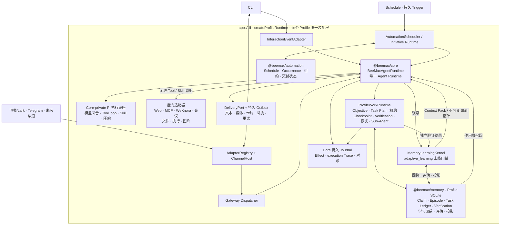

# BeeMax Agent

> 基于 Pi 的持久化个人与组织 Agent 运行时，提供作用域 Memory、受治理执行、可恢复 Task、渐进式 Skill 和多渠道交付。

[](https://github.com/Zanetach/beemax/releases/latest)
[](https://github.com/Zanetach/beemax/actions/workflows/ci.yml)


**阶段版本：** 1.6.0，发布归档需通过版本一致性、供应链审计、完整回归和隔离安装验证；支持 Ubuntu 和 macOS。

[English](README.md) | 简体中文


BeeMax 是一个 Agent 产品，只有一个由 Core 拥有的 Pi 执行循环。它可以在本地终端中对话，也可以通过同一个 Profile Gateway 接入飞书/Lark 和 Telegram；长期任务可以跨重启继续，图片可以通过模型原生视觉或 OCR 理解。

所有入口都执行同一套 Profile 作用域策略。

BeeMax 不在代码里固化订单、工单、合同等客户业务对象。未知业务词汇通过 Work Context、证据、已配置能力和企业策略进入系统，而不是被强制映射到固定业务本体。

## 执行流程

```text
自然语言 Turn
        ↓
一个 Pi 主模型直接理解用户要达成的结果
        ├─ 简单问题 → 直接回答
        └─ 复杂任务 → 在执行中动态调整计划
                          ↓
                 渐进加载 Tool / Skill
                          ↓
                 模型 ↔ Tool 循环与恢复
                          ↓
                 模型完成 + 系统守卫
                          ↓
                     文本与文件

持久 Trigger 或显式 Objective 生命周期
        ↓
通过准入的 Work Contract → Objective / Task Ledger
        ↓
同一个 Pi 循环 → Checkpoint → 独立 Verification → 交付

启用 `adaptive_learning` 后的已验证结果
        ↓
隔离提案 → 低风险 Learning Objective → 独立 Verification
        ↓
原子结算 → 作用域投影 / 不可变 managed-Skill 试验
```

Pi 负责理解任务、动态执行、模型交互、Tool、Session 事件和实时压缩。BeeMax Core 在 Pi 外增加产品语义：渐进能力披露、作用域、Sandbox、审批策略、持久责任、Effect 权威、恢复、Verification 和交付。Work Contract 只治理持久或后台责任，不是普通交互在进入主模型前必须经过的分类步骤。

## 快速开始

### 1. 一条命令安装并开始使用

Linux 和 macOS 需要 Node.js 22.19 或更高版本，以及 `curl`、`tar`、`npm` 和 `sha256sum` 或 `shasum`。

安装最新稳定版本、创建或检查 Profile，并直接进入对话：

```bash
curl -fsSL https://raw.githubusercontent.com/Zanetach/beemax/main/scripts/bootstrap-install.sh | bash -s -- --quickstart
```

引导安装器会解析 GitHub 最新稳定 Release，下载包含 BeeMax 和 vendored Pi 源码的校验和归档。应用文件安装到 `~/.beemax/app`，命令安装到 `~/.local/bin`。首次运行向导只要求必要配置和模型凭据，已有 Profile 会先同步缺失的内置 Skills、执行就绪检查，再进入同一套正式 Agent Runtime。

如需验证未发布源码或参与开发，可从源码安装：

```bash
git clone https://github.com/Zanetach/beemax.git
cd beemax
./scripts/install.sh
```

Ubuntu 和 macOS 安装过程会发现或安装 Tesseract OCR。Ubuntu 还会安装 Noto CJK 字体，保证中文 HTML/PDF 报告中的文字可见且可提取。只有宿主镜像自行管理这些依赖时，才应设置 `BEEMAX_INSTALL_MEDIA_DEPS=0`。

### 2. 以后再次开始

```bash
beemax quickstart --profile personal
```

也可以直接交给它一个普通人的任务：

```bash
beemax quickstart --profile personal --once "调研过去的黄金走势，给我一份有数据、有来源、有结论的报告。"
```

没有指定时间范围时，`historical-market-research` Skill 会说明并采用最近 30 个日历日这一可逆假设；执行中只渐进激活需要的 Skill 和 Tool，优先获取结构化 XAU/USD 数据并用独立来源交叉检查。只有确实需要正式文件时才继续发现报告 Skill。只读来源临时失败时，它会检查失败原因并改用等价健康能力，而不是机械重复同一次调用。只有经过验证的结果才进入后续对话可召回的作用域 Memory。

本地对话和渠道 Gateway 使用相同的 Profile、Memory、Skill、Pi Runtime、治理规则和持久工作图。Secret 通过安全提示输入，存放在 YAML 之外。

### 3. 按需接入消息渠道

```bash
beemax gateway setup --profile personal
beemax gateway run --profile personal
```

向导会配置渠道 allowlist、探测凭据和机器人身份，并输出飞书发布检查清单。默认使用 WebSocket 长连接；具有公网 HTTPS 部署时也可使用 webhook。

Telegram 可以与飞书共同运行在同一个 Profile Gateway 中：

```bash
beemax channel add telegram --profile personal
beemax channel test telegram --profile personal
beemax channel list --profile personal
```

## v1.6.0 已实现能力

| 领域 | 已实现范围 |
| --- | --- |
| Agent Runtime | CLI 和 Gateway 共用一个 Core-owned、model-first 的 Pi Runtime；复杂任务动态规划，持久 Task、恢复、自动化和主动执行进入 Contract 治理通道 |
| Work Context | 表达事实、目标、约束、不确定性、冲突、可选行动和来源的 Situation 模型 |
| Memory | 每个 Profile 一个 SQLite/FTS5 语义权威，支持作用域召回、Claim、已验证 Episode、候选、证据谱系、纠正、冲突、贡献回执、评估和不可变投影 |
| 持久工作 | Objective、DAG Task Plan、Task Run、租约、Checkpoint、Candidate Result、Verification、纠正、取消和恢复 |
| Effect | 对变更型 Tool Effect 统一授权，支持幂等、Provider 回执、未知结果、对账和补偿 |
| Initiative | 基于证据的观察和只读调查，带去重与打扰控制 |
| Context | 模型感知预算、有界 Tool 结果、Pi 压缩、Task Preservation Envelope 和跨重启恢复上下文 |
| 渠道 | 独立 Channel Runtime 和 Adapter 包、确定性多实例 Binding、共享群聊 Conversation、有限上下文激活、飞书流式卡片、Telegram 文本/媒体、受治理交付和 Profile 生命周期隔离 |
| 图片 | 模型原生视觉、辅助视觉模型、本地 Tesseract OCR 和可选 GPT Image 生成 |
| 能力生态 | 渐进式 Skill、Web 调研、MCP、WeKnora 检索、飞书会议、文件、日程、提醒、受限 Sub-Agent，以及受 `adaptive_learning` 控制的 managed-Skill stable/canary 通道 |
| 运维 | Doctor、Profile 备份、显式 Channel/Session 所有权迁移、Docker 执行、Ubuntu 资源门禁、Linux systemd、macOS LaunchAgent、日志、Trace、Effect 检查和验证更新 |

## Architecture



[`apps/cli/src/runtime-composition.ts`](apps/cli/src/runtime-composition.ts) 是应用装配入口，不是第二个 Agent Runtime。它为 CLI 或 Gateway 创建同一套 Profile Runtime。[`apps/cli/src/profile-work-runtime.ts`](apps/cli/src/profile-work-runtime.ts) 绑定同一个 Task Ledger、Effect 权威、execution Trace、恢复服务、Verification、审批和 Memory Learning Kernel。

`@beemax/core` 是唯一 Agent Runtime 边界，Pi 是 Core 私有的执行底座。Gateway 只负责可信渠道认证、路由、生命周期、呈现和交付，不负责选择模型、组装 Prompt、召回 Memory、授权 Tool 或决定 Agent 工作。能力包只能通过 Core-owned Tool Contract 接入，不能绕过 Profile 作用域、Sandbox、审批或 Effect 治理。

能力包通过 Core 使用 Pi 原语。CLI 呈现层可以使用 `pi-tui`，但不拥有 Agent 执行。详见 [Core/Gateway 所有权契约](docs/architecture/core-gateway-boundaries.md)。

## Profile 与配置

每个 Profile 都是 `~/.beemax/profiles/<name>/` 下相互隔离的 Agent Home。

| 路径 | 用途 |
| --- | --- |
| `config.yaml` | Profile 的模型、Runtime、渠道、Context 和能力配置 |
| `.env` | Provider 和渠道 Secret，使用仅所有者可读权限 |
| `SOUL.md` | 长期身份、风格和默认行为边界 |
| `USER.md` | 稳定的用户偏好和工作上下文 |
| `MEMORY.md` | 经审阅的持久记忆快照 |
| `workspace/` | 隔离的默认工作区和项目指令 |
| `skills/` | Profile 作用域渐进式 Skill |
| `data/` | SQLite 权威、Pi Session、Trace、缓存和交付状态 |

常用 Profile 操作：

```bash
beemax profile create work
beemax profile list
beemax profile show work
beemax profile use work
beemax profile backup work ./backups
beemax doctor --profile work
```

可用 `BEEMAX_HOME` 迁移所有 Profile Home。旧的仓库内 Profile 仍可读取，也可以使用 `beemax profile migrate <name>` 无损复制。

### 模型

Setup 从 Pi 内置注册表读取 Provider 和模型能力。一个 Profile 可以配置多个模型，并在不同 Conversation 中切换。

自定义端点支持 OpenAI Chat Completions、OpenAI Responses 和 Anthropic Messages 协议。缺少能力元数据时，必须声明真实上下文窗口和最大输出：

```yaml
model:
  provider: custom
  model: company-model
  baseUrl: https://models.example.com/v1
  customProtocol: openai-responses
  contextWindow: 128000
  maxTokens: 8192
```

API Key 应保存在 Profile `.env` 中，或通过 `beemax setup` 输入。BeeMax 会拒绝从命令行参数传入模型或凭据 Secret。

### Toolset 与渐进能力选择

Profile 默认使用 `standard` Toolset。低信任渠道可以配置 `agent.toolset: safe`。

`safe` 保留读取/搜索、Memory 检查、Task 状态、日程、Skill 检查和只读 MCP Tool；排除 shell、文件写入、Memory 变更、图片生成、日程变更和变更型 MCP Tool。

能力选择采用渐进披露。已经准入的精确 Tool/MCP/Skill 名称、别名或触发短语走确定性元数据快速路径；描述词重叠只用于召回，不能授予执行权限。其余需求由 Profile 文本模型进行有界语义判断，并可在已配置模型之间故障转移。错误、空、缺字段或低于阈值的语义结果会 fail closed，不会降级成更弱的词法路由。没有 Profile 文本模型时仍可使用词法召回，但最终仍要通过 Policy 和 turn-scoped Tool Spec 准入。

```yaml
agent:
  capabilityPreferences:
    web_search: 0.4
    skill:source-review: 0.8
  capabilityCognition:
    maxModelAttempts: 3
    maxTokens: 2048
    timeoutMs: 12000
```

偏好值范围为 `-1` 到 `1`，只优化等价候选，不授予权限。`maxTokens` 只是一次有界 JSON 判断的最大输出，不是 Agent Turn 或 Objective 的 Token 上限；`timeoutMs` 只约束可选预检，不会超时或放弃 Objective。能力认知没有累计 Token 或成本上限。单个卡死的网络请求仍会显式失败，使其他 Provider 或精确确定性发现路径继续同一个 Objective。

缺失 Provider 的自动获取默认关闭。管理员可以在 Profile 中预授权精确 Provider Adapter；变更型 `capability_acquire` Tool 仍需 Runtime 审批，且必须在健康探测返回证据后才恢复原 Objective：

```yaml
capabilityProviders:
  installation:
    enabled: true
    allowedProviders: [exa-mcporter]
```

等价环境变量为 `BEEMAX_PROVIDER_INSTALLATION_ENABLED=true` 和 `BEEMAX_PROVIDER_INSTALLATION_ALLOW=exa-mcporter`。BeeMax 当前提供固定版本的 Exa/mcporter Adapter 以恢复 `web_search`；不会接受任意包名或模型生成的 shell 命令。安装依赖来自 SHA-256 验证的 `package-lock`，禁用包生命周期脚本，并在 Profile 私有目录中原子发布。配置缺失、权限拒绝、安装不健康或结果未知都会 fail closed。

每个 Capability 决策都有不含原始内容的 cognition ID，用于关联模型用量、fallback 遥测、execution Trace 和最终 Task 结果。发布前可刷新真实语义路由与结果证据：

```bash
npm run eval:capability-ranking:live -- \
  --profile <profile> \
  --write evals/baselines/capability-ranking-live.json
```

真实 Pi 通道将 turn-scoped Tool Spec 提供给配置模型，由模型自行选择 Tool，并接受独立 Acceptance Criteria 检查。Token、延迟和模型回合只用于测量和报告；缺少必须的 Provider 或用量证据会 fail closed，但这些指标不会形成累计 Agent Turn 或 Objective 终止上限。

## Memory 与持久工作

BeeMax 将聊天历史与持久组织证据分离：

- 每个 Profile 的 SQLite 是唯一语义 Memory 权威；Task、Effect、Verification、审批和交付 Ledger 仍是独立执行权威。
- Conversation Candidate 默认保持 pending，直到被审阅或晋升。
- 启用 `adaptive_learning` 后，显式、低风险个人偏好可以经受治理的提取器准入；更广泛的组织知识仍需对应类型权限。
- Claim 保留来源证据、有效期、可见性、作用域、纠正和冲突谱系。
- 已验证 Objective 结果可以幂等发布 Situation-backed Episode。
- 召回受 Profile、owner、Conversation、Thread、Access Scope 和业务对象证据约束。
- 未知客户词汇保持开放语义，不会强制映射到固定订单、工单或合同 Schema。

### 受治理的 L4 Memory Learning 基础

v1.5.1 在 Profile rollout authority 后提供受治理实现基础。生产 Conversation 证据可以形成隔离提取提案和低风险 Learning Objective。只有经过精确关联、独立 Verification 的结果，才能结算贡献回执和评估，或发布项目/组织投影。程序候选在独立试验授权不可变 canary 或 stable 指针前始终处于隔离状态；回滚只切换指针，不改写历史。

安全规则：

- 原始模型输出、重复行为和未验证候选只是证据，不是权限或活跃策略。
- Trusted Access Scope 和可见性在排序前过滤，相关性判断不能扩大权限。
- Verification 不可用、取消、授权拒绝或因果归因不清时结算为 `unknown`，不会猜测成功或失败。
- 纠正和遗忘会使依赖回执与投影失效，而不是静默改写来源。
- managed-Skill 始终受当前 Tool、Sandbox、审批和 Effect 治理；学习不能创造新执行权限。

这不是“已经通过 L4 认证”的声明。L4 标签仍需通过 [L4 上线与认证门禁](docs/operations/l4-memory-learning-rollout-and-certification.md) 规定的生产路径、多 Provider、Memory-On/Memory-Off 配对、故障、隐私、迁移和 soak 证据。

常用 Memory 命令：

```bash
beemax memory status --profile personal
beemax memory candidates --profile personal
beemax memory claims --profile personal
beemax memory explain <memory-id> --profile personal
beemax memory promote <candidate-id> --profile personal --yes
beemax memory reject <candidate-id> --profile personal --yes
```

需要承担责任的工作会成为包含持久 Task 的 Objective。只有恢复策略、幂等身份、执行作用域和未解决 Effect 状态全部允许时，崩溃后的工作才能安全恢复。

在聊天中可以直接检查工作状态，无需让模型重建：

```text
/status
/tasks plans
/tasks show <plan-id>
/tasks verify <plan-id>
/tasks retry <plan-id>
/tasks cancel <plan-id>
```

Verification 不可用时只会针对保留的 Candidate Result 重试 Verification，不会重新执行 Task。显式拒绝只有在 safe-retry 权限完整时，才可能启动一次有界 Corrective Attempt。

## 受治理 Action 与 Effect

每个 Action 都会根据目标、风险、可逆性、企业策略、当前 Effect 状态、审批和 execution grant 独立判断。

除非受信任的作用域策略明确允许具体操作，变更型 Tool 都需要审批。高风险或不可逆操作不会因为宽泛的“允许”策略自动获得自治权限。

外部变更遵循持久生命周期：

```text
planned → executing → committed | failed | unknown
```

`committed` 变更不会重放。`unknown` 会阻止重试，直到操作员观察外部系统并完成对账。

```bash
beemax effect list --status unknown --profile personal
beemax effect reconcile <effect-id> --status committed \
  --operation <observed-operation> --external-ref <reference> \
  --profile personal
beemax effect reconcile <effect-id> --status failed --profile personal
```

恢复流程详见 [故障恢复 Runbook](docs/operations/fault-recovery.md)。

## Context 管理

BeeMax 只有一条 Context Pipeline 和一个 Compactor。

Core 负责组装有界 Situation、作用域 Memory 证据、能力上下文和持久 Task 状态；Pi 负责实时 Session、阈值/溢出检测、摘要和手动压缩。

```yaml
context:
  maxTurnChars: 12000
  maxToolResultTokens: 12000
  compaction:
    enabled: true
    # reserveTokens: 19200
    # keepRecentTokens: 20480
```

默认值会随当前模型上下文窗口缩放。`/usage` 显示有效预算，`/compact` 在 Session 空闲时请求压缩。

压缩后，BeeMax 会检查持久责任身份。缺失 Task 从权威 Task Ledger 恢复并写回 Pi Session transcript，不会从摘要中猜测。

## Initiative 与 Automation

BeeMax 可以观察持久 Trigger，并提议或执行有界主动工作。自治能力按证据门禁分级，不使用一个全局开关。

```bash
beemax autonomy status --profile personal
beemax autonomy promote situation_context --profile personal --yes
beemax autonomy stop read_only_investigation \
  --evidence-ref incident:2026-07-14 --profile personal --yes
beemax autonomy rollback initiative_observation \
  --evidence-ref review:2026-07-14 --profile personal --yes
```

晋升需要质量、安全、预期价值、重复率和打扰率证据。企业 deny 永远优先，企业 allow 不能绕过失败门禁。

Schedule、Reminder 和 Heartbeat 都是持久且 Profile-scoped 的。Heartbeat 单飞执行，在 Agent 忙碌时延后，遵守 active hours，并抑制 `HEARTBEAT_OK`。

```text
schedule_create   schedule_get      schedule_list
schedule_update   schedule_pause    schedule_resume
schedule_run_now  schedule_delete   schedule_runs
schedule_status
```

无人值守的 Schedule Agent Run 使用有界隔离执行。每个到期时间都会物化为一个持久 Schedule Occurrence，并关联 Pi 创建的 Objective 和 Task Run。可续期 fenced claim 阻止过期实例结算同一 Occurrence；有限重试和显式 misfire policy 防止无限补跑。

Pi 执行和渠道交付独立结算。已验证结果先持久化，再进入 Delivery Outbox。因此飞书或 Telegram 故障只会重试交付，不会重新执行已经完成的 Agent 或 Tool 工作。

## 图片与 OCR

入站图片通过一个 Profile-scoped media-understanding 接口：

1. 当前模型支持图片输入时接收原图。
2. 其他已配置的视觉模型可以作为辅助 Adapter。
3. Tesseract 在 Ubuntu 和 macOS 上提供本地 OCR fallback。
4. 没有任何 Adapter 能检查图片时，BeeMax 会明确失败。

```yaml
mediaUnderstanding:
  auxiliaryVisionEnabled: true
  localOcr:
    enabled: true
    # command: /usr/bin/tesseract
    # languages: eng+chi_sim
    timeoutMs: 30000
```

媒体结果以不可信证据进入 Pi，携带 digest、来源、置信度、告警和耗时。原始图片字节不会写入回执、遥测、Task Ledger 或 Memory。

## Skill、MCP、Web 与知识库

BeeMax 安装内置 Profile Skill，并渐进发现可用 Pi Skill。初始 Prompt 只包含 Skill 元数据，任务匹配后才加载完整正文。

```bash
beemax skills list --profile personal
beemax skills sync --profile personal
beemax skills install pi-web-access --profile personal
```

MCP 支持 stdio 和 Streamable HTTP Server。Secret 应通过 `${ENV_VAR}` 引用。没有显式只读标注的 Tool 按变更操作治理。

```bash
beemax mcp status --profile personal
```

Web 调研支持 Provider-backed Search 和带 SSRF 防护的正文提取。WeKnora 只通过只读 `knowledge_retrieve` Tool 暴露显式配置的知识空间。

```yaml
knowledge:
  enabled: true
  provider: weknora
  baseUrl: http://127.0.0.1:8080
  spaces:
    - id: company
      name: Company Knowledge
      knowledgeBaseId: kb-xxxxxxxx
```

将 `BEEMAX_WEKNORA_API_KEY` 保存在 Profile `.env` 中。

## Messaging Gateway

一个 Profile Gateway 托管所有启用的 Channel Adapter，同时只使用一套共享 Profile Runtime。`AdapterRegistry` 创建 Transport，`ChannelHost` 隔离生命周期故障，`GatewayDeliveryPort` 按平台路由出站 Artifact。Channel Adapter 只标准化身份、消息和媒体，不拥有 Task、Memory、Policy、Effect、Verification、恢复或第二个 Pi Loop。

非敏感声明位于 `gateway.channels[]`。每个条目包含 Adapter ID、Instance ID、启用状态、`credentialRef` 和 Adapter Setting。内置渠道 Secret 保存在仅所有者可读的 Profile `.env`，并通过 `profile-env:<adapter>` 在可信 Adapter/诊断边界解析，不进入 YAML、普通 `BeeMaxConfig`、日志、Memory 或模型上下文。

```yaml
gateway:
  channels:
    - id: feishu-main
      adapter: feishu
      enabled: true
      credentialRef: profile-env:feishu
      settings: {}
    - id: telegram-main
      adapter: telegram
      enabled: true
      credentialRef: profile-env:telegram
      settings:
        allowedUsers: ["123456789"]
        allowedChats: []
        allowAllUsers: false
        activation:
          mode: explicit
          respondTo: [mention, reply, command]
```

使用 `beemax channel list --profile personal` 查看渠道声明，使用 `beemax doctor --profile personal` 验证已启用 Adapter，再通过标准 Gateway 生命周期命令统一运行。

## 飞书与 Lark

BeeMax 支持飞书/Lark 自建应用，可使用 WebSocket 长连接或加密 webhook。

应用需要启用 Bot、私聊消息接收、群聊 `@mention` 接收和机器人发送能力。订阅 `im.message.receive_v1`，并在测试前发布应用。

访问控制默认拒绝。使用 `FEISHU_ALLOWED_USERS` 配置允许的用户 ID，也可使用 `FEISHU_ALLOWED_CHATS` 限制聊天。

未知私聊用户只会收到有界配对码，不会直接进入 Agent：

```bash
beemax pairing list --profile personal
beemax pairing approve feishu ABCD2345 --profile personal
beemax pairing revoke feishu ou_xxx --profile personal
```

每个 Turn 使用一张流式交互卡呈现回答、进度、受治理审批、有界 Tool Activity 和用量元数据。同一时间只能有一个 Gateway 进程拥有一个 Profile。

飞书会议 Tool 支持会议查询、预约、参会人、主持人控制和录制生命周期。私有用户资源仍需要未来的飞书 User OAuth 层。

## Telegram

BeeMax 通过 Telegram Bot API 提供有界 long polling、默认拒绝的用户/聊天 allowlist、文本回复和编辑、typing 指示、原生图片/文件交付，以及对入站图片、文档、音频和语音的有界临时下载。

群聊激活与飞书使用同一 Transport-neutral Contract：可信 mention/reply/command 信号、同一 Telegram Thread 内的有界上下文跟进，以及不会形成 Agent Turn 的可选 observe-only 路径。没有交互卡能力的渠道自动降级为最终文本，但保留相同的 Core 治理语义。

通过 BotFather 创建机器人，然后运行 `beemax channel add telegram --profile personal`。Token 由安全提示输入或读取 `TELEGRAM_BOT_TOKEN`；允许的数字用户 ID 可在向导中输入或通过 `TELEGRAM_ALLOWED_USERS` 提供。

## 部署与运维

### Ubuntu

首个实测生产资源级别是 Ubuntu 24.04 x64、Node.js 22、至少 2 个逻辑 CPU 和 6 GiB 主机内存。systemd 限制、高水位和可复现队列/并发/SQLite/RSS 门禁详见 [Ubuntu 资源高水位](docs/operations/ubuntu-resource-high-water.md)。

Docker 是 BeeMax 对内置命令和工作区 Tool 的首个生产 Execution Sandbox。可信本地执行不是 Sandbox。配置、强制限制、取消清理、能力作用域和真实 Docker 发布门禁详见 [Docker Execution Sandbox](docs/operations/docker-execution-sandbox.md)。

首次端到端测试先以前台方式运行 Gateway：

```bash
beemax gateway run --profile personal
```

随后安装用户级 systemd 服务：

```bash
beemax gateway install --profile personal
beemax gateway start --profile personal
beemax gateway status --profile personal
beemax gateway logs --profile personal
```

无需登录即可启动的用户服务需要启用 lingering：

```bash
sudo loginctl enable-linger "$USER"
```

也可以使用 `beemax service install --system` 安装系统级服务。请使用专用非 root 账户运行 Agent，并设置 `BEEMAX_SERVICE_USER`。

### macOS

相同生命周期命令会为每个 Profile 安装并控制一个 LaunchAgent。在没有 Supervisor 的 WSL 或容器中，应保持 Gateway 前台运行，或使用宿主进程管理器。

### 健康检查与诊断

```bash
beemax doctor --profile personal
beemax status --deep --profile personal
beemax gateway health --profile personal
beemax gateway logs --profile personal --tail 200
beemax trace show <execution-id> --profile personal
```

## 安全模型

- 飞书/Lark 和 Telegram 默认拒绝访问。
- Profile Secret 与 YAML 隔离，并使用仅所有者可读权限。
- Credential Vault 通过作用域引用保存加密外部凭据。
- Shell 和文件 Tool 被限制在配置工作区内，并阻止已知破坏性命令和凭据路径。
- Mutation Receipt 不包含凭据材料。
- MCP 与外部 Tool 不能使用模型生成的 proof-like 内容自证变更成功。
- Task、Effect、交付、Trigger 和补偿 Claim 使用租约与过期持有者 fencing。
- Queue、Trace、卡片、Tool 输出、Context 和后台并发均有边界。
- 未获得明确人工权限时，高风险自治保持不可用。

详见 [自治上线](docs/operations/autonomy-rollout.md)、[性能与成本](docs/operations/performance-and-cost.md) 和 [P0–P10 验收记录](docs/operations/p0-p10-acceptance.md)。

旧的 Actor-scoped 群聊 transcript 不会被猜测或自动合并。管理员可以通过 `beemax migration session plan/apply` 将一个 transcript 显式分配给标准共享 Conversation，保留全部旧文件，并使用 digest-guarded rollback。详见 [Session 所有权迁移](docs/operations/session-ownership-migration.md)。

## CLI 参考

| 命令 | 用途 |
| --- | --- |
| `beemax setup` | 配置 Profile、模型、身份、Skill 和可选渠道 |
| `beemax chat` | 启动自适应本地终端 Agent |
| `beemax gateway` | 配置、运行、安装、检查和控制 Channel Gateway |
| `beemax binding` | 验证、解释、原子激活或禁用确定性 Channel-to-Profile Route |
| `beemax profile` | 创建、选择、迁移、备份、检查和删除 Profile |
| `beemax migration channel-instance` | 规划、执行、审计和安全回滚旧渠道 Route 所有权 |
| `beemax model` | 查看或切换 Profile 模型 |
| `beemax memory` | 检查、解释、编译、晋升、拒绝或遗忘 Memory 证据 |
| `beemax autonomy` | 检查和控制证据门禁自治级别 |
| `beemax credentials` | 管理加密 Profile Credential Vault |
| `beemax effect` | 检查并对账未解决 Tool Effect |
| `beemax trace` | 检查不含原始内容的 execution Trace |
| `beemax doctor` | 验证 Runtime 和集成就绪状态 |
| `beemax update` | 在保留 Profile 的同时安装最新已验证 Release |

运行 `beemax --help` 查看完整命令。聊天中使用 `/help` 查看 Session、模型、压缩、Task、重试、取消和显示控制。

## 故障排查

### 机器人收不到消息

运行 `beemax gateway health --profile <name>`。确认应用已发布、WebSocket 长连接已启用、已订阅 `im.message.receive_v1`，且发送者已被允许或配对。

### Task 重启后没有恢复

检查 `/tasks show <plan-id>`、`beemax effect list --status unknown` 和 execution Trace。不安全或非幂等 Task 会 fail closed，不会重放。

### 纯文本模型无法读取图片

运行 `beemax doctor`。配置支持图片的模型、启用辅助视觉，或确认 Tesseract 和所需语言数据已安装。

### Context 接近上限

使用 `/usage` 查看有效预算，在 Session 空闲时执行 `/compact`。活跃持久 Task 通过 Task Preservation Envelope 跨压缩保留。

### MCP 不可用

运行 `beemax mcp status --profile <name>`。检查 Server 命令或 URL、所需环境变量、启动 Deadline 和 Profile Toolset。

## 开发与验证

```bash
npm ci
npm run build
npm run typecheck
npm test
```

完整发布门禁还包括未知业务评测、固定性能 Profile、heap/RSS 边界、故障证据、架构边界和迁移演练：

```bash
npm run verify:release
npm run test:reliability
```

为当前精确版本创建并验证归档：

```bash
VERSION="v$(node -p "require('./package.json').version")"
bash scripts/create-release-archive.sh "$VERSION"
bash scripts/verify-release-archive.sh "$VERSION"
```

Tag、根包、所有 BeeMax Workspace、内部依赖和 Changelog 版本必须一致。归档 Verifier 会检查跨平台校验和、源码布局、隔离安装、重建、Profile reload 和已打包 Skill。

### v1.5.1 真实发布证据

以下已提交 live baseline 于 2026-07-19 使用已配置 Provider 模型生成，并由发布 Verifier 独立重算：

| 门禁 | 结果 | 实测证据 |
| --- | --- | --- |
| 自适应 Turn 入场 | 6/6 正确（100%） | 5 个直接 model-first case、1 个持久 Contract case、8,422 个 Provider Token |
| 渐进 Capability Ranking | 16/16 通过 | Top-1 100%、Top-K recall 100%、no-match precision 100%、禁止能力激活率 0% |
| 真实 Pi model-first outcome | 16/16 accepted | 32/32 个 Provider Turn 有报告、36,051 个实测 Token、精确 Tool/Skill 回执和终态回答 |
| 已发布版本 | [v1.5.1](https://github.com/Zanetach/beemax/releases/tag/v1.5.1) | [Release Workflow](https://github.com/Zanetach/beemax/actions/runs/29677218897) 通过；归档 SHA-256 为 `ba62e6514dcced45c45f1e4dc7021247119c440bee235cc083c171d28ae1d6cf` |

原始证据位于 [自适应 Turn 入场基线](evals/baselines/adaptive-turn-admission-live.json) 和 [Capability Ranking / 真实 Pi 结果基线](evals/baselines/capability-ranking-live.json)。这些是真实模型在冻结评测语料和隔离评测 Tool Implementation 上运行的 Runtime 门禁，能够证明被测试的入场、选择、执行回执和完成守卫路径；它们不表示所有开放业务任务的端到端成功率都是 100%。

## 仓库结构

```text
apps/cli/                         CLI、Profile 装配、Setup、Service
packages/core/                    Agent 语义和唯一 Pi Runtime 接口
packages/memory/                  SQLite/FTS5 Memory 与持久权威
packages/channel-runtime/         平台无关 Channel Contract 与生命周期
packages/channel-feishu/          飞书 Transport 与富交互呈现 Adapter
packages/channel-telegram/        Telegram Transport Adapter
packages/gateway/                 渠道无关交互编排与治理
packages/automation/              Schedule 持久化与时间计算
packages/knowledge/               WeKnora 能力 Adapter
packages/mcp-capability/          MCP Client 能力
packages/feishu-capability/       飞书会议能力
pi/                               Vendored Pi 源码与 Workspace 包
config/                           配置示例
evals/                            Runtime 与性能评测语料
scripts/                          安装、发布、评测和迁移工具
docs/                             架构、ADR、运维、PRD 和研究
```

## 文档

- [统一 Agent Runtime PRD](docs/prd/beemax-pi-unified-agent-runtime.md)
- [Core 与 Gateway 边界](docs/architecture/core-gateway-boundaries.md)
- [渠道无关 Runtime Contract](docs/architecture/channel-runtime-contract.md)
- [L4 Memory Learning 架构](docs/architecture/l4-memory-learning-architecture.md)
- [L4 Memory Learning 上线与认证](docs/operations/l4-memory-learning-rollout-and-certification.md)
- [故障恢复 Runbook](docs/operations/fault-recovery.md)
- [自治上线](docs/operations/autonomy-rollout.md)
- [性能与成本](docs/operations/performance-and-cost.md)
- [P0–P10 验收](docs/operations/p0-p10-acceptance.md)
- [Changelog](CHANGELOG.md)

## 当前边界

BeeMax v1.5.1 不包含固定客户业务本体、第二个 Agent Loop、高风险全自治执行、大型多 Agent 组织或任意模型生成的生产 Skill 变更。

它已经包含受 `adaptive_learning` 控制的 managed-Skill 通道：只有不可变、完整性密封、具有已接受试验身份和晋升权限的版本才能进入有界 canary；已验证运行证据可以晋升或回滚指针，但不能改写历史版本。

后续扩展点包括 Slack、Discord、钉钉和企业微信等 Registry Adapter；用于私有资源的飞书 User OAuth；面向更大规模水平部署的外部 Work Queue；以及更深入的企业策略集成。
