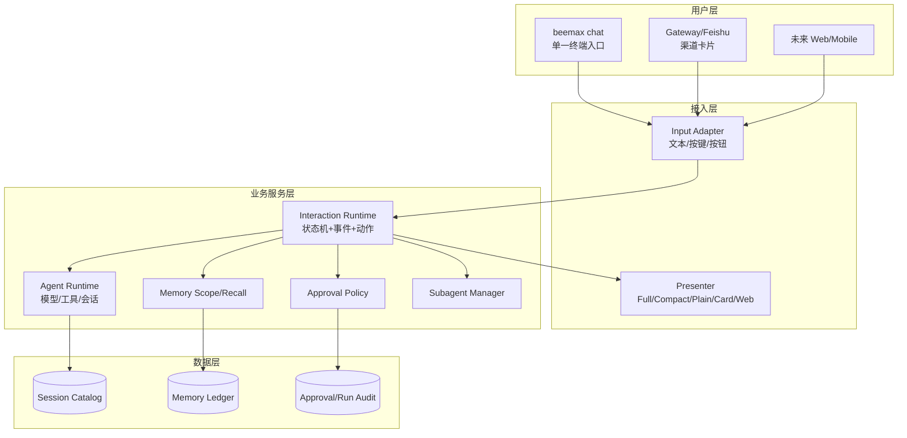
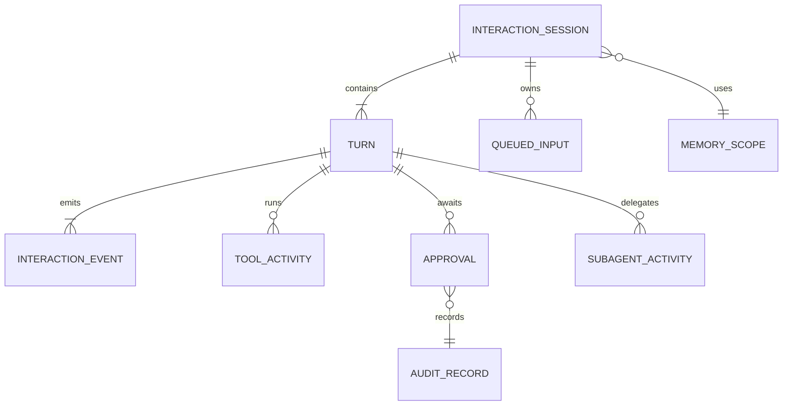
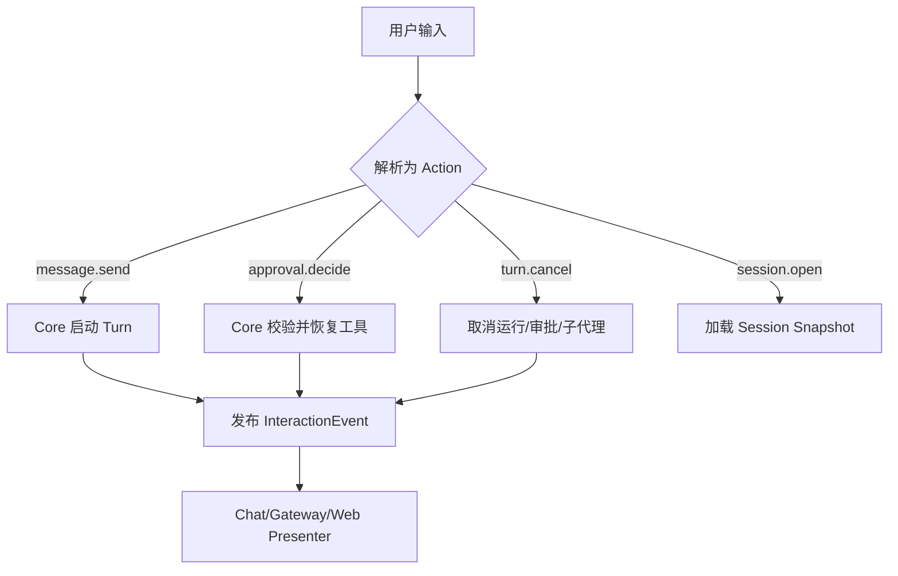
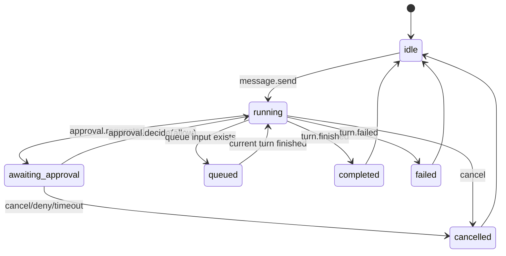

# BeeMax 统一交互运行时与终端工作台 PRD

| 项目属性 | 企业自研 × Agent 平台基础服务 |
| --- | --- |
| 重要性 | 高 |
| 紧迫性 | 高 |
| 需求方 | BeeMax 产品与工程团队 |
| PRD 编写人 | BeeMax |
| 提交日期 | 2026-07-11 |

## PRD 修改记录

| 变更时间 | 变更内容 | 修改人 | 版本 |
| --- | --- | --- | --- |
| 2026-07-11 | 初始长期架构设计 | BeeMax | v1.0 |
| 2026-07-11 | R1 完成；R2 已交付共享命令、实时状态、结构化审批、活动详情、Picker 与 queue/steer 降级 | BeeMax | v1.1 |

---

## 1、项目背景

BeeMax 已具备 CLI、Gateway、会话、工具、审批、子代理和结构化记忆闭环，但交互状态仍分散在 CLI/Gateway 的渲染逻辑与底层 Pi 事件之间。随着 Full Workbench、远程 Gateway、Web 控制台和移动端进入路线，继续复制命令与状态将造成行为分叉。

当前优先问题：

1. 工具、审批、子代理和会话状态缺少统一、可复用的交互事件模型。
2. `beemax chat` 需要同时覆盖 SSH/文本流与状态化工作台，不能要求用户在两个产品入口之间选择。
3. 未来 `beemax chat` Full 模式、Gateway、Web 若各自解释 Runtime 状态，会产生权限、记忆 scope 与取消行为不一致。

解决方向：在 `@beemax/core` 建立一个深模块 `InteractionRuntime`，将交互语义收敛为小接口的状态快照、事件流和动作；`beemax chat` 的 Full/Compact/Plain、Gateway、Web 仅作为 Adapter。当前 I1 实现命名为 `InteractionEventAdapter`，只承担运行时事件转换、取消和审批状态桥接；完整的订阅、队列和跨端协调留在后续里程碑。

## 2、需求基本情况

| 要素 | 内容 |
| --- | --- |
| 需求提出人 | BeeMax 产品负责人 |
| 功能使用人 | 本地开发者、远程运维者、Agent 用户 |
| 受影响人 | Gateway/渠道接入、能力 Adapter、后续 Web/移动端团队 |
| 核心痛点 | 同一 Agent 在不同交互界面中缺少一致的状态、审批和会话体验 |
| 使用频率 | 每个交互式 Agent 回合 |
| 需求价值 | 以单一 `beemax chat` 入口按环境自适应呈现，且不复制 Agent 逻辑 |

**主场景：本地长时间 Agent 工作台**

用户启动 BeeMax，在同一会话中查看模型、上下文、工具和子代理活动；收到有完整上下文的审批卡；可取消、排队或引导运行中的任务；中断后恢复同一会话。

## 3、业务分析与系统调研

| 调研对象 | 可借鉴点 | 不直接复制的部分 |
| --- | --- | --- |
| OpenClaw | Gateway/local 连接到统一 TUI；持久 Footer；工具卡和会话选择器 | 不将 BeeMax 绑定到其 Gateway 协议或策略格式 |
| Hermes Agent | Classic CLI 与 TUI 共用 Runtime；busy input、modal 审批、详情分区 | 不复制其 Python/Node 双运行时实现 |
| BeeMax 当前架构 | Core/Gateway 职责边界、Profile 隔离、审批和记忆 policy 已在 Core 收敛 | 不允许 TUI/CLI 绕开 Core 做 prompt、记忆或授权决策 |

## 4、项目收益目标

| 目标类型 | 衡量指标 | 目标值 | 时限 |
| --- | --- | --- | --- |
| 一致性 | Chat Full/Compact/Plain、Gateway 共享交互动作与状态 | P0 命令 100% 同语义 | I3 前 |
| 可靠性 | 审批等待中取消成功率 | 100%，无死锁 | I2 |
| 可观测性 | 每个运行中回合可见状态 | 模型、session、耗时、token、审批、工具 | I2 |
| 体验 | 会话恢复与工具详情获取步骤 | 不超过 2 次操作 | I3 |

验收标准：同一 Session 在 Chat Full/Compact/Plain 与 Gateway 间切换时，用户看到的模型、会话、工具、审批、记忆 scope 和取消结果一致。

## 5、项目方案概述

| 模块 | 说明 | 优先级 |
| --- | --- | --- |
| Interaction Runtime | 状态机、事件流、动作处理和订阅 | P0 |
| Approval Experience | 结构化审批、取消、长期策略显示 | P0 |
| Chat Presenter | Full/Compact/Plain 三种渲染模式、状态、草稿与详情恢复 | P0 |
| Workbench 能力 | alternate screen、卡片、overlay、picker；由 `beemax chat` 自动选择 | P1 |
| Remote Control | Gateway/Web 接入统一协议 | P1 |
| Cross-device | Web、移动节点、语音与 Canvas | P2 |

MVP 先覆盖 `InteractionEventAdapter + 自适应 beemax chat`；不包含移动节点、语音、Canvas 和复杂多人协作。

## 6、项目范围

| 系统 | 关系 | 本期影响 |
| --- | --- | --- |
| `@beemax/core` | 主体 | 新增交互运行时与状态机 |
| `apps/cli` | Adapter | `beemax chat` 的 Full/Compact/Plain 渲染与输入适配 |
| `packages/gateway` | Adapter | 将渠道输入转为统一 Action，消费事件 |
| `packages/memory` | 能力 | 提供 memory scope 与记忆变更事件 |
| Pi Runtime | 内部实现 | 仅由 Core 适配，不能泄漏到 Presenter |

本期不包含：独立 Web 产品、语音 I/O、移动节点、跨 Profile 共享会话、原始推理展示、渠道侧重写 Agent 逻辑。

## 7、项目风险

| 风险 | 影响 | 应对 |
| --- | --- | --- |
| 直接暴露 Pi 事件 | UI 与底层耦合，未来替换困难 | Core 转换为 BeeMax 语义事件 |
| Chat 各模式命令分叉 | 用户行为与测试不一致 | Command registry 只在 Core 定义一次 |
| 全屏工作台覆盖 SSH 场景 | 运维可用性下降 | 同一 `beemax chat` 自动降级 Plain Presenter，支持 `--plain` |
| 审批 UI 绕过 policy | 安全与审计失效 | Core 唯一决策，Presenter 仅提交 action |
| 用户级记忆泄漏 | 隐私事故 | 所有 snapshot/recall 在 Core 校验 scope |

## 8、术语和缩略语

| 术语 | 定义 |
| --- | --- |
| Interaction Runtime | BeeMax 的交互状态机、事件流和动作入口 |
| Presenter | 将交互事件渲染为 Chat Full/Compact/Plain、卡片或 Web 的 Adapter |
| Action | 用户或 UI 对 Core 发出的语义操作 |
| Snapshot | 可恢复、可渲染的当前交互状态 |
| Scope | Profile、平台、chat、用户和 session 组成的权限/记忆范围 |

### 8.1 一等能力原则

搜索、浏览器、记忆、文件、日历、邮件、渠道、媒体与自动化均为 BeeMax 的一等能力。每项能力必须拥有：稳定输入/输出 schema、明确风险等级、可关联 Profile/Scope/Turn 的审计事件，以及由 Core 执行的审批策略。Presenter、Skill 与渠道不得以脚本拼接替代这些契约。

`bash` 仅作为开发者显式请求的通用终端逃生舱，不承载产品级浏览、邮件、日历、记忆或渠道能力；新增产品能力必须先实现独立 Tool/Capability，再考虑是否提供 shell 兼容路径。

## 9、参考文献和引用文档

| 文档 | 位置 | 说明 |
| --- | --- | --- |
| BeeMax Core/Gateway 边界 | `docs/architecture/core-gateway-boundaries.md` | 当前架构约束 |
| OpenClaw TUI | OpenClaw 官方文档 | 本地/远程统一控制台参考 |
| Hermes CLI/TUI | Hermes 官方文档 | Classic CLI/TUI 双 Presenter 参考 |

## 10、功能需求

### 10.1 产品框架概述



**核心数据模型**



| 实体 | 关键字段 | 说明 |
| --- | --- | --- |
| InteractionSession | id, scope, model, status, preferences | 用户可见会话状态 |
| Turn | id, sessionId, state, startedAt, finishedAt | 一次 Agent 回合 |
| ToolActivity | callId, name, risk, state, summary | 工具卡数据 |
| Approval | id, toolCallId, risk, impact, state, expiry | 审批一等对象 |
| QueuedInput | id, text, mode, createdAt | queue/steer 的输入记录 |

**核心动作流程**



**Turn 状态机**



| 当前状态 | 动作 | 目标状态 | 约束 |
| --- | --- | --- | --- |
| running | `turn.cancel` | cancelled | 优先级最高 |
| awaiting_approval | `turn.cancel` | cancelled | `/stop`、Esc、Ctrl+C 都有效 |
| awaiting_approval | `approval.decide(once/session)` | running | Core 校验 scope 与有效期 |
| running | `turn.queue` | queued | 保留输入，不改变当前 Turn |
| running | `turn.steer` | running | 仅模型/运行时支持时可用，否则降级 queue |

### 10.2 产品需求详解

#### 10.2.1 Interaction Runtime

外部 Interface 保持小而稳定：

```ts
interface InteractionRuntime {
  snapshot(scope: InteractionScope): Promise<InteractionSnapshot>;
  dispatch(action: InteractionAction): Promise<ActionResult>;
  subscribe(scope: InteractionScope, sink: InteractionEventSink): Unsubscribe;
}
```

业务规则：

| 编号 | 类型 | 规则 |
| --- | --- | --- |
| IR-1 | 约束 | Presenter 不得直接调用模型、工具、记忆或审批 broker。 |
| IR-2 | 事实 | 每个 event 均带 sessionId、turnId、scope 与时间。 |
| IR-3 | 触发 | `turn.cancel` 必须同时取消 active turn、pending approval 与归属子代理。 |
| IR-4 | 推论 | 不支持 steer 的运行时自动将 steer 降级为 queue，并发布 notice。 |

#### 10.2.2 Approval Experience

审批 View 必须包含工具、参数脱敏摘要、目标、风险、影响、可逆性、执行原因、超时和完整详情。决策仅允许 `once/session/deny`；策略级 allowlist/yolo 由独立管理入口处理。

#### 10.2.3 `beemax chat` 自适应 Presenter

| 功能 | 规则 |
| --- | --- |
| 状态行 | 显示 profile、model、session、turn state、耗时、context、queue、approval 状态。 |
| 工具详情 | `hidden/collapsed/expanded` 必须为真实可恢复详情，不是仅隐藏开始日志。 |
| 审批 | 以结构化文本卡展示；等待时 `/stop` 优先于审批输入。 |
| 忙碌输入 | I2 保留草稿；I3 支持 queue；I4 支持 steer。 |

**启动与模式选择规则：**

| 触发条件 | 模式 | 行为 |
| --- | --- | --- |
| 交互式 TTY，具备 alternate-screen 能力 | Full | 工作台：状态栏、卡片、overlay、picker、多行 Composer。 |
| 交互式 TTY，但终端能力有限或用户指定 `--no-alt-screen` | Compact | 保留状态行与结构化文本卡，不占用 alternate screen。 |
| stdin/stdout 非 TTY，或用户指定 `--plain` | Plain | 纯文本流，适配 pipe、日志、脚本与故障恢复。 |
| `--gateway <url>` | 以上任一模式 | 仅改变 Runtime 连接位置，不改变命令与状态语义。 |

`beemax tui` 如保留，仅作为 `beemax chat --full` 的兼容别名；产品文档、帮助和 onboarding 只推荐 `beemax chat`。

#### 10.2.4 Full Workbench 呈现能力

| 页面/区域 | 行为 | 权限 |
| --- | --- | --- |
| Transcript | 回答、工具、思考摘要、通知 | 普通用户 |
| Footer | 常驻 session/usage/status | 普通用户 |
| Approval Overlay | 详情、一次/会话/拒绝、取消 | 当前 scope 用户 |
| Model/Session Picker | 搜索、选择、恢复、新建 | 当前 scope 用户 |
| Subagent Inspector | 树、状态、耗时、取消 | 当前 scope 用户 |

#### 10.2.5 Gateway 与未来 Web

Gateway 只把渠道消息归一化为 Action，并把 Event 降级渲染为卡片/文本；Web 与 `beemax chat` Full 模式可消费完整 Event。任何界面都不得自行改变模型、prompt、memory scope、审批决定或工具 policy。

### 10.3 异常情况处理方案

| 场景 | 处理方案 |
| --- | --- |
| Presenter 断开 | Core 继续运行；可重连后按 event sequence 恢复 snapshot。 |
| 审批超时 | Core 记录 audit，拒绝工具，Turn 回到可恢复状态。 |
| 重复 Action | actionId 幂等；重复提交返回已有结果。 |
| Full 模式不支持能力 | 降级为 Compact/Plain 文本卡，不改变 action 语义。 |
| 远程 Gateway 断线 | 保留 session 与运行记录；重新连接后加载 snapshot。 |
| UI 崩溃 | 不影响 Core 会话；CLI 可作为恢复入口。 |

## 11、数据埋点

| 事件 | 参数 | 用途 |
| --- | --- | --- |
| `interaction.turn_started` | surface, model, session | 回合采用率与耗时 |
| `interaction.approval_requested` | tool, risk, surface | 审批密度与风险分布 |
| `interaction.approval_resolved` | decision, latency | 拒绝率与审批体验 |
| `interaction.input_queued` | mode, waitMs | queue/steer 价值 |
| `interaction.presenter_reconnected` | surface, gapEvents | 断线恢复质量 |
| `interaction.session_resumed` | source, age | 会话恢复使用率 |

不得采集原始用户内容、原始推理、密钥或敏感参数；审计引用使用受控 ID。

## 12、角色和权限

| 角色 | 权限 |
| --- | --- |
| 普通用户 | 仅操作自身 scope 的会话、审批、记忆和队列。 |
| Profile 管理员 | 配置模型、渠道、审批策略、Skills/MCP。 |
| 运维观察者 | 查看匿名化健康、审计和运行指标，不可执行 Agent Action。 |

| 操作 | 普通用户 | Profile 管理员 | 运维观察者 |
| --- | --- | --- | --- |
| 发送/取消当前回合 | ✓ | ✓ | — |
| 批准当前 scope 工具 | ✓ | ✓ | — |
| 修改长期审批策略 | — | ✓ | — |
| 查看其他用户会话/记忆 | — | 仅经明确审计授权 | — |
| 查看健康与审计汇总 | — | ✓ | ✓ |

## 13、运营计划

| 阶段 | 范围 | 目标 | 回滚 |
| --- | --- | --- | --- |
| I1 协议试点 | Core + CLI | 事件/动作不改变现有语义 | 保留旧 presenter adapter |
| I2 自适应 Chat | 本地 Profile | 审批、状态、取消、详情闭环；Plain 模式稳定 | `--plain` 文本模式 |
| I3 Full Workbench | 内部开发者 | `beemax chat` 的 picker、overlay、工具卡、恢复 | Compact/Plain 自动回退 |
| I4 远程控制 | Gateway/Web 试点 | 同 session 跨 surface 一致 | Gateway 保持卡片降级 |

培训与推广：发布交互行为对照表、快捷键指南、审批策略说明；每两周复盘取消率、审批等待、队列使用率和会话恢复成功率。

### 13.1 可执行提升路线

| 批次 | 周期 | 可交付物 | 验收门槛 | 对标维度提升 |
| --- | --- | --- | --- | --- |
| R1 统一语义层 | 第 1–2 周 | 有 scope/session/time/sequence 的事件信封；Gateway 消费 Core Event；Core 原子取消运行、审批、子代理 | CLI 与 Feishu 的 `/stop`、工具和审批事件可用同一契约断言 | 核心 Agent、权限、工程交付 |
| R2 终端控制台 | 第 3–5 周 | 常驻 Footer、工具/审批卡、会话和模型 Picker、草稿、队列 | SSH/Plain 无 ANSI 回归；Full/Compact 的同一操作结果一致 | Chat / 终端体验 |
| R3 控制面与渠道 | 第 6–9 周 | 认证后的 Web 控制台；Telegram、Discord Adapter；远程恢复协议 | 新渠道不触碰 Agent/审批/记忆实现，只实现 Input/Presenter Adapter | 渠道、Web、运维 |
| R4 媒体与设备 | 第 10–14 周 | 附件/图片/音频管道、语音输入输出、Canvas/节点试点 | 媒体权限、大小、留存与失败回退均可观测 | 设备、语音、多模态 |
| R5 生产化 | 全程并行 | E2E、发布候选、兼容性矩阵、指标/告警、恢复演练 | 每个发布候选有真实渠道 smoke test、回滚包与迁移说明 | 工程交付成熟度 |

R1 先完成，未通过其验收不进入新增渠道或语音开发；这保证 BeeMax 不会以更多入口扩大不一致行为。

**实施状态（2026-07-11）：** R1 已完成并经全仓测试验证。R2 已完成共享 Command Registry、实时 Footer、可恢复活动详情、结构化审批数据卡、会话/模型搜索选择、单槽队列、Pi 多行 Composer 与 Sub-Agent Inspector；`turn.steer` 在当前 Pi 运行时明确降级为 queue。Full 模式已具备 alternate-screen Workbench（状态栏、转录区、活动卡、子代理卡、审批区、搜索 Picker、可编辑 Composer 与键盘审批 Overlay）；审批选择统一提交 Core `approval.decide` Action，子代理按当前 scope 刷新并由 `/stop` 原子级联取消。

## 14、待决事项

| 编号 | 待决事项 | 负责人 | 状态 |
| --- | --- | --- | --- |
| TBD-1 | Full Workbench 技术选型：Ink、prompt_toolkit/React 或现有 Pi TUI 复用 | [TODO] | 待决策 |
| TBD-2 | 远程 Interaction Protocol：WebSocket 版本与认证方案 | [TODO] | 待决策 |
| TBD-3 | queue/steer 是否对所有模型开放及最大队列长度 | [TODO] | 待决策 |
| TBD-4 | 审批风险分类与长期 allowlist policy 的产品规则 | [TODO] | 待决策 |
| TBD-5 | 多用户 Profile 的管理员审计访问边界 | [TODO] | 待决策 |

---

## 附：待完善清单

### 🔴 必须补充

1. 明确 Full Workbench 技术栈和远程协议，二者决定 I3/I4 的代码组织。
2. 明确 Profile 是否允许多用户及管理员审计规则，决定 session 与 memory scope 的治理方式。

### 🟡 建议补充

1. 为 approval risk、reversibility 和 impact 建立统一分类表。
2. 确定 queue/steer 的模型兼容性和用户可见降级文案。

### 🟢 可选完善

1. 后续为 Full Workbench 提供主题、鼠标与无障碍方案。
2. 在 Web 控制台加入可视化 session/subagent 时间线。
