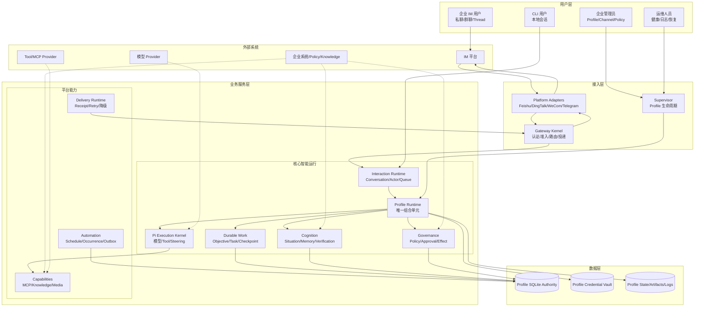
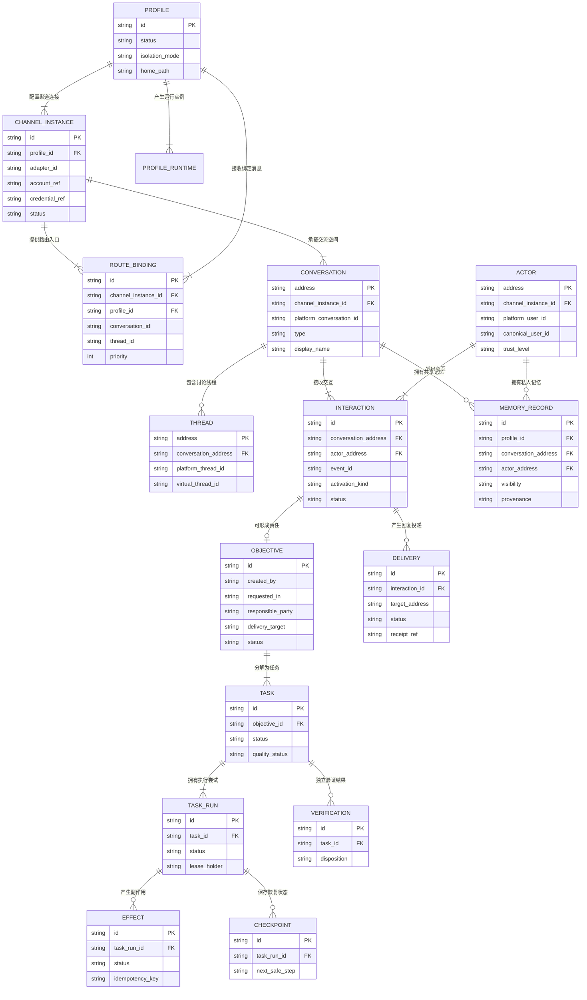
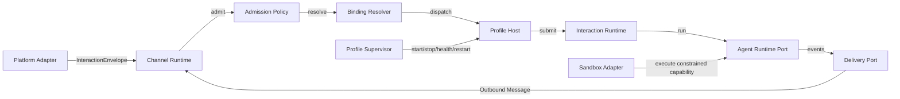
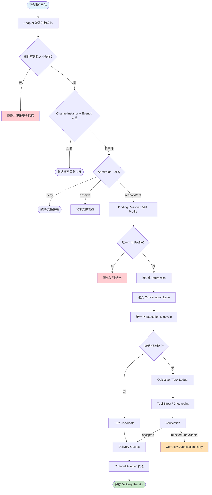
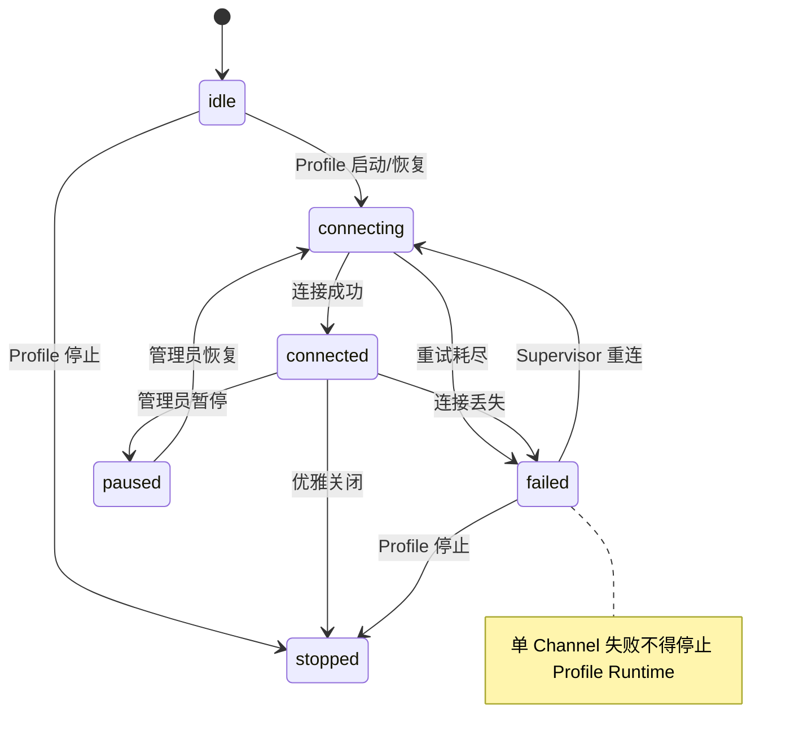
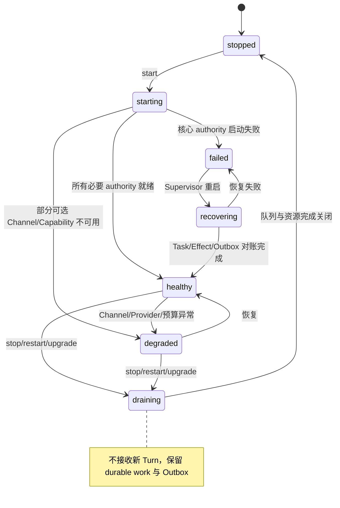
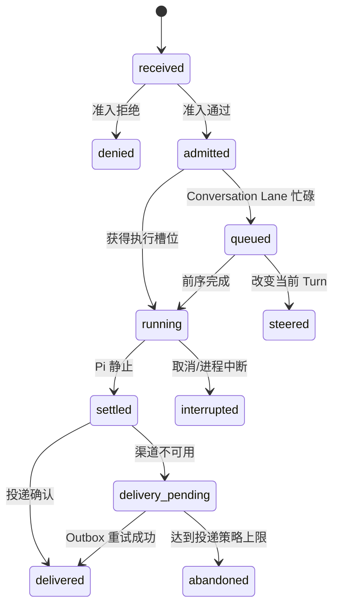

# BeeMax 多渠道、群聊与 Profile 隔离运行架构 PRD

| 项目 | 内容 |
| --- | --- |
| PRD 审核人 | [TODO: 产品负责人、Runtime 负责人、安全负责人] |
| 重要性 | 高 |
| 紧迫性 | 高 |
| 需求方 | BeeMax 产品与 Runtime 团队 |
| PRD 编写人 | Codex（基于产品负责人确认方向） |
| PRD 提交日期 | 2026-07-14 |
| 产品定型 | 商业化产品 × 企业级基础服务型软件 |
| 关联权威规格 | `BeeMax Pi-native 组织智能 Runtime PRD` |

## PRD 修改记录

| 变更时间 | 变更内容 | 变更提出部门与理由 | 修改人 | 审核人 | 版本号 |
| --- | --- | --- | --- | --- | --- |
| 2026-07-14 | 初始版本：统一多渠道、群聊、Profile 隔离、路由、权限与可靠性 | 产品与 Runtime 架构收敛 | Codex | [TODO] | v1.0 |
| 2026-07-14 | 第一实施切片：Conversation/Actor 分离、Channel Instance 持久路由、通用群准入、Memory visibility、systemd 资源上限 | P0 安全语义与 P1 多实例基础先行 | Codex | 自动化门禁通过，产品审核待完成 | v1.1-draft |
| 2026-07-14 | 第二实施切片：Profile Binding、通用 Activation 契约与 Gateway ingress 背压 | 补齐确定性路由和运行时容量边界 | Codex | build、typecheck、全量测试及架构/迁移/Memory 门禁通过 | v1.2-draft |
| 2026-07-14 | 第三实施切片：Binding 管理命令与 contextual active-thread 状态 | 补齐路由诊断与自然群聊追问 | Codex | build、typecheck、710 项全量测试及架构/迁移/Memory 门禁通过 | v1.3-draft |
| 2026-07-14 | 第四实施切片：受限群观察、ambient 响应 quiet hours 与回复频率预算 | 在不建立第二执行链的前提下补齐群聊观察和响应边界 | Codex | build、typecheck、714 项全量测试及架构/迁移/Memory 门禁通过 | v1.4-draft |
| 2026-07-14 | 第五实施切片：智能 Ambient 价值选择、可信 Conversation Type 与统一主动投递治理 | 让群观察由通用认知判断价值，并确保主动群结果可治理、可延迟且不重跑 Pi | Codex | build、typecheck、726 项全量测试及架构/迁移/Memory 门禁通过；双轴复审通过 | v1.5-draft |
| 2026-07-14 | 第六实施切片：Binding 原子启停与最小 Profile Host 生命周期 | 补齐冲突安全的路由管理，并把 Profile admission、health、degrade、drain 收敛为统一运行时权威 | Codex | build、typecheck、734 项全量测试及架构/迁移/Memory 门禁通过；双轴审查问题已修复 | v1.6-draft |
| 2026-07-14 | 第七实施切片：旧 Memory/Automation 显式 Channel Instance 归属迁移 | 多实例启用前消除旧路由歧义，提供事务、备份、审计与安全回滚 | Codex | build、typecheck、750 项全量测试及架构/迁移/性能/Memory 门禁通过；双轴审查问题已修复 | v1.7-draft |
| 2026-07-14 | 第八实施切片：旧群聊 Session Ownership Migration | 以管理员显式选择替代 Actor transcript 猜测，提供非破坏保留、Catalog 收敛与安全回滚 | Codex | build、typecheck、762 项全量测试及架构/迁移/性能/Memory 门禁通过；双轴复审均 clean，崩溃恢复、路径越界、header、文件身份、短写及 no-clobber 恢复问题已关闭 | v1.8-draft |
| 2026-07-14 | 第九实施切片：安全验收发布门禁 | 将群聊 Private Memory、跨 Profile Memory 与重复 Effect 三项安全阻塞收敛为独立可执行证据 | Codex | `eval:security` 3/3、765 项全量测试及 P10 acceptance 通过；双轴复审均 clean | v1.9-draft |
| 2026-07-14 | 第十实施切片：Ubuntu 资源高水位门禁 | 为首期 Ubuntu x64 小型规格建立 RSS、队列、并发、DB 与 systemd 的统一可执行合同 | Codex | Ubuntu 24.04 x64 门禁通过（峰值 RSS 436.8 MiB、队列/并发/DB/systemd 合同通过）；767 项全量测试与完整发布门禁通过，Spec 复审 clean、Standards 无硬违规 | v1.10-draft |
| 2026-07-14 | 第十一实施切片：Docker Execution Sandbox | 明确 Host Execution 不是 Sandbox，并为内置命令/文件 Capability 建立真实容器隔离与取消清理证据 | Codex | build、typecheck、773 项全量测试、发布评估与真实 Docker 开发门禁通过；双轴复审 clean。Ubuntu 24.04 x64 正式 artifact 由 CI/tag 生成，本机证据不冒充正式证据 | v1.11-draft |
| 2026-07-14 | 第十二实施切片：Channel Runtime 与平台 Adapter 独立包 | 让通用 Runtime、Gateway、Feishu、Telegram 和平台呈现的源码、依赖、发布边界与真实所有权一致 | Codex | 三个独立包、真实 ChannelHost→Gateway→Runtime→Delivery 契约、架构 schema v5 与双轴复审通过 | v1.12-draft |
| 2026-07-14 | 第十三实施切片：1.2 发布审计闭环 | 消除 Channel Secret 长期配置副本，补齐 Telegram 群聊 Activation、Profile 故障隔离、平台删除构建和 CLI 迁移续作证据 | Codex | callback-only Credential consumer、真实双 Profile 子进程强杀演练、完整共享 Adapter conformance、双向平台删除构建与 Session crash continuation 门禁通过；产品/安全人工审核待签署 | v1.13-rc |

---

## 当前实施状态（2026-07-14）

当前已完成第一至第十三实施切片的工程实现、文档与本地发布门禁；Ubuntu 24.04 x64 的正式资源和 Docker 证据由已配置的 CI/tag release 生成。这里的“完成”表示 1.2 工程发布候选满足自动化合同，不替代 PRD 表头仍待完成的产品、Runtime 与安全负责人签署，也不表示 GitHub tag 已发布：

- 群聊/Channel/Thread 的 Conversation 不再包含当前 Actor；Task Responsibility 仍按 Actor 或可信统一身份归属。
- `channelInstanceId` 已贯穿 Gateway 入站、投递、Task Plan Completion Notice、Automation Job/Delivery/Route/Media 和 Memory 分区。
- 同平台多实例的消息去重、Memory、Schedule 和 Delivery 具备独立命名空间；单实例继续使用旧命名空间，避免普通升级导致历史 Memory 断裂。
- 群聊 Private Claim 仅可在 DM 披露，Conversation Claim 可在共享群 Conversation 召回。
- 旧 Actor Session transcript、Session Catalog 与 Task owner 提供 additive fallback read。
- 通用 Group Admission 决策模块已落地，飞书 Adapter 已接入；Ubuntu systemd 已增加可配置 Memory/CPU/Tasks 上限。
- Profile Binding 已实现 Thread→Conversation→Account→Instance 优先级、同层冲突失败、启动校验与入站 fail-closed；模型不能选择 Profile。
- Activation 契约已支持 disabled/explicit/contextual/ambient 与 mention/reply/active-thread/command；飞书和 Telegram 共用通用决策边界。Telegram 只信任平台 entity、目标 Bot reply 和同 Thread 有界活动状态，observe-only 内容不进入 Agent 消息路径。
- Gateway ingress 已实现 Profile 全局和单 Conversation 高水位、拒绝计数和 `/status` 诊断；容量耗尽时仍允许 `/stop`。
- `beemax binding validate/explain` 已复用 Gateway 强隔离校验，可诊断唯一匹配层级并拒绝冲突、未知实例和跨 Profile 路由。
- 通用 Active Conversation Lane 已实现有界 TTL/LRU 状态；飞书支持 mention、可信回复、命令及同 Thread 自然追问，不向其他 Thread 扩散。
- 通用 Group Response Governor 已实现跨午夜 quiet hours、每 Lane 有界回复预算和有界 Lane 状态；入站触发的 ambient 响应受控，`/stop` 等命令不被预算锁死。
- 飞书非激活群消息可按显式配置投递为 Ambient Group Observation；该路径只写入现有 Profile SQLite 的有界 Initiative Observation 候选，不进入 Agent、Pi、Task、Tool 或 Delivery。
- Observation 以 Profile、Channel Instance、Conversation 和 Thread 精确隔离；同平台多机器人不会因相同群 ID 串线，保留数量按 Lane 配置并即时裁剪。
- Ambient Observation 通过 Core 的异步 cognition port 评估相关性、可信度、预期价值和置信度；模型结果必须通过通用阈值校验，推理不可用时 fail-closed defer 且不持久化未经价值批准的群原文；并发按 Profile/Lane 有界，Gateway 中没有客户、订单或工单规则。
- 主动出站统一经过 `GovernedDeliveryPort`；治理按可信 Conversation Type 区分 DM 与群聊，并按 Profile 的 transport-neutral quiet hours、每 Lane 频率预算执行，交互回复和控制消息不被误限流。
- Schedule、Initiative、Task Completion 与媒体的 durable Delivery Target 均保留可信 Conversation Type；Initiative 验证结果先进入 durable Delivery Outbox，治理延迟不会重跑 Pi 或消耗普通失败重试预算。
- Legacy 主动目标缺少可信 Conversation Type 时 fail-closed，Heartbeat 多实例路由有歧义时不投递；`delivery_settled` 按 Profile/Channel Instance 记录 delivered/deferred/failed、原因、尝试次数和延迟，媒体投递也具备 lease/token fencing。
- `beemax binding activate/disable <id>` 仅修改既有 Binding：独占写锁阻止并发 CLI 丢失更新，完整强隔离校验在发布前执行，临时文件 fsync + rename 保证原子替换；未知 Binding 或冲突不会改变原配置。
- 最小 `ProfileHost` 已成为普通 Interaction 的 Profile 级 admission 权威：仅 healthy/degraded 接收新 Turn，draining/failed/recovering/stopped fail-closed；Gateway 停止时先 drain，再等待已接收 Turn 释放。
- 独立 systemd `%i` Profile unit、每 Profile 资源限制与双 `ProfileHost` 故障/容量验收共同证明一个 Profile failed/saturated 时另一 Profile 仍可接收 Interaction；该行为进入 `eval:reliability` 和 P10 证据。
- Profile Host 从 Channel Host 快照推导运行健康并持续更新：单个 Channel Instance 故障进入 degraded，不停止其他 Channel 或 Profile Runtime；核心 authority 不可用才进入 failed。`/status` 可查看 state、accepting、lifecycle rejection 与降级原因。
- 旧版无 instance 的 Memory、Automation、Initiative 和 Completion Notice 路由数据不再靠运行时猜测归属；管理员使用 `beemax migration channel-instance plan/apply` 显式选择唯一目标实例，所有相关表在同一 Profile SQLite 事务内更新。
- 迁移会验证目标是该 Profile 中已启用且 adapter 匹配的 Channel Instance，并在 Gateway Profile 锁与 SQLite 写栅栏内创建经完整性校验的快照、数据库审计记录和迁移前后逻辑 SHA-256 清单；结构化 Memory scope、Initiative 嵌套路由和唯一键冲突均在写入前检查。`rollback` 仅在迁移后数据库未发生任何新写入时恢复，并保留迁移后快照。
- 旧 Actor-scoped 群聊 transcript 不再依赖永久 fallback 或自动任选；管理员通过 `beemax migration session plan/apply` 显式选择一个 legacy Session 作为 canonical shared Conversation 历史。迁移流式复制 Pi JSONL、收敛内容无关的 Session Catalog owner，保留全部 legacy 文件且不自动合并或删除。
- Session rollback 以 source/target SHA-256、canonical identity、Profile 路径与 Catalog receipt 共同校验；canonical transcript 或偏好一旦出现新变化就 fail-closed。保留期固定为“无自动过期”，未来删除必须进入独立的企业 retention policy 与审计动作。
- Session Migration 的 CLI 公共入口已覆盖 prepare manifest 写入后、canonical transcript 发布前崩溃的续作：确认 rollback 后安全标记 aborted，不遗留 canonical 文件或猜测重放。
- `npm run eval:security` 使用真实 SQLite Memory authority 与跨实例 Effect Journal 独立验收：Private DM Claim 不进入群聊 recall、一个 Profile 的 Memory Store 不能由另一 Profile 打开、同一 idempotency key 只能产生一个 committed mutation；该门禁已进入 `verify:release` 与 P10 证据清单。
- `ubuntu-small-node22` 把 Ubuntu 24.04 x64 小型主机的 systemd 2 GiB/200%/512 tasks、Interaction Queue 500 条/2 MiB、Profile Task 并发 4 与 RSS 1.5 GiB/DB 1 GiB 运维高水位收敛为配置合同；`eval:resources:ubuntu` 用真实队列、Scheduler、SQLite 与 RSS 压测，CI 和 tag release 上传逐次 JSON 证据。
- Docker 是首个生产 Execution Sandbox；`local` 明确为继承 BeeMax 进程用户权限的 Host Execution Adapter。`mode: all` 不允许静默使用 local，配置拼写错误 fail-closed；内置 `bash/read/write` 统一经过 `ExecutionPort`，其他 Pi 宿主文件 Tool 被移除。
- 一次一容器的 Docker Adapter 已加入 network/rootfs/capability/no-new-privileges/IPC/CPU/memory/PID/tmpfs/nofile/output 边界、Profile label 和取消/超时强制清理；`eval:sandbox:ubuntu` 用真实 Docker daemon 验证 workspace none/ro/rw 与全部隔离观察。
- `BeeMaxConfig` 不再保存 Feishu/Telegram 明文 Secret 注册表或 legacy token 字段；`credentialRef` 只在可信 Adapter、doctor、setup/test 边界即时解析受保护的 Profile `.env`，Secret 轮换不要求重载普通配置对象。
- `eval:architecture` 在两个隔离临时依赖域中真实删除 Feishu 或 Telegram 包并构建 Channel Runtime、Gateway 与剩余 Adapter；Feishu/Telegram factory 同时运行共享 conformance harness。

仍按本 PRD 后续阶段实施，不计为本切片完成：

- Shared Channel Relay 与跨进程 Profile 路由。
- 钉钉、企业微信等新增 Adapter；Channel Runtime 包拆分已完成并由独立包、契约测试和架构门禁验收。

---

## 1、项目背景

> 💡 方法论提示：采用战略层、战术层、执行层三层调研框架，并以“影响范围 × 严重程度 × 紧迫度”排序问题。

### 1.1 业务现状

BeeMax 已形成以 Pi 为唯一智能执行内核、以 Profile 为运行身份、以 Memory 与 Task Ledger 承载长期认知和责任、以 Gateway 接入飞书与 Telegram 的企业 Agent Runtime。现有系统已经具备 durable Task、Verification、Effect、Checkpoint、Automation、Media Understanding、Credential Vault 和 Linux systemd 部署基础。

当前多渠道能力仍处于从“平台实现”向“通用渠道运行架构”迁移的阶段：ChannelHost 已存在，但平台 Adapter、群聊准入、Profile 组合、会话身份和平台能力仍有部分耦合。尤其是群聊 Conversation 与消息发送者 Actor 尚未完全分离，同平台多账号也受到 `platform` 唯一索引限制。

### 1.2 面临问题

1. **群聊会话语义不正确**：当前 Conversation Key 包含发送者，不同成员在同一群或 Thread 中可能无法共享连续上下文。
2. **渠道与平台规则耦合**：飞书 Adapter 内承担群聊准入、群规则和平台传输，新增钉钉、企微时容易复制规则。
3. **同平台多实例受限**：一个 Profile 无法自然挂载多个同平台机器人账号，阻碍企业多工作区、多机器人部署。
4. **Profile 隔离语义不完整**：数据目录和进程隔离已有基础，但 namespace、进程、Sandbox、租户安全仍容易被混为一谈。
5. **群聊 Memory 存在隐私风险**：没有统一定义共享 Conversation Memory 与 Participant Private Memory 的召回和披露规则。
6. **路由可扩展性不足**：平台、账号、群、Thread 到 Profile 的确定性 Binding 尚未形成通用模型。
7. **故障域与资源预算需深化**：一个 Channel、Profile 或外部 Provider 异常时，需要明确熔断、背压、恢复和资源上限。

### 1.3 解决思路

以独立 Profile 进程作为默认生产部署，通过共享的 Gateway Kernel、Channel Runtime 和独立平台 Adapter 降低扩展成本；将 Conversation、Actor、Route、Responsibility 和 Visibility 建模为不同概念；群聊采用共享 Conversation、独立 Actor、显式责任与分层 Memory；所有智能理解与执行继续进入同一个 Pi、Memory、Task Ledger、Effect、Checkpoint 和 Verification 闭环。

### 1.4 决策依据

- 现有 BeeMax 已有 Profile 目录、Memory Store identity、systemd 实例、ChannelHost 和 Interaction Runtime，无需推倒重写。
- Hermes 官方默认采用一 Profile 一 Gateway 进程，证明强故障隔离具有实际运维价值。
- OpenClaw 的 Binding、多 Agent state、Sandbox 和多账号路由证明共享渠道与确定性路由具有扩展价值。
- 客户业务对象和企业规则无法预先枚举，Runtime 只能提供通用完整性、安全和配置机制。
- [TODO: 补充种子客户数量、日均消息量、典型 Profile 数、渠道账号数和群聊比例。]

## 2、需求基本情况

| 要素 | 内容 |
| --- | --- |
| **需求提出人** | BeeMax 产品负责人 |
| **功能使用人** | 企业员工、群管理员、Profile 管理员、平台运维人员、能力开发者 |
| **受影响人** | 企业安全负责人、IT 管理员、渠道平台管理员、被委托任务的协作者 |
| **场景描述** | 多渠道私聊、群聊协作、Thread 连续工作、多 Profile 独立运行与恢复 |
| **发生频率** | 实时消息持续发生；后台任务和主动工作按事件或 Schedule 发生 |
| **核心痛点** | 渠道增多和企业场景变化时，不能通过复制平台代码或固化业务规则扩展 |
| **需求价值** | 在保持 Pi 统一智能闭环的同时，提高渠道扩展性、群聊自然度、隔离性和生产稳定性 |

### 核心场景描述

**场景1：群聊中的连续协作**

- **人物**：多名企业成员与一个 BeeMax Profile。
- **时间**：工作群中连续讨论和执行任务期间。
- **地点**：飞书、钉钉、企业微信、Telegram 等群聊或 Thread。
- **起因**：成员 @BeeMax、回复 BeeMax，或继续一个已激活的任务 Thread。
- **经过**：Gateway 准入并标准化消息；Runtime 识别共享 Conversation 与独立 Actor；Pi 判断回答、观察、追问或建立 durable Objective。
- **结果**：任务在原 Thread 持续推进，结果经 Verification 后投递；私人 Memory 不泄露到群聊。

**场景2：一个企业运行多个独立 Profile**

- **人物**：企业 IT 管理员、销售 Profile、财务 Profile、支持 Profile。
- **时间**：长期生产运行和版本升级期间。
- **地点**：Ubuntu 主机或容器环境。
- **起因**：不同部门需要不同人格、权限、Memory、渠道和工具能力。
- **经过**：Supervisor 分别管理 Profile Worker；每个 Profile 使用独立目录、进程、凭证、Task Ledger 和资源预算。
- **结果**：一个 Profile 崩溃或重启不影响其他 Profile；跨 Profile 协作只有显式 Delegation 才发生。

**场景3：同平台多个账号和未来新渠道接入**

- **人物**：渠道 Adapter 开发者和企业管理员。
- **时间**：新建第二个飞书机器人、接入钉钉或企微时。
- **地点**：BeeMax 配置和 Channel Runtime。
- **起因**：企业有多个工作区、账号或机器人身份。
- **经过**：管理员创建 `ChannelInstance` 并使用 Credential Ref；Adapter 声明能力；Gateway 按 instance identity 管理连接和投递。
- **结果**：无需修改 Pi、Memory、Task Ledger 或业务语义代码即可扩展平台和账号。

## 3、商业分析

> 💡 方法论提示：采用 STP 与差异化价值分析；没有可靠数据的市场规模和 SaaS 指标不做虚构估算。

### 3.1 目标市场与客户分析

| 分析维度 | 内容 |
| --- | --- |
| **目标市场** | 需要私有化或受控部署企业 Agent 的中小企业、数字化团队和软件集成商 |
| **市场规模** | [TODO: 通过 IDC、Gartner、信通院或目标区域报告验证企业 Agent Runtime 市场规模] |
| **市场特征** | 模型能力快速迭代，但企业落地仍受渠道、权限、长期任务、隐私和可靠性约束 |
| **发展趋势** | 从单轮聊天向多渠道、长期责任、工具执行、组织记忆和主动工作演进 |
| **客户画像** | 具备至少一个企业 IM、希望接入内部知识/系统、要求 Ubuntu 或私有化部署的团队 |
| **客户痛点** | 场景不可穷举；平台集成重复；Agent 状态混用；执行不可恢复；群聊隐私和权限不清晰 |
| **卖点提炼** | 一个不固化客户业务、但能长期承担责任并安全恢复的企业 Agent Runtime |

### 3.2 竞品分析

| 分析维度 | Hermes Agent | OpenClaw | BeeMax 目标定位 |
| --- | --- | --- | --- |
| **运行模型** | 默认 Profile 独立 Gateway，可选 multiplex | 单 Gateway 多 Agent | 默认独立 Profile，后续可选 Channel Relay |
| **渠道能力** | 多 Adapter Gateway | 多账号 Binding 与插件渠道 | Channel Runtime + 多实例 + 确定性 Binding |
| **长期责任** | Session、cron、delegation | Session、subagent、cron | Task Ledger、Effect、Checkpoint、Verification |
| **群聊模型** | 平台 Session 与准入 | Binding、DM/group session scope | Conversation/Actor/Responsibility 分离 |
| **安全隔离** | Profile 不等于 Sandbox | 支持 per-agent/session Sandbox | Profile 进程 + Vault + 可插拔 Sandbox |
| **差异化价值** | 个人/通用自成长 Agent | 渠道和多 Agent 控制面 | 组织责任、业务无本体、验证闭环和企业隔离 |

### 3.3 差异化定位

BeeMax 不通过预制行业对象和规则覆盖客户场景，而是用 Situation、Organization Memory、Enterprise Policy Adapter 和 Pi 动态理解未知业务；Runtime 只固化身份、权限、责任、副作用、恢复和验证。这使平台扩展与智能深化可以分别演进。

### 3.4 SaaS/商业模型待验证项

| 指标 | 目标/状态 | 说明 |
| --- | --- | --- |
| **部署模式** | 开源/私有化优先；托管模式待验证 | [TODO: 确认正式商业模式] |
| **目标定价** | [TODO] | 需按 Profile、节点、渠道或企业规模验证 |
| **CAC** | [TODO] | 尚无可靠获客数据 |
| **LTV** | [TODO] | 依赖定价和续费周期 |
| **LTV/CAC** | 目标大于 3 | 仅作为商业健康基线 |
| **Churn Rate** | [TODO] | 待种子客户阶段建立基线 |

## 4、项目收益目标

> 💡 方法论提示：目标采用 SMART 原则；未经实测的数据标记为待基线化。

### 4.1 项目目标

| 目标类型 | 目标描述 | 衡量指标 | 目标值 | 达成时限 |
| --- | --- | --- | --- | --- |
| **稳定性目标** | 单 Profile 或单 Channel 故障不扩散 | 故障隔离测试通过率 | 100% | 本 PRD P2 完成 |
| **扩展目标** | 新增渠道不修改 Agent/Memory/Task 语义 | Channel 契约测试与架构门禁 | 100% | P1 完成 |
| **群聊目标** | 群聊共享上下文且不泄露私人 Memory | 群聊隔离验收用例 | 100% | P0 完成 |
| **执行目标** | 渠道失败不触发重复 Pi/Effect | Outbox、幂等和恢复用例 | 100% | P1 完成 |
| **性能目标** | 资源受限时保持有界队列和内存 | `ubuntu-small-node22` 资源门禁 | RSS < 512 MiB（固定门禁负载）、heap 增量 < 64 MiB、队列 ≤ 500/2 MiB、任务并发 = 4、5k SQLite 样本 ≤ 32 MiB | 发布前 |

### 4.2 验收标准

1. 同一群或 Thread 的不同成员共享 Conversation Session，但 Actor、权限和责任保持独立。
2. 群聊不能召回或披露未授权的 Participant Private Memory。
3. 一个 Profile 失败、重启或达到资源上限时，其他 Profile 继续处理消息和任务。
4. 一个 Profile 可配置两个同平台 Channel Instance，不发生 Adapter 覆盖或投递歧义。
5. 飞书群聊规则迁移到通用 Admission interface，平台 Adapter 不包含 Agent 业务语义。
6. 所有长期工作继续使用唯一 Task Ledger、Pi Loop、Effect Authority 和 Verification。
7. Ubuntu 安装、systemd 管理、优雅关闭、重启恢复通过发布门禁。

### 4.3 成功标准

项目正式发布后一个评估周期内：

1. 新增一个符合 Channel Runtime 的平台 Adapter 不需要修改 Core。
2. 群聊重复回应、错线程回应和私人信息泄露事件为零。
3. Profile/Channel 故障恢复不产生重复 Objective、Task 或 committed Effect。
4. [TODO: 建立种子客户激活率、周活 Profile 数、任务完成率和用户干预次数基线。]

## 5、项目方案概述

### 5.1 核心功能概述

| 序号 | 功能模块 | 功能简述 | 优先级 |
| --- | --- | --- | --- |
| 1 | 统一 Interaction | 分离 Route、Conversation、Actor、Content、Activation 和 Trust | P0 |
| 2 | 群聊智能协作 | 共享会话、Thread、激活判断、并发、隐私和任务归属 | P0 |
| 3 | Channel Runtime | 标准 Adapter interface、能力声明和契约测试 | P0 |
| 4 | 多实例 Gateway | Channel 生命周期、准入、Binding、投递和可观测性 | P1 |
| 5 | Profile 隔离 | 独立进程、状态、凭证、预算、健康和恢复 | P1 |
| 6 | 平台 Adapter | 飞书、Telegram 迁移；钉钉、企微、微信生态扩展 | P2 |
| 7 | Sandbox 与资源治理 | Tool 执行隔离、CPU/内存/网络/文件限制 | P2 |
| 8 | 跨 Profile Delegation | 显式授权、最小上下文和 Receipt | P3 |
| 9 | Shared Channel Relay | 共享机器人账号路由到独立 Profile Worker | P3 |

### 5.2 方案概述

- **产品方案**：群聊作为一等交互空间；Profile 作为一等运行和责任单元；平台通过声明能力接入。
- **技术方案**：默认一 Profile 一进程；Gateway Kernel 通用；Channel Adapter 独立；Pi Runtime 保持唯一。
- **运营方案**：先在飞书与 Telegram 验证契约和迁移，再接入钉钉、企微；通过灰度 Profile 发布。

### 5.3 本期闭环范围

**本期包含：**

- Interaction 身份模型与群聊 Session 规则。
- Channel 多实例 identity、通用群聊 Admission、Binding 和 Delivery。
- 飞书与 Telegram 兼容迁移。
- Profile 故障、资源、恢复和 Ubuntu 部署门禁。
- 群聊 Memory visibility、Task responsibility 和关键验收测试。

**本期暂不包含：**

- 高风险跨客户 Profile 自主协作。
- 默认启用共享进程 multiplex。
- 自动生成企业 Policy。
- 固定客户、订单、工单等业务本体。
- 大规模多 Agent 组织和可视化编排器。

## 6、项目范围

### 6.1 涉及系统

| 系统名称 | 关系类型 | 影响描述 | 责任方 |
| --- | --- | --- | --- |
| BeeMax Core/Pi Runtime | 核心执行 | 接收标准 Interaction，保持唯一执行链 | Runtime 团队 |
| Gateway/Channel Runtime | 消息控制面 | 多实例、准入、路由、连接和投递 | Gateway 团队 |
| Memory/Task Ledger | 状态权威 | 增加 Conversation、Actor、Visibility 与 Responsibility 语义 | Runtime 团队 |
| Automation/Outbox | 异步执行 | 保持执行与投递分离 | Runtime 团队 |
| 飞书/Telegram | 首批平台 | Adapter 迁移与契约验证 | 集成团队 |
| 钉钉/企微/微信生态 | 后续平台 | 按统一 Adapter interface 接入 | 集成团队 |
| Ubuntu/systemd | 部署平台 | Profile 服务、资源限制、日志和恢复 | 运维团队 |

### 6.2 影响范围

- **用户影响**：群聊激活和 Session 行为更自然；管理员获得清晰的 Profile/Channel 状态。
- **流程影响**：平台消息先标准化和准入，再进入统一 Interaction/Pi；投递继续通过 Outbox。
- **数据影响**：Conversation identity、Channel Instance、Actor、Visibility 需要兼容迁移；不得破坏现有 Task、Memory 和 Session。
- **上下游影响**：平台凭证保持 Credential Ref；MCP、Knowledge 和 Capability 不感知具体渠道。

### 6.3 不在本期范围内

1. 完整 Organizational World Model：当前没有足够需求证明需要固定组织实体图谱。
2. 新建第二套 Memory Store 或 Agent Loop：会分裂事实和完成语义。
3. 用 experimental Pi orchestrator 替代 Task Ledger：尚不具备 durable authority 等价能力。
4. 自动修改生产 Skill 或发布 Enterprise Policy：风险和治理闭环不足。
5. 未获官方支持的个人微信协议：稳定性和合规性不可控。

## 7、项目风险

### 7.1 前提假设

| 编号 | 假设内容 | 如果假设不成立的影响 |
| --- | --- | --- |
| A1 | Pi 继续作为唯一执行内核 | 将产生双 Loop 和状态竞争 |
| A2 | 平台可提供稳定 event/message identity | 去重需使用降级组合键，风险上升 |
| A3 | 企业管理员能够配置 Profile、Channel 和基础 Policy | 无法建立可信授权与确定性路由 |
| A4 | Ubuntu/systemd 是首要生产部署环境 | 若改为纯 Serverless，需要重做监督和持久卷策略 |

### 7.2 约束条件

| 编号 | 约束描述 | 对设计的影响 |
| --- | --- | --- |
| C1 | 不固定客户业务本体 | 业务语义由 Situation/Memory/Pi 动态理解 |
| C2 | 不新增第二事实 authority | 通过现有 SQLite authority 和 focused ports 迁移 |
| C3 | Profile 默认独立进程 | 跨 Profile 必须使用显式消息/Delegation |
| C4 | Adapter 不接触非渠道凭证 | Credential Vault 按用途注入 |
| C5 | 保持现有数据兼容 | schema 和 key 迁移必须 additive、可回退 |

### 7.3 风险清单

| 编号 | 风险类别 | 风险描述 | 概率 | 影响 | 应对方案 |
| --- | --- | --- | --- | --- | --- |
| R1 | 产品 | 群聊过度响应造成打扰 | 中 | 高 | contextual 默认、激活信号、频率预算和 observe 决策 |
| R2 | 产品 | 群聊共享上下文造成隐私泄露 | 中 | 高 | Visibility、披露检查、敏感审批转私聊、红队用例 |
| R3 | 技术 | Session Key 迁移导致历史断裂 | 中 | 高 | additive read、显式 Session Ownership Migration、legacy 非破坏保留和摘要回滚 |
| R4 | 技术 | 多实例路由造成错误投递 | 中 | 高 | instance identity、Binding 优先级、Delivery Receipt 和契约测试 |
| R5 | 技术 | 单 Profile OOM 影响宿主 | 中 | 高 | systemd MemoryMax、队列背压、附件和 Tool Result 上限 |
| R6 | 运营 | 平台权限配置复杂 | 高 | 中 | doctor、setup wizard、最小权限文档和诊断输出 |
| R7 | 合规 | 群聊成员信息和企业数据跨作用域 | 中 | 高 | Access Scope、审计、保留策略、租户隔离和删除能力 |
| R8 | 依赖 | 平台协议或 Provider 不稳定 | 高 | 中 | Adapter 隔离、熔断、重连、Outbox 和能力降级 |

## 8、术语和缩略语

| 术语 | 定义说明 |
| --- | --- |
| Profile | 独立的 Agent 配置、状态和运行身份；不自动等于 Sandbox 或租户安全边界 |
| Profile Host | 管理一个 Profile Runtime 资源、启动、健康和停止的深模块 |
| Channel Instance | 某个具体平台账号/机器人连接实例，由稳定 instance id 标识 |
| Channel Runtime | 平台 Adapter 必须实现的通用消息接入和投递 interface |
| Gateway Kernel | 管理 Channel 生命周期、准入、路由、投递和可观测性的通用实现 |
| Interaction | 经过认证、标准化和准入后交给 Core 的一次交互输入 |
| Conversation | DM、Group、Channel 或其 Thread 所代表的共享交流空间 |
| Actor | 产生当前 Interaction 的人、机器人或系统身份 |
| Responsibility | durable work 最终由谁承担和跟进的身份语义 |
| Activation Policy | 决定群消息是否进入 Agent 响应判断的通用准入策略 |
| Binding | Channel/account/conversation/thread 到 Profile 的确定性映射 |
| Visibility | Memory、Task 或结果允许被哪些作用域召回与披露 |
| Channel Relay | 共享一个渠道连接并把标准 Interaction 路由到独立 Profile Worker 的可选部署形态 |

## 9、参考文献和引用文档

| 文档名称 | 版本 | 位置 | 说明 |
| --- | --- | --- | --- |
| BeeMax Pi-native 组织智能 Runtime PRD | v2.2 | `docs/prd/beemax-pi-unified-agent-runtime.md` | 唯一 Pi、Memory、Task、Effect 和 Verification 权威规格 |
| Interaction Runtime PRD | 当前 | `docs/architecture/interaction-runtime-prd.md` | Interaction 生命周期和命令语义 |
| Channel Runtime Contract | 当前 | `docs/architecture/channel-runtime-contract.md` | 现有 Channel/Gateway interface |
| Core/Gateway Boundaries | 当前 | `docs/architecture/core-gateway-boundaries.md` | 模块职责和依赖规则 |
| Hermes/OpenClaw Profile Isolation | 2026-07-14 | `docs/research/hermes-openclaw-profile-isolation.md` | 外部架构一手资料对比 |
| ADR 0001—0004 | 当前 | `docs/adr/` | Task、Recovery、Outbox 和 Credential 决策 |

## 10、功能需求

> 💡 方法论提示：基础服务型产品重点是稳定 interface、多租户隔离、调用流程、降级和可观测性；AI 部分采用“确定性准入 + 智能决策 + 独立验证”。

### 10.1 产品框架概述

#### 10.1.1 应用架构图



| 层级 | 核心责任 | 明确不负责 |
| --- | --- | --- |
| Platform Adapter | 验签、协议解析、媒体临时生命周期、平台发送 | Profile 选择、Memory、Task、业务语义 |
| Gateway Kernel | Channel 生命周期、准入、Binding、去重、背压、投递 | Pi 推理、长期责任、企业业务对象 |
| Interaction Runtime | Conversation Lane、Steer/Follow-up、控制命令、输入队列 | 平台 SDK、Memory authority |
| Profile Runtime | 唯一组合 Pi、Memory、Work、Governance 和 Capability | 机器级服务管理 |
| Supervisor | Profile 进程启停、健康、资源和升级 | Agent Turn 和 Tool 调用 |

#### 10.1.2 核心数据模型



| 实体 | 权威归属 | 关键约束 |
| --- | --- | --- |
| Profile | Profile 配置与 Supervisor | `profileId` 不能从模型输出产生 |
| Channel Instance | Gateway 配置 | 同平台允许多个 instance；Secret 只使用 Credential Ref |
| Conversation | Interaction/Gateway | Group identity 不包含 Actor；Thread 是子空间 |
| Actor | Identity/Access Scope | 显示名不能自动合并为 canonical identity |
| Memory Record | Profile Memory Authority | Visibility 是硬召回和披露约束 |
| Objective/Task | Task Ledger | 责任、执行、投递目标分离 |
| Delivery | Outbox/Delivery Runtime | 投递失败不得重放 Pi 或 Effect |

#### 10.1.3 API/interface 结构图



核心 external seams：

| Interface | 调用方 | 可观察结果 |
| --- | --- | --- |
| Channel Adapter | Gateway Kernel | connect/disconnect/health/inbound/send receipt |
| Admission Policy | Gateway | admit/deny/observe 与理由 |
| Binding Resolver | Gateway | 唯一 Profile Route 或明确无匹配/冲突 |
| Profile Host | Supervisor/Gateway | lifecycle、health、dispatch、drain |
| Interaction Runtime | CLI/Gateway | queued/steered/follow-up/run/result/control |
| Delivery Port | Core/Automation | acknowledged/retryable/permanent failure |

#### 10.1.4 核心调用流程



#### 10.1.5 关键状态机

**Channel Instance 状态机**



**Profile Host 状态机**



**Interaction 状态机**



| 当前状态 | 触发事件 | 目标状态 | 约束 |
| --- | --- | --- | --- |
| connecting | Adapter 连接成功 | connected | 必须通过 health 探测 |
| healthy | 单 Channel 失败 | degraded/healthy | 不自动停止 Profile |
| running | Pi settled | settled | 不代表 durable Business Completion |
| settled | 投递失败 | delivery_pending | 不重放 Pi |
| failed Profile | Supervisor 重启 | recovering | 必须先对账 Effect、Task 和 Outbox |

#### 10.1.6 功能清单

| 子系统 | 操作面 | CLI | IM | 管理端 | 说明 |
| --- | --- | --- | --- | --- | --- |
| Profile 管理 | 创建、启停、状态、重启 | ✓ | — | 未来 | Ubuntu 首期由 CLI/systemd 提供 |
| Channel 管理 | 实例配置、健康、暂停、恢复 | ✓ | 受控命令 | 未来 | 支持同平台多实例 |
| Binding | 路由配置与诊断 | ✓ | — | 未来 | 明确优先级与冲突 |
| 群聊 | 激活、Thread、共享上下文 | — | ✓ | 策略配置 | 平台无关 |
| Session | 新建、恢复、Steer、Follow-up | ✓ | ✓ | 未来 | Conversation Lane 统一 |
| Durable Work | 创建、状态、恢复、取消 | ✓ | ✓ | 未来 | Task Ledger 权威 |
| Memory | 分层召回、可见性、更正、遗忘 | ✓ | ✓ | 未来 | 群聊隐私硬约束 |
| Delivery | 文本、卡片、媒体、重试 | — | ✓ | 状态查看 | 能力降级 |
| Observability | 健康、队列、执行 Trace、错误 | ✓ | 状态命令 | 未来 | 不记录 Secret/思维链 |

### 10.2 产品需求详解

#### 10.2.1 统一 Interaction 与身份

##### 流程

Platform Event → Adapter 验证 → Interaction Envelope → Admission → Binding → Profile Interaction Runtime。Route、Conversation、Actor、Content、Activation、Trust 必须独立表达；Transport payload 不得直接构造 Access Scope、Delegated Task 或 Execution Grant。

##### 管理/诊断交互

| 查询项 | 输出字段 | 说明 |
| --- | --- | --- |
| Interaction 诊断 | interactionId、channelInstance、conversation、actor、status | Actor 显示需脱敏 |
| Route 诊断 | matched binding、profileId、precedence | 不输出 Credential |
| Session 诊断 | conversation address、thread、busy、queue depth | 不输出私人 Memory |

##### 业务规则

| 编号 | 类型 | 规则描述 |
| --- | --- | --- |
| INT-1 | 事实 | DM Conversation identity 可包含 peer；Group identity 永不包含当前 Actor |
| INT-2 | 约束 | canonical user identity 只能来自可信映射，不能按显示名自动合并 |
| INT-3 | 约束 | `channelInstanceId` 是多账号路由必要字段，`platform` 不能作为唯一主键 |
| INT-4 | 触发 | 平台无 Thread 时，可由 `/new` 或 Runtime 创建 virtual thread |
| INT-5 | 推论 | reply-to-agent 或 active thread 可形成 contextual activation 信号 |

#### 10.2.2 群聊智能协作

##### 流程

群消息 → 确定性准入 → Conversation Lane → 智能响应决策（respond/act/clarify/observe/defer/ignore）→ 必要时建立 Objective → 原 Thread 投递。

##### 策略配置

| 字段 | 类型 | 默认值 | 说明 |
| --- | --- | --- | --- |
| activation.mode | enum | contextual | disabled/explicit/contextual/ambient |
| respondTo | list | mention,reply,active_thread,command | 激活信号 |
| ambientObservation | bool | false | 是否接收非激活消息用于受限观察 |
| gateway.observation.retainPerLane | integer | 100 | 跨 Adapter 的每 Conversation Lane 文本候选保留上限；旧 Feishu 字段仅迁移读取 |
| allowedActors | refs | 空 | 空不等于全部允许，由上层 Policy 决定 |
| quietHours | schedule | 空 | 主动群消息安静时段 |
| maxRepliesPerWindow | integer | 有界默认 | 防止群聊刷屏 |

##### 业务规则

| 编号 | 类型 | 规则描述 |
| --- | --- | --- |
| GRP-1 | 约束 | `explicit` 模式首次消息必须 @、回复机器人或命令 |
| GRP-2 | 推论 | 已激活 Thread 中的自然追问可不重复 @，但必须属于同一 Conversation Thread |
| GRP-3 | 约束 | observe 不得创建 Objective、调用 Tool 或发送通知 |
| GRP-4 | 约束 | 群成员不能通过消息内容替其他成员授予 Tool 权限 |
| GRP-5 | 触发 | 多个独立 Thread 可以并发；同一 Lane 默认串行并支持 Steer/Follow-up |
| GRP-6 | 约束 | 敏感批准和凭证交互必须转私聊或可信审批面 |
| GRP-7 | 推论 | 无需回应但有可信价值的内容可成为候选观察，不自动成为长期 Convention/Policy |
| GRP-8 | 约束 | Ambient Observation 必须显式启用并通过 Profile 的 initiative_observation rollout；默认关闭且只保留有界文本候选 |
| GRP-9 | 约束 | quiet hours 仅抑制主动 ambient 响应；命令不受回复窗口预算阻断 |

##### AI 功能设计

| 分析维度 | 评估 |
| --- | --- |
| 确定性 | 准入、身份、权限、路由高确定性；回应价值与业务语义低确定性 |
| 容错性 | 群聊表达可容错；权限、隐私、Mutation 和完成声明不可容错 |
| 交互模式 | Chat + Copilot + 后台 durable automation |

- **人机边界**：模型判断语义与行动价值；Runtime 决定准入、访问、Effect 和完成。
- **降级方案**：模型不可用时保持队列或明确失败，不使用关键词假装完成业务判断。
- **监控指标**：群聊有用响应率、误响应率、重复响应率、用户打断率、隐私阻断次数。

#### 10.2.3 Memory 可见性与披露

##### 流程

Situation → Access Scope → 按 Visibility 过滤 → 相关性排名 → Pi 非执行证据 → 输出前披露检查 → Episode/Correction 更新。

##### 可见性类型

| Visibility | 允许召回 | 默认披露 |
| --- | --- | --- |
| private | 指定 Actor 的可信私聊作用域 | 仅该 Actor 私聊 |
| conversation | 指定 Group/Thread | 同一 Conversation/Thread |
| profile | 同一 Profile | 仍受内容敏感性和 Policy 限制 |
| organization | 经授权组织成员 | 按 Enterprise Policy |
| restricted | 显式 Access Scope | 必须再次验证授权 |

##### 业务规则

| 编号 | 类型 | 规则描述 |
| --- | --- | --- |
| MEM-1 | 约束 | Private Memory 不得因相关性高而输出到 Group |
| MEM-2 | 约束 | 群聊内容不是自动 Organization Memory，只能形成可更正 Episode/Candidate |
| MEM-3 | 触发 | 可信更正保留 supersession/provenance，不静默改写历史 |
| MEM-4 | 推论 | 多人重复陈述只提高候选置信度，不产生授权或 Enterprise Policy |
| MEM-5 | 约束 | Profile 间默认无 recall；跨 Profile 只接收显式 Delegation 提供的最小上下文 |

#### 10.2.4 Channel Runtime 与多实例 Gateway

##### 流程

Channel Instance Config → Adapter Registry 创建 → ChannelHost 独立连接/重连 → Inbound/Outbound 契约 → Health Snapshot。

##### 配置字段

| 字段 | 必填 | 说明 |
| --- | --- | --- |
| id | 是 | Profile 内稳定、唯一的 instance id |
| adapter | 是 | 开放 adapter id，不由 Core 枚举 |
| enabled | 是 | 生命周期开关 |
| credentialRef | 按平台 | 指向 Profile Vault/受保护环境 |
| accountRef | 建议 | 非 Secret 的账号身份引用 |
| settings | 否 | 平台连接参数，不得包含 Credential Secret |

##### 业务规则

| 编号 | 类型 | 规则描述 |
| --- | --- | --- |
| CH-1 | 约束 | 同平台允许多个 Channel Instance；发送必须选择 instance id |
| CH-2 | 约束 | 一个 Adapter 失败不得销毁 Profile Runtime 或其他 Adapter |
| CH-3 | 触发 | disconnected/failed 进入有界指数退避和熔断 |
| CH-4 | 约束 | Adapter 只能声明能力，不能决定 Agent 是否建 Task 或召回 Memory |
| CH-5 | 推论 | 不支持 card/edit/thread 的平台按能力降级，不改变执行语义 |
| CH-6 | 约束 | 旧版无 instance 数据只能由管理员显式归属到一个实例；系统不得猜测或同时投影给多个实例 |

##### 旧数据显式归属迁移

Profile Gateway 必须先停止；迁移命令复用同一个 Profile 进程锁，运行中的 Gateway 会使操作失败。管理员先执行只读计划，再确认写入：

```bash
beemax migration channel-instance plan --platform feishu --channel-instance company-a --profile personal
beemax migration channel-instance apply --platform feishu --channel-instance company-a --migration-id assign-company-a --yes --profile personal
beemax migration channel-instance rollback ~/.beemax/profiles/personal/migrations/channel-instance/assign-company-a.json --yes --profile personal
```

`apply` 只处理 BeeMax 基础设施显式登记的路由表，在一个 SQLite 写栅栏和事务中覆盖 before backup、编码式 Memory scope、独立 `channel_instance_id` 路由、迁移后摘要与 prepared recovery manifest；客户扩展表不会因列名相似而被猜测改写。结构化 scope key 与 Initiative 嵌套路由同步更新。目标唯一键冲突、无效嵌套 JSON 或并发变化全部 fail-closed。`rollback` 从所选 Profile 配置派生并校验所有路径，以经过摘要验证的 before SQLite snapshot 作为精确恢复源，通过集合式 SQL、精确整数/REAL、分块内容摘要、no-clobber artifact 发布、同一 SQLite inode 内的 exclusive 反向事务和持久状态机支持大数据量与崩溃后幂等续作；任何后续写入都会阻止恢复，排队 writer 则在回滚提交后继续，避免抹掉新业务数据。详细操作见 [`docs/operations/channel-instance-ownership-migration.md`](../operations/channel-instance-ownership-migration.md)。

#### 10.2.5 Binding 与 Profile 路由

##### 匹配流程

Thread 精确匹配 → Conversation 精确匹配 → Account 匹配 → Channel Instance 默认绑定。相同层级多条命中视为配置冲突，不能由数组顺序静默选择。

##### 操作

| 操作 | 触发条件 | 权限要求 |
| --- | --- | --- |
| binding validate | 配置保存/启动 | Profile 管理员 |
| binding explain | 路由诊断 | Profile 管理员/运维 |
| binding activate | 校验通过 | Profile 管理员 |
| binding disable | 紧急隔离 | Profile 管理员/安全管理员 |

`activate/disable` 当前只切换已经存在的 Binding，不隐式创建路由。写操作持有配置级独占锁，在内存中完成全量唯一性、Channel Instance 归属和 Profile 强隔离校验后，才通过 fsync + atomic rename 发布；校验失败时配置文件保持原样。

##### 业务规则

| 编号 | 类型 | 规则描述 |
| --- | --- | --- |
| BIND-1 | 约束 | 路由必须产生唯一 Profile 或明确失败 |
| BIND-2 | 约束 | 模型不能选择或切换 Profile identity |
| BIND-3 | 约束 | 强隔离模式下一个 Channel Instance 只归属一个 Profile |
| BIND-4 | 触发 | Shared Channel Relay 模式可将不同 Conversation 路由至独立 Profile Worker |
| BIND-5 | 约束 | 不同信任域不得使用 in-process multiplex |

#### 10.2.6 Profile Host、Supervisor 与资源治理

##### 流程

Supervisor → start Profile Host → 打开 authority/resources → recovery reconciliation → healthy/degraded → drain → dispose reverse order。

##### 状态与操作

| 操作 | 返回 | 失败模式 |
| --- | --- | --- |
| start(profileId) | starting/healthy/degraded | 核心 authority 失败则启动失败 |
| health(profileId) | lifecycle + resource/channel/work snapshot | 不读取 Secret |
| drain(profileId) | accepted + outstanding counts | 超时进入受控强制停止 |
| restart(profileId) | new runtime identity | 先完成 recovery reconciliation |
| stop(profileId) | stopped | 保留 durable state |

##### 业务规则

| 编号 | 类型 | 规则描述 |
| --- | --- | --- |
| PROF-1 | 约束 | 默认每个 Profile 使用独立进程/systemd unit |
| PROF-2 | 约束 | Profile 数据库必须校验所属 identity，拒绝跨 Profile 打开 |
| PROF-3 | 约束 | Profile 分别拥有 Session、Task、Automation、Vault、MCP 和队列预算 |
| PROF-4 | 触发 | 达到内存/队列上限时背压或拒绝新工作，不能无限增长 |
| PROF-5 | 触发 | crash 后先对账 Effect、Task、Occurrence、Outbox，再恢复执行 |
| PROF-6 | 约束 | Profile namespace、process、Sandbox、tenant trust 必须分别展示 |
| PROF-7 | 约束 | draining 必须先拒绝新的普通 Interaction，再等待已接收 Interaction；durable Task、Effect 和 Outbox 不因停止 admission 被删除 |
| PROF-8 | 推论 | 单个可选 Channel 故障只产生 degraded health；不得把 transport failure 等同于核心 authority failure |

#### 10.2.7 Durable Work、投递与主动性

##### 流程

Interaction/Schedule/Event → Situation → durable admission → Objective/Task → Pi → Effect/Checkpoint → Verification → Outbox → Channel Delivery Receipt → Episode。

##### 责任字段

| 字段 | 含义 | 默认 |
| --- | --- | --- |
| createdBy | 谁发起或接受责任 | 当前可信 Actor |
| requestedIn | 在哪个 Conversation 请求 | 当前 Conversation/Thread |
| responsibleParty | 谁负责跟进 | 当前 Actor；显式团队/角色可覆盖 |
| deliveryTarget | 结果投递位置 | 原 Conversation/Thread |
| visibility | Task/结果可见范围 | 当前 Conversation |

##### 业务规则

| 编号 | 类型 | 规则描述 |
| --- | --- | --- |
| WORK-1 | 约束 | 群聊发起不等于群内所有成员拥有 Task 权限 |
| WORK-2 | 约束 | Candidate Outcome 未经 Verification 不得作为完成结果投递 |
| WORK-3 | 约束 | Delivery failure 只重试投递，不重新执行 Pi/Task/Effect |
| WORK-4 | 触发 | 长任务离开聊天 Turn 进入 Task Ledger，后续由 Checkpoint 恢复 |
| WORK-5 | 约束 | 主动群通知需要有价值结果、正确 route、频率预算和 quiet hours |

#### 10.2.8 跨 Profile Delegation 与 Shared Channel Relay

本模块属于后续阶段，但 interface 必须兼容当前 identity。

| 能力 | 规则 |
| --- | --- |
| Delegation | 默认关闭；目标 allowlist；传递最小上下文；目标 Profile 独立创建 Objective |
| Result | 返回经过 Verification 的结果和 Receipt，不返回目标 Profile Memory |
| Shared Relay | 只接入、持久化、标准化和路由，不运行 Pi 或拥有 Task Ledger |
| Trust | 同企业可信域可共享 Relay；不同客户使用独立进程/容器/OS 用户 |

### 10.3 异常情况处理方案

| 异常类型 | 异常场景 | 处理方案 |
| --- | --- | --- |
| 网络异常 | Webhook 已到达但 Profile 暂不可用 | Interaction durable ingress；有界重试；过期进入隔离队列 |
| 重复事件 | 平台重复投递同一 message/event | `channelInstanceId + eventId` 去重；返回确认但不重放 |
| 并发冲突 | 同一 Conversation 同时收到多条消息 | Conversation Lane 串行；明确 Steer/Follow-up/Objective 语义 |
| 路由冲突 | 多条同优先级 Binding 命中 | 启动/保存时拒绝；运行时隔离并告警 |
| 数据异常 | Profile A 打开 Profile B 数据库 | identity 校验失败并停止该 Profile 启动 |
| 权限异常 | 群成员声称自己是管理员 | 只信任 Adapter/企业系统验证角色；否则 require approval/deny |
| 隐私异常 | 私聊 Memory 与群问题高度相关 | 可用于受限内部判断，但禁止披露；必要时转私聊确认 |
| Channel 异常 | 单 Adapter 断线或 SDK 死锁 | 超时、熔断、重连；其他 Adapter 与 Profile Runtime 继续 |
| Profile 崩溃 | OOM、未捕获异常、机器重启 | systemd 重启；Task/Effect/Outbox reconciliation；不乐观重放 Effect |
| Provider 异常 | 主模型不可用或限流 | 有界 fallback；保持 Execution Envelope；不可用则保存状态并恢复 |
| 投递异常 | 执行已完成但 IM 发送失败 | Outbox 重试；稳定 idempotency key；不重新执行任务 |
| 媒体异常 | 图片过大、OCR/视觉不可用 | 输入限制、能力降级、显式说明无法可靠识别 |
| 误操作 | 管理员错误暂停/删除配置 | revision、审计、确认、可回滚配置；不删除 durable history |
| 资源异常 | 队列、磁盘或内存达到高水位 | 背压、拒绝新非关键工作、清理有界历史、健康降级 |
| 安全异常 | Prompt injection 诱导跨 Scope 或读取 Secret | Access Scope、Vault、Tool Governance 和输出披露检查阻断 |

## 11、数据埋点与运行指标

### 11.1 埋点策略

- **埋点目标**：回答渠道是否稳定、群聊是否有用、Profile 是否隔离、任务是否真实完成、资源是否有界。
- **采集方式**：沿用 BeeMax Operational Metrics、Execution Trace、Gateway event journal 和结构化日志；后续可输出 OpenTelemetry。
- **数据原则**：不采集 Credential Secret、模型思维链、完整私人消息或未经授权的 Memory 内容。

### 11.2 管理面埋点

| 操作面 | 事件名称 | 采集参数 | 用途 |
| --- | --- | --- | --- |
| Profile 状态 | profile_health_observed | profile_id、lifecycle、queue_depth、memory_class | 隔离与容量监控 |
| Channel 状态 | channel_state_changed | profile_id、instance_id、adapter_id、from、to、reason | 连接稳定性 |
| Binding 诊断 | binding_resolved | instance_id、match_level、profile_id、conflict | 路由正确性 |
| 群聊准入 | group_interaction_admitted | mode、activation_kind、decision、reason | 误响应和漏响应分析 |
| 群聊观察 | group_observation_recorded | profile_id、platform、instance_id、conversation_type | 观察量与隔离诊断；不记录消息正文 |
| Recovery | profile_recovery_cycle | interrupted、retried、failed、outbox_pending | 恢复质量 |

### 11.3 行为与流程埋点

| 操作 | 事件名称 | 触发条件 | 采集参数 | 用途 |
| --- | --- | --- | --- | --- |
| 收到 Interaction | interaction_received | 标准化完成 | channel_instance、conversation_type、media_types | 渠道使用量 |
| 群聊响应决策 | group_response_decided | Pi/策略完成 | respond/act/observe/ignore、latency | 有用响应率 |
| 建立 Objective | objective_admitted | 接受 durable responsibility | trigger、conversation_type、actor_kind | 长任务采纳率 |
| Verification | verification_settled | accepted/rejected/unavailable | attempts、duration、evidence_count | 真实完成率 |
| Delivery | delivery_settled | delivered/retry/abandoned | channel_instance、attempts、latency | 投递可靠性 |
| 跨 Profile 委托 | delegation_settled | 后续功能启用 | source、target、disposition | 协作安全和价值 |

### 11.4 核心指标

| 指标 | 计算方式 | 数据来源 | 周期 |
| --- | --- | --- | --- |
| Channel 可用率 | connected 时间 / 应运行时间 | Channel lifecycle | 5分钟/日 |
| Profile 故障隔离成功率 | 单 Profile 故障时其他 Profile 可用用例通过数 / 总数 | 故障演练 | 发布前/季度 |
| 群聊有用响应率 | 用户接受或继续有效互动的回复 / 群回复数 | Interaction + feedback | 周 |
| 群聊误响应率 | 被忽略/负反馈/重复的回复 / 群回复数 | Interaction + feedback | 周 |
| 隐私阻断率 | 被 Visibility/Disclosure 阻断次数 / 召回尝试 | Memory audit | 日 |
| Verified completion rate | accepted Tasks / settled Candidate Tasks | Task Ledger | 日/周 |
| Delivery 重放安全率 | 投递重试未引发重复执行次数 / 重试次数 | Outbox + Execution Trace | 日 |
| Memory 高水位 | RSS/heap/db size/queue depth | Runtime metrics | 分钟 |

## 12、角色、权限与租户隔离

> 💡 方法论提示：基础服务采用 Access Scope + API/Capability 权限 + 运行隔离；角色名称是产品默认管理角色，不是客户业务本体。

### 12.1 角色定义

| 角色 | 说明 | 权限范围 |
| --- | --- | --- |
| Machine Operator | 安装、升级和观察 BeeMax | 机器级生命周期，不读取 Profile 业务内容 |
| Profile Administrator | 配置单个 Profile、Channel、Binding、模型和预算 | 指定 Profile |
| Security Administrator | 发布安全 Policy、紧急停止和审计 | 指定组织/租户作用域 |
| Channel Administrator | 管理 IM 应用、Webhook、bot token 和平台权限 | 指定 Channel Instance |
| Profile User | 与 Profile 私聊或群聊协作 | Conversation/Actor Access Scope |
| Capability Provider | 提供 MCP/Tool/平台 Capability | 声明范围，不获得 Profile Memory |
| Profile Runtime | 受治理的执行主体 | 只使用 Execution Envelope 和 Grant 授权能力 |

### 12.2 管理权限矩阵

| 功能 | Machine Operator | Profile Admin | Security Admin | Channel Admin | Profile User |
| --- | --- | --- | --- | --- | --- |
| 安装/升级 BeeMax | ✓ | — | — | — | — |
| 创建/删除 Profile | ✓ | 按授权 | — | — | — |
| 启停/重启 Profile | ✓ | ✓ | 紧急停止 | — | — |
| 查看 Profile 健康 | ✓ | ✓ | ✓ | 仅 Channel | 本人可见简化状态 |
| 配置 Channel Instance | — | ✓ | 审计 | ✓ | — |
| 配置 Binding/群策略 | — | ✓ | 审计/否决 | 受限 | — |
| 管理 Credential Ref | 受限 | 绑定引用 | 审计 | 渠道 Credential | — |
| 查看/更正 Memory | — | 按 Scope | 审计 | — | 本人/Conversation Scope |
| 批准 Tool Action | — | 按 Policy | ✓ | 渠道动作受限 | 发起人按 Scope |
| 跨 Profile Delegation | — | 配置 allowlist | 发布 Policy | — | 发起受限请求 |

### 12.3 Access Scope 与数据权限

1. Profile 是最小默认数据权威单元；不同 Profile 的 SQLite、Vault、Session、Task 和日志独立。
2. Conversation 是群聊共享上下文单元；Actor 是授权、责任和私人 Memory 单元。
3. Thread 比 Conversation 更窄；未授权时不得从 sibling Thread 召回私密内容。
4. Organization/Project 等业务 Scope 只接受可信 membership/provider，不从自然语言推断。
5. 输出披露范围不得大于输入 Access Scope 和 Memory Visibility 的交集。

### 12.4 多租户隔离等级

| 等级 | 适用场景 | 隔离方式 | 声明 |
| --- | --- | --- | --- |
| Namespace | 同一 Profile 内 Conversation/Actor | 逻辑 key、Visibility、Policy | 不是进程或 Sandbox 隔离 |
| Process | 同企业不同高价值 Profile | 独立 process/systemd/data/vault | 默认生产模式 |
| Sandbox | 高风险 Tool/不可信内容 | 容器/受限执行后端、网络和文件策略 | 限制 Capability 执行 |
| Tenant | 不同客户/法人/敌对用户 | 独立 OS user/container/host/secret domain | 不能仅靠 profileId |

### 12.5 API/Capability 安全

| 能力分组 | 认证 | 授权 | 限流 |
| --- | --- | --- | --- |
| Channel ingress | 平台签名/连接凭证 | Channel Instance + Admission | 平台、instance、actor 多级 |
| Read-only Capability | Credential consumer callback | Access Scope + Tool Policy | Profile/Provider budget |
| Mutation Capability | Vault + provider auth | Policy + Approval/Grant + Effect Authority | Task/Capability/Provider budget |
| Profile control | 本机/管理认证 | 管理角色 + profile scope | 严格管理限流 |
| Cross Profile | 双方运行身份 | allowlist + delegation policy + receipt | source/target 双边预算 |

## 13、运营与发布计划

### 13.1 分阶段发布

| 阶段 | 范围 | 目标 | 回滚方案 |
| --- | --- | --- | --- |
| 开发门禁 | Fake Adapter、现有 Feishu/Telegram 测试 | Interaction、Channel 多实例和群聊契约稳定 | feature flag/legacy key read |
| 内部 Profile | default + 测试 Profile | Ubuntu 生命周期、恢复、资源高水位 | 回退上一版本并保留 additive schema |
| 种子部署 | 2—5 个可信企业/团队 [TODO确认] | 验证群聊自然度、多账号和运维体验 | 单 Profile 停用新激活模式 |
| 灰度发布 | 新建 Profile 默认启用；旧 Profile 选择迁移 | 验证历史 Session/Memory 兼容 | 切回 legacy routing projection |
| 正式发布 | 全量支持 | 稳定接口与运维 SLA | 发布包回滚 + durable reconciliation |

### 13.2 种子客户策略

- **画像**：使用飞书/钉钉/企微，有至少两个 Agent 使用场景，能配合隐私和群聊测试。
- **数量**：[TODO: 确认种子企业数量与合作方式。]
- **验证点**：群聊误响应、私聊 Memory 披露、多 Profile 独立恢复、同平台多机器人、Ubuntu 运维。
- **排除条件**：首批不承诺高风险全自主操作或非官方个人微信协议。

### 13.3 Onboarding 与客户成功

1. 安装 BeeMax 和 Ubuntu 依赖。
2. 创建 Profile 并生成独立目录、Vault 和 systemd unit。
3. 通过 setup/doctor 配置 Channel Instance 和最小平台权限。
4. 配置群聊 activation、allowlist/Binding 和资源预算。
5. 运行私聊、群聊、Thread、图片、durable task 和故障恢复验收。
6. 观察一周指标后逐步开放 contextual/ambient 与 proactive 能力。

### 13.4 支持与迭代

| 流程 | 责任角色 | 建议 SLA/频率 |
| --- | --- | --- |
| Channel 连接故障 | 运维/集成 | P1 事件 4 小时内响应 [TODO确认] |
| Profile 恢复失败 | Runtime/运维 | P0 事件立即响应 |
| 隐私或跨 Scope 事件 | 安全负责人 | 立即停用相关 route/Capability |
| Adapter 兼容性 | 集成团队 | 随平台版本持续验证 |
| 指标与群聊体验复盘 | 产品/客户成功 | 周度/双周 |
| 架构与资源复盘 | Runtime/运维 | 每个正式版本 |

## 14、待决事项

| 编号 | 待决事项 | 涉及章节 | 负责人 | 预计决策时间 | 状态 |
| --- | --- | --- | --- | --- | --- |
| TBD-1 | 正式商业模式、目标定价和种子客户数量 | 3、13 | [TODO: 产品负责人] | 种子发布前 | 待决 |
| TBD-2 | 各部署规格的 RSS、并发、队列和 DB 高水位目标 | 4、10、11 | Runtime/运维 | 2026-07-14 | 已决：首期仅声明 `ubuntu-small-node22`，其他规格必须新增独立 Profile 与实测证据 |
| TBD-3 | Shared Channel Relay 是否进入本次正式版本或后续版本 | 5、10 | 产品/架构负责人 | P1 完成后 | 待决 |
| TBD-4 | Sandbox 首批支持 Docker、受限本机进程还是两者 | 10、12 | 安全/Runtime | 2026-07-14 | 已决：Docker 是首个生产 Execution Sandbox；local 仅为显式可信 Host Execution Adapter，不声明本机 Sandbox |
| TBD-5 | 旧群聊 Session Key 的迁移保留周期 | 7、10 | Runtime | 2026-07-14 | 已决：不自动过期；删除进入独立 retention policy 与审计 |
| TBD-6 | 管理控制面采用 CLI-only 还是同时提供 Web 管理端 | 10、13 | 产品负责人 | 正式发布前 | 待决 |
| TBD-7 | 钉钉、企微、微信生态 Adapter 的首发优先级 | 5、13 | 产品/集成 | P2 开始前 | 待决 |

---

## 附：PRD 自检

### 重大风险项快扫

| 风险项 | 状态 | 说明 |
| --- | --- | --- |
| R1 产品定位 | ✅已覆盖 | 面向未知企业业务的多渠道、可恢复 Agent Runtime |
| R2 核心业务流程 | ✅已覆盖 | 从平台事件到 Verification、Delivery、Memory 的完整链路 |
| R3 ER 模型 | 不适用/已简化 | 基础服务型产品已提供核心实体关系，不定义客户业务实体 |
| R4 角色权限 | ✅已覆盖 | 管理角色、Access Scope、Capability 和隔离等级 |
| R5 功能致命缺口 | ✅已覆盖 | Interaction、Group、Channel、Profile、Work、Delivery 闭环 |
| R6 需求与业务脱节 | ✅已覆盖 | 不假设订单/工单，通过通用 Situation 和 Policy 适应 |
| R7 合规风险 | ⚠️需客户化 | 已提供隐私和审计机制，具体行业保留/合规要求需企业配置 |
| R8 SaaS 多租户 | ✅已覆盖 | 明确 namespace/process/sandbox/tenant 四级隔离 |

### 14 维度快速扫描

| 维度 | 完成度 | 需补充内容 |
| --- | --- | --- |
| 业务分析质量 | 中高 | 需要真实种子客户业务量和群聊数据 |
| 产品类型适配性 | 高 | 已按商业化基础服务型调整 |
| 产品定位合理性 | 高 | 与 Pi canonical PRD 一致 |
| 场景分析与用户旅程 | 高 | 私聊、群聊、多 Profile、多账号已覆盖 |
| 文档结构完整性 | 高 | 1—14 章完整 |
| 架构设计质量 | 高 | 深模块、单一执行链、隔离等级清晰 |
| 数据建模质量 | 中高 | 实施时需固定 schema 兼容策略 |
| 流程与角色设计 | 高 | 核心流程、状态和权限完整 |
| 交互设计质量 | 中高 | Web 管理端尚未定稿 |
| 商业分析深度 | 中 | 缺少市场数据、定价和商业验证 |
| MVP/阶段策略 | 高 | P0—P3 和灰度范围明确 |
| 异常处理与健壮性 | 高 | 覆盖网络、并发、路由、数据、安全、资源 |
| AI 功能设计质量 | 高 | 确定性准入、智能判断、独立验证分离 |
| 运营与效果跟踪 | 中高 | SLA 和种子客户数量待确认 |

## 附：待完善清单

### 🔴 必须补充（发布前阻塞）

已关闭：

1. 群聊 Private Memory 不披露、跨 Profile 不召回和重复 Effect 不执行已由 `npm run eval:security` 独立验收并纳入 `verify:release`。
2. 首期 Ubuntu x64 小型规格的 RSS、队列、并发、数据库与 systemd 高水位已由 `npm run eval:resources:ubuntu` 压测确定；CI/tag release 生成机器声明 artifact。新规格不得继承该结论，必须新增 Profile 和证据。

### 🟡 建议补充（提升产品质量）

1. 使用种子客户真实数据建立群聊有用响应率、误响应率和干预次数基线。
2. 明确钉钉、企微和微信生态 Adapter 的发布优先级与官方接口限制。

已完成：首批 Sandbox backend 已确定为 Docker，Host Execution 明确不属于 Sandbox，并提供部署文档与真实 Docker 发布门禁。

### 🟢 可选完善（商业和体验）

1. 补充市场规模、定价、CAC、LTV 和 Churn 假设。
2. 设计 Web 管理控制台的信息架构和视觉原型。
3. 在 P1 稳定后评估 Shared Channel Relay 和跨 Profile Delegation。

> 本 PRD 的 1.2 工程范围已形成发布候选；商业指标 TODO 不阻塞底层 Runtime 发布，但产品、Runtime 与安全负责人审核仍须真实签署，且不得在正式商业发布材料中保留未经验证的数字。
