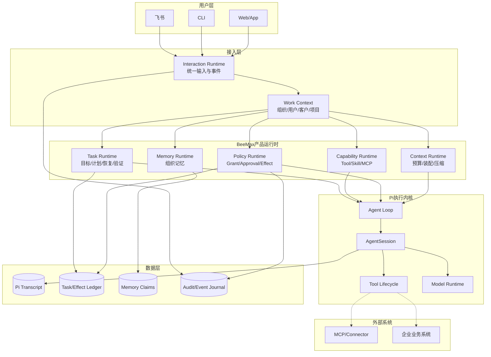
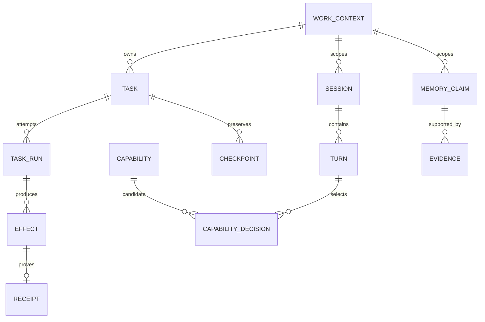
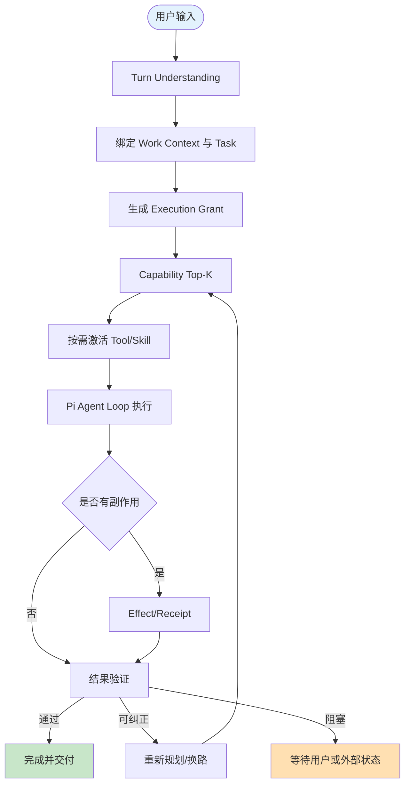
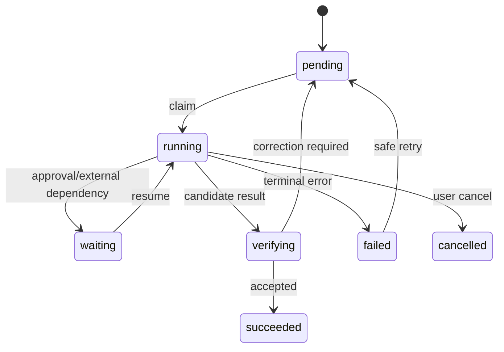
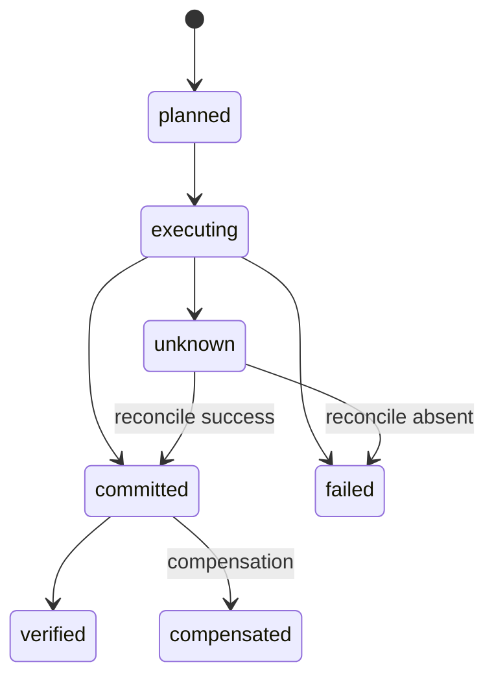

# BeeMax × Pi 统一 Agent Runtime PRD

| PRD 审核人 | 待填写 |
| --- | --- |
| 重要性 | 高 |
| 紧迫性 | 高 |
| 需求方 | BeeMax 产品与 Runtime 团队 |
| PRD 编写人 | Codex（基于产品负责人确认的目标） |
| PRD 提交日期 | 2026-07-13 |

## PRD 修改记录

| 变更时间 | 变更内容 | 变更提出部门与理由 | 修改人 | 审核人 | 版本号 |
| --- | --- | --- | --- | --- | --- |
| 2026-07-13 | 初始版本 | 统一任务执行、能力发现、记忆、上下文与 Pi Runtime，消除重复机制 | Codex | 待填写 | v1.0 |

---

## 1、项目背景

### 1.1 业务现状

BeeMax 是面向企业真实业务的数字员工产品，已经通过飞书、CLI 和 Gateway 接收任务，并以内嵌 `pi/` 提供模型调用、Agent Loop、Session、Tool Call、Streaming、Compaction 和资源加载能力。BeeMax 在其上实现了结构化 Memory、Task Ledger、Skill Runtime、Tool Policy、审批、Interaction Runtime 与渠道适配。

当前系统已具备较完整的模块能力，但尚未形成一条统一、可靠的任务执行链。Tool Policy、Capability 路由、Task、Effect、Context 和 Pi Agent Loop 之间仍有断点，导致代码能力没有稳定转化为用户可感知的任务完成能力。

### 1.2 面临问题

1. **普通任务被审批阻断**：无副作用的网络搜索因 Policy 注册覆盖问题被视为未知中风险能力，飞书连续弹出审批。
2. **授权粒度错误**：系统按单次 Tool Call 审批，而用户实际授权的是一个完整任务目标。
3. **能力发现准确度不足**：Tool/Skill 已支持渐进激活，但主要依赖词法、别名和 trigger，缺少语义、历史质量和成本排序。
4. **恢复语义不完整**：Task 已有 Checkpoint 和 Effect Receipt 雏形，但普通 Tool Call 未贯穿完整 Effect 生命周期，无法可靠判断副作用是否已发生。
5. **上下文装配分散**：System Prompt、Memory、Task、Skill、Tool 和 Compaction 由多个模块分别拼装与裁剪。
6. **融合尚未收敛**：Pi 是实际执行内核，但 BeeMax 外层逐渐承担第二套 Runtime 职责，存在重复 Registry、Loader、状态解释与事件转换风险。
7. **企业业务上下文未贯穿**：渠道身份已经隔离，但 organization、workspace、customer、project 等业务对象尚未统一贯穿会话、任务、记忆、文件、工具和审批。

### 1.3 解决思路

以任务完成质量为第一优先级，先修复 Policy 和审批阻断，再建立 Task Execution Grant、Effect/Receipt、统一 Capability Runtime、Context Runtime 和 Work Context，最后将 durable Task 与 Pi Agent Loop 深度融合并删除重复实现。

Pi 是 BeeMax 可直接修改、重构或替换局部实现的内嵌 Runtime。能力归属由用户价值、状态一致性、可靠性与长期维护成本决定，不由当前目录决定。

### 1.4 决策依据

- 当前源码已使用 Pi `AgentSession` 和 `SessionManager` 作为真实执行与 Transcript 内核。
- Skill 已具备 Discovery、Activation、Route、Resource 和 SHA256 版本围栏，可在此基础上增强而非重写。
- Memory Claim 已支持作用域、业务对象、来源、有效期、冲突和状态，可继续收敛读取模型。
- Task Ledger 已支持 Plan、Run、Checkpoint、Lease、Verification 和 Receipt，可与 Pi Loop 深化融合。
- 当前 `web_search` 审批问题可由明确的 Policy 注册覆盖路径解释，应作为第一颗 tracer bullet 修复。

## 2、需求基本情况

| 要素 | 内容 |
| --- | --- |
| 需求提出人 | BeeMax 产品负责人 |
| 功能使用人 | 企业员工、数字员工管理员、开发与运维人员 |
| 受影响人 | 客户、项目成员、审批人、渠道管理员、企业安全与合规负责人 |
| 场景描述 | 用户从飞书、CLI 或 Web 下达跨 Tool、Skill、Memory 的任务，Agent 持续执行并交付结果 |
| 发生频率 | 每次用户任务；长任务包含多次模型、工具、Skill 与恢复活动 |
| 核心痛点 | 已有能力无法稳定串成闭环，审批、路由、上下文或恢复断点会使整个任务失败 |
| 需求价值 | 提升任务最终成功率、长期理解能力、企业可用性与后续迭代效率 |

### 核心场景描述

**场景1：飞书研究与多格式交付**

- **人物**：企业员工，通过飞书使用 BeeMax。
- **时间**：工作过程中随时发起。
- **地点**：飞书私聊、群聊或线程。
- **起因**：用户要求研究某一主题并输出 HTML、PPT、PDF。
- **经过**：Agent 理解目标，召回客户要求，发现并激活搜索、报告和演示能力，连续执行、验证并生成产物。
- **结果**：普通只读能力自动执行；只有真实高风险副作用请求确认；失败可换路或恢复；最终产物满足验收条件。

**场景2：同一 Profile 多用户、多客户并发**

- **人物**：多个部门员工与多个客户项目。
- **时间**：同一时段并行下达任务。
- **地点**：飞书、App、Web 等渠道。
- **起因**：同一个数字员工 Profile 服务多个业务对象。
- **经过**：Work Context 将组织、用户、客户、项目、会话、任务贯穿至 Memory、Tool、File、Credential 和 Approval。
- **结果**：不串会话、不串任务、不串记忆、不越权，同时不牺牲能力发现和执行效率。

## 3、商业分析

### 3.1 目标市场与客户

| 分析维度 | 内容 |
| --- | --- |
| 目标市场 | 需要数字员工执行知识工作、业务运营和跨系统任务的企业 |
| 客户画像 | 多部门、多员工、多客户项目，已使用飞书或其他协作入口，重视任务完成与数据边界 |
| 客户痛点 | 通用聊天 Agent 不懂长期业务、复杂任务易中断、工具审批繁琐、结果不可验证 |
| 差异化卖点 | 能理解组织上下文、自动寻找能力、可靠执行长任务并积累可治理的企业记忆 |
| 市场规模 | [TODO: 由商业团队补充 TAM/SAM/SOM 与来源] |

### 3.2 参考产品

| 维度 | Codex 类执行 Agent | Hermes Agent 类网关 Agent | BeeMax 目标 |
| --- | --- | --- | --- |
| 目标交互 | 持续执行、阶段进度、必要时询问 | 多渠道与可配置权限模式 | 两者结合并加入企业组织记忆 |
| 能力发现 | 工具与 Skill 按需使用 | Gateway/Tool 配置与自动执行 | 统一 Capability Runtime 与渐进加载 |
| 长期状态 | 任务上下文为主 | Gateway/Memory 为主 | Session、Task、Memory、Effect 明确分工 |
| 差异化 | 工程执行体验 | 多入口 Agent 能力 | 企业业务对象、长期任务、结构化记忆与深度 Pi 内核 |

### 3.3 商业模型待补充

定价、CAC、LTV、Churn 与回本周期不属于本次 Runtime 改造的工程决策范围，由商业计划另行维护。[TODO: 商业化发布前补充版本与计费边界]

## 4、项目收益目标

| 目标类型 | 目标描述 | 衡量指标 | 目标值 | 达成时限 |
| --- | --- | --- | --- | --- |
| 核心业务目标 | 提升复杂任务最终完成能力 | 可恢复任务最终成功率 | ≥95% | P7 完成 |
| 智能目标 | 更准确地理解目标并选择能力 | Tool/Skill Top-5 命中率 | ≥98% | P4 完成 |
| 记忆目标 | 快速召回客户关键要求 | Recall@5 | ≥95% | P6 完成 |
| 安全目标 | 避免跨客户错误召回 | 错误召回率 | <0.1% | P6 完成 |
| 体验目标 | 消除普通任务无意义审批 | 只读任务无意义审批率 | <1% | P1 完成 |
| 稳定目标 | 消除跨进程不可序列化错误 | structured-clone 错误 | 0 | P3 完成 |

### 验收标准

1. 普通网络搜索和读取能力无需审批。
2. 用户任务、约束、Effect 与未完成责任在 Compaction 和重启后不丢失。
3. 未验证结果不得满足下游依赖。
4. 已提交副作用不得被不安全重放。
5. Tool/Skill 按需发现、激活、版本锁定并可解释选择原因。
6. CLI、Gateway、飞书与未来 Web 使用同一 Runtime 语义。
7. Profile、用户、会话、客户、项目和线程不得相互污染。
8. 每个重要状态只有一个明确权威来源。

## 5、项目方案概述

| 序号 | 功能模块 | 功能简述 | 优先级 |
| --- | --- | --- | --- |
| 1 | Policy 与审批 | 修复 Policy 覆盖，支持 off/smart/strict 和目标导向授权 | P0 |
| 2 | Task Execution Grant | 将用户任务转化为受限、可恢复的执行授权 | P0 |
| 3 | Effect/Receipt | 记录副作用完整生命周期，支持幂等、对账和补偿 | P0 |
| 4 | Capability Runtime | 统一 Tool、Skill、MCP 的发现、选择、激活与换路 | P1 |
| 5 | Context Runtime | 统一上下文装配、预算、生命周期和 Compaction | P1 |
| 6 | Memory Runtime | 统一组织记忆召回、排序、冲突与业务对象过滤 | P1 |
| 7 | Task × Pi Loop | durable Task 原生驱动 Pi 执行、恢复和验证 | P1 |
| 8 | Interaction Runtime | 多渠道共享统一事件与进度语义 | P2 |
| 9 | 架构去重门禁 | 阻止新增重复 Registry、Loader、状态机和事实源 | P0 |

### MVP 范围

首个可发布里程碑包含 Policy 修复、Task Execution Grant 和 Effect/Receipt。它必须让飞书研究任务无需连续审批，并能在失败后安全恢复。

首阶段明确不同时大改 Pi Agent Loop、Memory 数据模型和 Task 调度器；这些模块在行为基线稳定后通过后续 tracer bullet 融合。

## 6、项目范围

### 6.1 涉及系统

| 系统 | 关系 | 影响 |
| --- | --- | --- |
| `pi-ai` | 模型层 | 错误语义、预算与 Provider 能力 |
| `pi-agent-core` | Agent Loop | Tool 生命周期、取消、恢复 Hook |
| `pi-coding-agent` | Session/Tool/Resource | 动态能力、Context、Compaction、Session |
| `packages/core` | BeeMax Runtime | Policy、Skill、Task、Context、Interaction |
| `packages/memory` | 状态存储 | Memory、Task Ledger、Effect 持久化 |
| `packages/gateway` | 多渠道接入 | 事件、审批、队列和 Presenter |
| `apps/cli` | Composition Root | 飞书、CLI、Runtime 组合与配置 |

### 6.2 不在本期范围

1. 更换当前模型 Provider 体系。
2. 一次性重写整个 Pi。
3. 为追求目录统一而移动无收益代码。
4. 重新设计商业计费和销售体系。
5. 未经验证自动安装任意第三方可执行代码。

## 7、项目风险

| 编号 | 风险 | 概率 | 影响 | 应对方案 |
| --- | --- | --- | --- | --- |
| R1 | 同时重构 Pi、Memory、Task 导致回归面失控 | 高 | 高 | tracer bullet；每阶段限制修改范围 |
| R2 | 双写迁移形成两个状态权威 | 中 | 高 | 迁移期只允许一个写入者，双读限时存在 |
| R3 | 权限治理降低 Agent 执行能力 | 高 | 高 | 目标导向 Grant；只读默认自动执行 |
| R4 | Context 收敛降低模型表现 | 中 | 高 | 建立真实评测集，逐项比较 Token 与成功率 |
| R5 | Effect 记录与外部真实状态不一致 | 中 | 高 | 幂等键、Receipt、reconcile 与 unknown 状态 |
| R6 | 语义检索增加延迟 | 中 | 中 | Top-K、缓存、词法预筛与 P95 预算 |
| R7 | Pi 深改增加上游同步成本 | 中 | 中 | 通用接口优先，隔离 BeeMax 产品规则 |
| R8 | 工作区已有修改被覆盖 | 低 | 高 | 每阶段检查 Git 状态，只提交本阶段文件 |

## 8、术语和缩略语

| 术语 | 定义 |
| --- | --- |
| Pi | 仓库内可修改的 Agent 执行内核 |
| Runtime | 执行 Agent 任务所需的模型、上下文、能力、状态与恢复语义 |
| Work Context | 组织、工作区、用户、客户、项目、会话和任务的统一业务关联 |
| Execution Grant | 用户目标派生的、有范围和期限的任务级执行授权 |
| Capability | Tool、Skill、MCP、Extension 等可被 Agent 使用的能力 |
| Effect | Tool 对本地或外部世界产生或可能产生的影响 |
| Receipt | 证明 Effect 状态的持久化回执 |
| Transcript | 用户与 Agent 实际发生的消息历史 |
| Memory Claim | 带作用域、来源、有效期和冲突状态的长期事实 |
| Checkpoint | 任务恢复所需的结构化执行快照 |

## 9、参考文献和引用文档

| 文档 | 位置 | 说明 |
| --- | --- | --- |
| Pi 源码 | `pi/` | 内嵌执行内核 |
| BeeMax Core | `packages/core/` | 产品 Runtime 语义 |
| BeeMax Memory | `packages/memory/` | Memory 与 Task 持久化 |
| Hermes 部署研究 | `docs/research/hermes-agent-deployment.md` | 外部架构参考，非目标事实源 |

## 10、功能需求

### 10.1 目标架构



### 10.1.1 核心实体



| 实体 | 权威 | 说明 |
| --- | --- | --- |
| Transcript | Pi SessionManager | 不由 Gateway 或 Memory 重复保存为权威 |
| Session/Turn | Pi + BeeMax Interaction | Transcript 与交互阶段职责分离 |
| Objective/Task/Run | Task Ledger | durable 工作事实 |
| Effect/Receipt | Effect Ledger | 外部副作用权威 |
| Memory Claim | Memory Runtime | 长期组织事实 |
| Active Capability | Pi AgentSession | 当前模型可调用能力 |
| Capability Metadata | Capability Index | 发现和路由权威 |
| Approval/Grant | Policy Runtime | 授权权威 |

### 10.1.2 主流程



### 10.1.3 Task 状态机



### 10.1.4 Effect 状态机



### 10.2 模块需求

#### 10.2.1 Policy 与 Execution Grant

规则：

1. Tool 显式 Policy 优先于内建 Policy；无显式 Policy 的同名 Tool 不得覆盖已有 Policy。
2. 只读能力默认自动执行。
3. 支持 `off/smart/strict`，默认 `smart`。
4. Grant 与 task、Work Context、能力范围、Effect 等级和有效期绑定。
5. 超出 Grant 时只审批增量影响。
6. 渠道只展示审批，不参与 Policy 决策。

#### 10.2.2 Effect/Receipt

规则：

1. 每个有副作用 Tool Call 在执行前创建 Effect。
2. Receipt 必须可序列化并可持久化。
3. `unknown` 不得直接重试，必须 reconcile。
4. 已 `committed` 的 Effect 不得重放。
5. Credential Secret 不得进入 Effect、日志或模型上下文。

#### 10.2.3 Capability Runtime

规则：

1. Discovery 只加载轻量索引。
2. Tool/Skill/MCP 统一 Top-K 路由，执行生命周期仍可不同。
3. Skill 必须经过 discover → activate → route → resource → complete。
4. Skill 和资源全程绑定 SHA256。
5. 失败后先换路，再判断能力缺口。
6. 新能力安装必须经过来源校验、沙箱验证、临时启用和晋升。

#### 10.2.4 Context与Compaction

规则：

1. Context Item 具有来源、优先级、Token 成本、生命周期和可压缩性。
2. 目标、约束、Acceptance Criteria、Effect、Receipt 和未完成责任不可丢失。
3. Skill 正文、过期 Tool Schema、大型 Tool Result 必须及时释放。
4. 手动与自动 Compaction 共用一套 Preservation Policy。

#### 10.2.5 Memory Runtime

规则：

1. 先做作用域与业务对象硬过滤，再计算文本或语义相关度。
2. Candidate 不得直接成为稳定事实。
3. 新事实通过 `supersedes` 替代旧事实，冲突通过 `conflictsWith` 保留。
4. 实时事实优先查询外部来源。
5. 上层只使用统一 Memory Runtime，不直接依赖底层多张表。

#### 10.2.6 Task × Pi Agent Loop

规则：

1. Task Ledger 是 durable 工作权威，Pi Agent Loop 是执行内核。
2. Task Run 恢复时加载 Checkpoint、Grant、Effect 与未完成依赖。
3. 未验证结果不得满足下游依赖。
4. Scheduler、TaskPlanRuntime 与 Pi Loop 不得重复调度同一执行单元。
5. 子 Agent 返回结构化状态、证据、产物和未解决问题。

### 10.3 异常处理

| 异常 | 处理 |
| --- | --- |
| 模型限流/5xx | 受预算控制的 retry/fallback；不重放已提交 Effect |
| Tool 超时 | 只读安全重试；写入进入 unknown 并 reconcile |
| 审批超时 | Task 进入 waiting，不丢失执行状态，可取消或恢复 |
| Skill 版本变化 | 中止本次激活并重新发现，禁止混用版本 |
| Context 超预算 | 按优先级释放 ephemeral 内容，任务保真项不可裁剪 |
| Memory 冲突 | 注入冲突提示并查询来源或询问用户，不静默选边 |
| 进程崩溃 | 通过 Task Run Lease、Checkpoint 和 Receipt 恢复 |
| Worker clone 失败 | 在边界拒绝非 DTO 数据并记录具体字段路径 |
| 数据库锁竞争 | 有界重试、WAL、超时与明确错误，不无限等待 |
| 渠道重复消息 | 幂等去重，不能重复创建 Task 或 Effect |

## 11、数据埋点与可观测性

| 事件 | 参数 | 用途 |
| --- | --- | --- |
| turn_understood | intent、objects、constraints、confidence | 意图准确率 |
| capability_ranked | candidates、scores、reason、latency | Top-K 命中与延迟 |
| capability_activated | kind、name、version | 渐进加载行为 |
| approval_requested | task、tool、effect、reason | 无意义审批率 |
| effect_transition | effect、from、to、receipt | 副作用可靠性 |
| checkpoint_saved | task、bytes、stage | 恢复覆盖率 |
| recovery_completed | task、outcome、duration | 最终恢复成功率 |
| memory_recalled | scope、object、ids、latency | Recall 与错误召回 |
| context_built | tokenByKind、released、latency | Token 与性能 |
| task_verified | criteria、outcome、corrections | 结果质量 |

禁止在埋点中记录 Credential Secret、完整敏感参数和不必要的用户正文。

## 12、角色、权限与数据边界

| 角色 | 权限 |
| --- | --- |
| 普通用户 | 在本人、会话和获授权业务对象范围内下达任务 |
| Profile 管理员 | 配置模型、Capability、Policy 默认值和成员 |
| 企业管理员 | 配置组织、工作区、业务对象映射和审计策略 |
| 审批人 | 审批指定范围的高风险 Effect，不自动获得数据读取权 |
| Runtime 运维 | 查看脱敏运行指标和故障，不读取 Credential Secret |

隔离规则：

- Work Context 必须由可信 Composition Root 建立，不能相信渠道任意字段。
- Credential 只以 Ref 进入模型和 Tool 参数。
- 子 Agent 权限是父任务 Grant 的子集。
- Profile、用户、会话、客户、项目与线程先硬隔离，再做 Memory 或 Capability 排序。

## 13、发布与迁移计划

| 阶段 | 范围 | 发布方式 | 回滚 |
| --- | --- | --- | --- |
| P0 | 行为基线和评测集 | 测试与观测先行 | 无运行行为变化 |
| P1 | Policy 覆盖和审批模式 | 飞书 Profile 灰度 | 切回 strict/旧决策器 |
| P2 | Execution Grant | 单 Profile 灰度 | Grant 失败退回 Smart Policy |
| P3 | Effect/Receipt | 只读后写入能力分批 | 新 Ledger 单写、旧字段双读 |
| P4 | Capability Runtime | 按能力类型迁移 | 回退词法 Router |
| P5 | Context/Session | 手动 Compact 后自动 Compact | 回退旧 Context Provider |
| P6 | Memory Runtime | 新读取接口灰度 | 保留底层数据，不回滚数据迁移 |
| P7 | Task × Pi Loop | 后台任务先行 | 回退外层驱动器 |
| P8-P10 | 事件统一、删除与验收 | 渠道逐一切换 | 保留一个版本兼容窗口 |

## 14、待决事项

| 编号 | 待决事项 | 负责人 | 状态 |
| --- | --- | --- | --- |
| TBD-1 | `off/smart/strict` 是否允许 Profile 管理员覆盖企业默认值 | 产品/安全 | 待决策 |
| TBD-2 | 语义检索采用本地 embedding 还是 Provider 服务 | Runtime | 待基准测试 |
| TBD-3 | Effect Ledger 独立表还是复用现有 Task 存储事务 | Runtime/数据 | 待原型 |
| TBD-4 | Work Context 中 customer/project 的自动识别来源 | 产品/集成 | 待设计 |
| TBD-5 | Pi 上游同步与 BeeMax Fork 发布策略 | 工程负责人 | 待决策 |
| TBD-6 | 生产性能基线和机器规格 | 运维 | 待补充 |

---

## 附A：架构去重门禁

新增需求编码前必须回答：

1. 现有 Pi/BeeMax 哪个模块最接近？
2. 为什么不能扩展现有模块？
3. 是否新增状态，唯一写入者是谁？
4. 是否新增 Registry、Loader、Queue、Cache、Retry 或状态机？
5. 是否产生双写、双读或双调度？
6. 崩溃后从哪里恢复？
7. 新设计完成后删除什么旧实现？

未经架构决策，不得新增第二套 Agent Loop、Session Manager、Context Builder、Memory Store、Tool Registry、Skill Registry、Resource Loader、Capability Router、Scheduler、Task Queue、Retry Engine、Event Model、Approval State 或 Compaction Pipeline。

## 附B：实施顺序

```text
P0 行为与状态基线
→ P1 Policy修复
→ P2 Task Execution Grant
→ P3 Effect/Receipt
→ P4 Capability渐进加载
→ P5 Context/Session融合
→ P6 Memory召回升级
→ P7 Task与Pi Loop融合
→ P8 Interaction统一
→ P9 删除重复实现
→ P10 全量验收
```

## 附C：PRD 自检

| 维度 | 结果 |
| --- | --- |
| 产品定位 | 已明确：商业化基础服务型 Agent Runtime |
| 核心流程 | 已覆盖主流程、异常路径与两类状态机 |
| 数据模型 | 已定义核心实体与权威边界；字段级设计在各阶段技术设计补充 |
| 权限与隔离 | 已定义 Work Context、Grant 和 Credential 边界 |
| 功能完整性 | 已覆盖 Policy、Capability、Context、Memory、Task、Interaction |
| SaaS 多租户 | 已定义隔离原则；具体租户存储策略待商业部署设计 |
| AI 可靠性 | 已定义换路、恢复、验证、Effect 与降级 |
| 运营与观测 | 已定义灰度、回滚、指标和 E2E 目标 |

### 必须补充

1. P0 建立真实评测集后填写当前基线值。
2. Effect Ledger 实施前确定事务和存储方案。
3. Work Context 自动识别 customer/project 前确定可信数据来源。

### 建议补充

1. 建立 Pi Fork 的版本和上游同步政策。
2. 结合生产机器确定 P95 延迟与内存阈值。
3. 在首批企业试点后补充商业成功指标。
